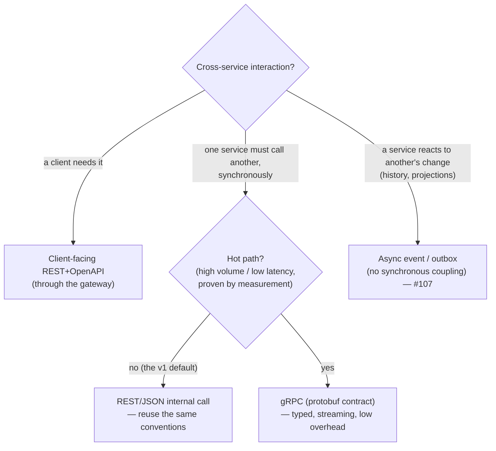

# API & Inter-Service Contract Conventions

> **Status:** High-Level Design (HLD) for v1 — the conventions the M0 build realizes; refined
> toward as-built as services land. Builds on
> [service-decomposition.md](service-decomposition.md) and
> [data-model.md](data-model.md). Intent lives in [../../requirements/](../../requirements/).

**Issue:** #108 · **Epic:** #103 (EPIC-DESIGN) · **Milestone:** M0
**Requirements:** NFR-ARC-1, NFR-MNT-1 (+ NFR-SEC-1, NFR-TST-1, NFR-I18N-1, NFR-RL-1)
**Decisions:** [D-1](../../requirements/decisions.md#d-1--v1-uses-a-full-microservices-architecture)
(microservices → inter-service contracts),
[D-5](../../requirements/decisions.md) (Go/Flutter/React),
[D-7](../../requirements/decisions.md) (Keycloak JWT)
**Depends on:** #104, #105 · **ADR:** [0003-api-contract-conventions](../adr/0003-api-contract-conventions.md)
**Contracts:** [`contracts/openapi/`](../../contracts/openapi/)

---

## 1. Scope

This defines **how every service exposes and consumes APIs** so the eight services from
[#104](service-decomposition.md) present **one consistent surface** and can be built,
consumed, and contract-tested independently (NFR-ARC-1, NFR-MNT-1, NFR-TST-1). It fixes:

- the **client-facing API style** — REST + OpenAPI, contract-first (the tech-stack's
  "Proposed" API style, now decided);
- **resource naming, pagination, filtering** and a single **error format**;
- an **API versioning & evolution** strategy;
- **inter-service** communication guidance (REST vs gRPC vs async) per
  [D-1](../../requirements/decisions.md#d-1--v1-uses-a-full-microservices-architecture);
- the **OpenAPI layout** + a reusable **contract template**, with skeletons for the first
  services committed under [`contracts/`](../../contracts/).

It does **not** define per-service business endpoints in full (each service epic does that,
against these conventions), nor the auth/offline-login mechanics (#109) or the sync write-back
protocol (#106) — it defines the _contract shapes_ those build on.

---

## 2. Contract-first, and the two contract surfaces

**Contract-first:** the OpenAPI document is authored/reviewed **before** the code; server
stubs, the typed client, and contract tests are generated from it, and CI fails if code and
spec drift. This is what makes "keep spec and code in sync" (coding-standards) enforceable.

There are **two** distinct surfaces, and they are not the same contract:

| Surface                                   | Who calls it                                                        | Style                                                                                           | Where the contract lives                       |
| ----------------------------------------- | ------------------------------------------------------------------- | ----------------------------------------------------------------------------------------------- | ---------------------------------------------- |
| **Client-facing** (through the gateway)   | Flutter PWA, React Admin App, the `ai` service's _confirmed writes_ | **REST + OpenAPI 3.1** (mandatory)                                                              | `contracts/openapi/<service>.openapi.yaml`     |
| **Inter-service** (east-west, in-cluster) | one Go service → another                                            | Prefer **REST/JSON**; **gRPC** only for a measured hot path; **async events** for notifications | see [§10](#10-inter-service-communication-d-1) |

Everything a client touches is REST+OpenAPI. Inter-service traffic is deliberately **minimal
by design** ([#104](service-decomposition.md) pushes composite reads to the client's replicated
slice), so it gets guidance, not a heavyweight mandate.

---

## 3. Resource naming & URL conventions

Resource-oriented REST. The **gateway** prefixes the version and routes by resource to the
owning service (so a service spec's paths are version-relative — see [§8](#8-versioning--evolution)).

- **Nouns, plural, `kebab-case`, lower-case:** `/apiaries`, `/journeys`, `/organizations`,
  `/plan-items`. No verbs in paths.
- **Collection + item:** `/apiaries` (collection) and `/apiaries/{apiaryId}` (item). Path ids
  are the resource's **UUID** ([data-model.md](data-model.md)).
- **Sub-resources nest** only for genuine ownership: `/organizations/{orgId}/invitations`,
  `/organizations/{orgId}/members`. Keep nesting **shallow** (avoid > 2 levels); reference
  across bounded contexts by **id, not by nesting** (a service never routes into another's
  resource — [#104](service-decomposition.md) rule 2).
- **Actions that aren't CRUD** become a **sub-resource** (`POST /.../invitations` to invite)
  or a **command sub-path** (`POST /journeys/{id}/close`) — not a verb on the collection.
- **Computed reads** are sub-resources: `GET /apiaries/{id}/distance?to={otherId}` (FR-AP-5).
- **Query params** are `snake_case`; so are all JSON field names (consistent with the Go/SQL
  layers and [data-model.md](data-model.md)).

---

## 4. HTTP methods, status codes & idempotency

| Method   | Use                               | Success                     | Idempotent                                   |
| -------- | --------------------------------- | --------------------------- | -------------------------------------------- |
| `GET`    | read (item/collection)            | `200`                       | yes                                          |
| `POST`   | create (client supplies the UUID) | `201` + `Location` + `ETag` | **made** idempotent via `Idempotency-Key`    |
| `PATCH`  | partial update (JSON merge)       | `200`                       | with `If-Match`                              |
| `DELETE` | soft-delete (tombstone)           | `204`                       | yes                                          |
| `PUT`    | full replace                      | `200`                       | yes — used sparingly; `PATCH` is the default |

**Canonical error statuses** (bodies always [RFC 9457](#7-error-format-rfc-9457)):
`400` malformed · `401` no/invalid token · `403` authenticated-but-forbidden ·
`404` not found _within the caller's org_ · `409` version/state conflict (stale `If-Match`,
concurrent edit) · `422` validation failure · `429` rate-limited (stub, D-4) · `5xx` server.

**Idempotency for offline:** because a queued offline create can be re-sent, `POST` accepts an
`Idempotency-Key` header; the same key + body returns the original result rather than a
duplicate. This pairs with **client-generated UUID PKs** ([data-model.md](data-model.md)) — the
row's own id is the natural idempotency anchor for the sync upload (#106).

---

## 5. Request/response conventions

- **Media types:** `application/json` for bodies; **`application/problem+json`** for every
  error ([§7](#7-error-format-rfc-9457)).
- **Field casing:** `snake_case` JSON, matching DB columns and Go tags.
- **Timestamps:** RFC 3339 / ISO 8601, **UTC** (`...Z`). Domain time (e.g. `occurred_at`) and
  system time (`created_at`/`updated_at`) are distinct fields ([data-model.md](data-model.md) §2).
- **Ids:** string **UUID** (v7 preferred), client-generatable.
- **Geo:** **GeoJSON** `Point` with `[longitude, latitude]` (WGS84), mapping to PostGIS
  `geography(Point,4326)` ([data-model.md](data-model.md) §6).
- **Money/measures:** SI units, numbers not strings (`honey_kg`, `distance_m`).
- **Enums are open sets** (`role`, activity `type`, invitation `status`) — additive, never
  renumbered ([data-model.md](data-model.md) §2), so adding a value is a backward-compatible change.
- **Localization (NFR-I18N-1):** the API returns **stable machine codes**; human strings that
  reach the field UI are localized **client-side** (EN/PT). Server-provided messages
  (`Problem.detail`, validation `message`) honor `Accept-Language` where present.

---

## 6. Pagination, filtering & sorting

- **Cursor (keyset) pagination by default** — stable under concurrent writes and cheap on
  indexed keys (v7 UUID / `created_at`), which suits sync and large lists better than offset.
  Params: `?limit=` (default 50, max 200) + `?cursor=` (opaque). Offset is not used in v1.
- **Standard list envelope** (every collection response):

  ```json
  { "data": [/* items */], "page": { "next_cursor": "…|null", "limit": 50 } }
  ```

  `next_cursor: null` means the last page. (Single items are returned bare, not wrapped.)

- **Filtering** via explicit `snake_case` query params (`?type=harvest&from=…&to=…`), per the
  filterable lists the FRs call for (FR-AC-5/6, FR-JO-2). **Search** is `?q=` (FR-AP-6; scope
  is [Q-SEARCH](../../requirements/open-questions.md)).
- **Sorting** via `?sort=` with a documented allow-list per endpoint (e.g. apiaries support
  `?near=lon,lat` → distance order, FR-AP-2). No arbitrary client-driven sort.

> Most **field reads happen offline** against the replicated slice ([#104](service-decomposition.md)),
> so server pagination chiefly serves the **Admin App** and online reads — another reason to
> keep it simple and consistent.

---

## 7. Error format (RFC 9457)

**One error format everywhere: [RFC 9457](https://www.rfc-editor.org/rfc/rfc9457) Problem
Details** (`application/problem+json`). Canonical schema in
[`contracts/openapi/_shared/components.openapi.yaml`](../../contracts/openapi/_shared/components.openapi.yaml)
(`Problem`):

```json
{
  "type": "https://docs.beekeepingit/errors/validation-failed",
  "title": "Validation failed",
  "status": 422,
  "detail": "hive_count must be >= 0",
  "code": "validation.failed",
  "errors": [{ "field": "hive_count", "code": "out_of_range", "message": "Must be 0 or more." }]
}
```

- **`code`** is a **stable, machine-readable** application error code (e.g. `apiary.not_found`)
  — clients branch on `code`, never on prose. `title`/`detail`/`errors[].message` are
  human-readable and localizable (NFR-I18N-1).
- **`errors[]`** carries **field-level** validation detail (422) — the shape the offline client
  needs to surface a rejected sync push and let the user fix it (FR-OF-2 / D-12).
- Chosen because it is an **IETF standard** (interoperable, tooling-friendly, testable) instead
  of a bespoke shape — see [ADR-0003](../adr/0003-api-contract-conventions.md).

---

## 8. Versioning & evolution

- **Major version in the URL path: `/v1/…`.** Simple for clients, cache- and gateway-friendly,
  and unambiguous. The **gateway owns the `/vN` prefix** and routes `/v1/apiaries/**` to the
  apiaries service, so each **service spec's paths are version-relative** (`servers: [{ url:
/v1 }]`, paths start at `/apiaries`). A breaking change ⇒ `/v2` runs **alongside** `/v1`
  until clients migrate — essential because **field clients update slowly** and old PWApp
  installs linger.
- **`info.version`** in each spec is the **document's** semver (evolution tracking); it is
  **not** the URL major version — do not conflate them.
- **Within a major version, only backward-compatible changes:** add optional fields/endpoints,
  add enum values (open sets, [§5](#5-requestresponse-conventions)), never remove/rename/retype
  a field or tighten validation. Removals go through **deprecate → `Deprecation`/`Sunset`
  headers → next major**.
- **OpenAPI is the version contract:** a CI diff (e.g. `oasdiff`) flags breaking changes so a
  `/v1` break can't merge silently (wired in EPIC-13 — [§11](#11-tooling--ci)).

---

## 9. Auth & tenancy in the contract (D-7, ADR-0002)

- **Every client-facing operation requires a Keycloak-issued JWT bearer** (`bearerAuth`,
  D-7). The gateway and/or the owning service validate it via JWKS (#109).
- **Tenancy is derived server-side, never a client parameter.** The caller's
  `organization_id` comes from the **token + membership**, so it is **never** a path, query, or
  body field ([ADR-0002](../adr/0002-multi-tenancy.md)). Where an org id must appear in a path
  for a nested admin resource (`/organizations/{orgId}/…`), the service **asserts it matches**
  the caller's org — the path never _widens_ scope. `404` (not `403`) is returned for
  out-of-scope ids so the API doesn't confirm their existence.
- **AI confirmed writes reuse this surface unchanged:** the `ai` service never writes domain
  data; a user-confirmed action is executed by the **owning service via this same REST
  contract** (NFR-AI-4 / D-11) — so there is nothing AI-specific in the contract.

---

## 10. Inter-service communication (D-1)

[D-1](../../requirements/decisions.md#d-1--v1-uses-a-full-microservices-architecture) requires
"clear APIs for inter-service communication," but [#104](service-decomposition.md) deliberately
**minimizes east-west calls** (schema-per-service, references-by-id, composite reads on the
client slice). So the guidance is proportionate:



- **Default to REST/JSON** for the _rare_ synchronous internal call in v1 — same naming, error
  and versioning conventions as client-facing (one mental model, NFR-MNT-1). No public exposure.
- **gRPC only where measured** — reserved for a genuine high-frequency/low-latency internal
  path (none in v1). If adopted, the **protobuf `.proto` is the contract** (added under
  `contracts/proto/`), kept as disciplined as the OpenAPI specs. We don't pay gRPC's toolchain
  cost speculatively (the tech-stack marks it "optional").
- **Prefer async for reactions:** cross-service _notifications_ (e.g. history capture,
  read-model updates) go through the **event/outbox path (#107)**, not synchronous calls — this
  keeps services decoupled and avoids distributed request chains.
- **No cross-service DB access** and **no cross-schema joins** ([#104](service-decomposition.md)
  rules 1–3) — integration is always through a contract, never another service's tables.

---

## 11. Tooling & CI

- **Layout:** OpenAPI 3.1, one file per service under
  [`contracts/openapi/`](../../contracts/openapi/); shared pieces in `_shared/` referenced by
  relative `$ref` (bundled before codegen). See [`contracts/README.md`](../../contracts/README.md).
- **The reusable contract template** is `_shared/components.openapi.yaml` — security scheme,
  pagination params, standard headers (`ETag`, `Idempotency-Key`, `If-Match`, `X-Request-Id`),
  the `Problem` error schema and standard responses. New services are stamped from it.
- **Wired in CI ([#153](https://github.com/TiagoJVO/beekeepingit/issues/153)):** spec **lint**
  (Redocly, `task openapi:lint` in `task ci`) and a **breaking-change** diff (`oasdiff`,
  `contracts-ci.yml`) on PRs touching `contracts/openapi/**` — see
  [`taskfiles/openapi.yml`](../../taskfiles/openapi.yml). **Server-stub codegen** (Go
  `oapi-codegen`) is wired but no-ops until a service adds an `oapi-codegen.yaml` config;
  **Dart/TS typed-client codegen** is deferred (no consumer yet, tool undecided). **Contract
  tests** at boundaries run inside the owning service's own integration tests via
  `services/servicetemplate/contracttest`, which validates a real HTTP response against the
  service's OpenAPI spec — see `services/apiaries/main_test.go`.

---

## 12. Open questions & hand-offs

| Item                                                                                            | Effect on the contract                                                                                                                                                            | Resolved in                                                                     |
| ----------------------------------------------------------------------------------------------- | --------------------------------------------------------------------------------------------------------------------------------------------------------------------------------- | ------------------------------------------------------------------------------- |
| Q-SYNC (**resolved**)                                                                           | The **sync write-back** protocol (offline queue → authoritative tables) layers on these REST writes + `Idempotency-Key`; atomic-push semantics (D-12) are defined there, not here | [sync.md](sync.md) / [ADR-0006](../adr/0006-sync-conflict-resolution.md) (#106) |
| Q-AUTH — **resolved**                                                                           | JWT validation (edge + per-service), org scope from token+membership, offline-token handling                                                                                      | [auth.md](auth.md) / [ADR-0004](../adr/0004-authn-authz.md) (#109)              |
| Q-ROLE — **resolved**                                                                           | `admin` is **org-scoped**; member/invitation endpoints are admin-only                                                                                                             | [auth.md](auth.md) §5.3 / [ADR-0004](../adr/0004-authn-authz.md) (#109)         |
| [Q-SEARCH](../../requirements/open-questions.md)                                                | `?q=` scope (which entities, offline vs online, which attributes)                                                                                                                 | EPIC-02                                                                         |
| [Q-JOUR](../../requirements/open-questions.md) / [Q-TODO](../../requirements/open-questions.md) | Exact journey/todo endpoints & payloads (attribution, lifecycle)                                                                                                                  | EPIC-04 / EPIC-05                                                               |
| [NFR-RL-1](../../requirements/non-functional-requirements.md) (D-4)                             | `429` + quota/usage headers are **stubbed** now; enforced later via the Admin App                                                                                                 | deferred (D-4)                                                                  |

---

## 13. Acceptance-criteria traceability (#108)

- [x] Client-facing API style fixed — **REST + OpenAPI 3.1, contract-first**; resource naming,
      pagination, errors documented — §2, §3, §6, §7
- [x] Consistent **error format** (RFC 9457) and **versioning** strategy (URL major `/vN` +
      backward-compatible evolution) defined — §7, §8
- [x] **Inter-service** guidance (REST default, gRPC only where measured, async for reactions)
      per D-1 — §10
- [x] **OpenAPI skeletons + a contract template** for the first services committed —
      [`contracts/openapi/`](../../contracts/openapi/) (`_shared` template + `apiaries` +
      `organizations`) — §11
- [x] An **ADR** records the contract conventions — [ADR-0003](../adr/0003-api-contract-conventions.md)

## 14. Links

- Prev in EPIC-DESIGN: [#104 service-decomposition](service-decomposition.md) ·
  [#105 data-model](data-model.md)
- ADR: [0003-api-contract-conventions](../adr/0003-api-contract-conventions.md)
- Contracts: [`contracts/`](../../contracts/) · Intent:
  [`requirements/tech-stack.md`](../../requirements/tech-stack.md)
- Next in EPIC-DESIGN: #106 (sync/conflict) → #107 (history) → #109 (authN/authZ) → #110
  (walking-skeleton design)
