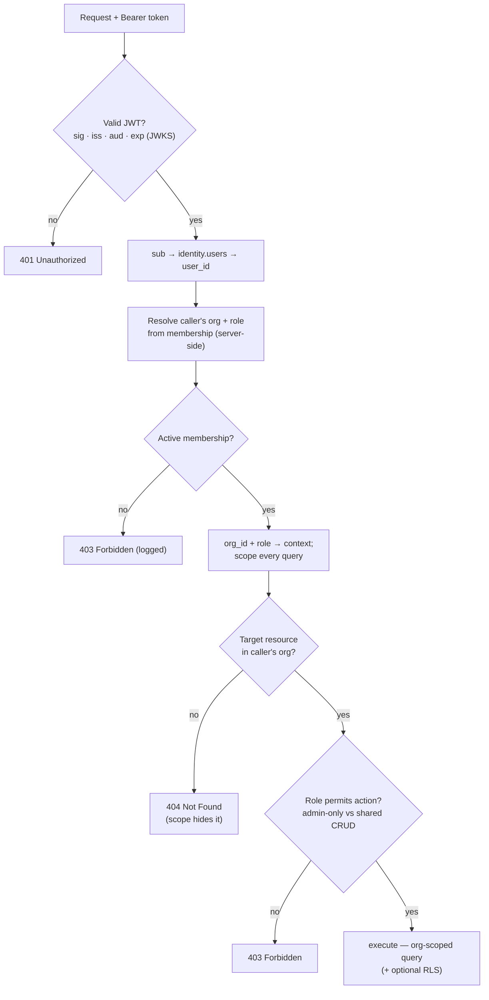

# Authentication, Authorization & Offline Login

> **Status:** High-Level Design (HLD) for v1 — the target the M0 build realizes; refined toward
> as-built as services land. Builds on
> [service-decomposition.md](service-decomposition.md), [data-model.md](data-model.md) and
> [api-contracts.md](api-contracts.md). Intent lives in [../../requirements/](../../requirements/).

**Issue:** #109 · **Epic:** #103 (EPIC-DESIGN) · **Milestone:** M0
**Requirements:** NFR-SEC-1, NFR-ROL-1, NFR-ROL-2, FR-TEN-1, FR-TEN-2, FR-ONB-1/2/3, FR-OF-1, NFR-AI-4
**Decisions:** [D-7](../../requirements/decisions.md#d-7) (Authentik, IdP-agnostic OIDC boundary),
[D-3](../../requirements/decisions.md) (org creator = admin, invite by email),
[D-5](../../requirements/decisions.md) (Flutter/Go/React), [D-10](../../requirements/decisions.md) (PWA-first)
**Resolves:** [Q-AUTH](../../requirements/open-questions.md), [Q-ROLE](../../requirements/open-questions.md)
**Depends on:** #104, #105, #108 · **ADR:** [0004-authn-authz](../adr/0004-authn-authz.md),
[0016-replace-keycloak-with-authentik](../adr/0016-replace-keycloak-with-authentik.md)
**Frozen integration contract:** [oidc-integration.md](oidc-integration.md) — the exact issuer,
discovery, `sub`/`aud`, endpoints, blueprint and naming every workstream builds against. This
document is the **provider-neutral design model**; that one pins the **Authentik** values.

---

## 1. Scope

How a user **proves who they are** (authentication) and **what they may do** (authorization) in
v1, plus **offline login**. Concretely, this document specifies:

- the **OIDC provider** (an Authentik application + OAuth2 provider, D-7) and its role model
  (NFR-ROL) — held behind an **IdP-agnostic boundary**: the app depends only on standard OIDC
  (discovery + JWKS + standard claims), so the provider is a **swappable deployment detail**
  ([ADR-0016](../adr/0016-replace-keycloak-with-authentik.md), [oidc-integration.md §1](oidc-integration.md));
- **JWT validation via JWKS** in the shared Go middleware (the authN every service runs);
- the **app-layer, org-scoped authorization** model — membership + resource ownership (FR-TEN) —
  that sits **on top of** the IdP's coarse identity, and **how `organization_id` is derived from the
  token + membership** (the hand-off [ADR-0002](../adr/0002-multi-tenancy.md) and
  [data-model.md §5](data-model.md#5-multi-tenancy-model-fr-ten) defer here);
- **offline-login** token/JWKS caching and the **grace window** (D-7) — a **native-phase** concern
  (D-10), designed now so the architecture everyone depends on is settled;
- the lifecycle pieces that close **Q-AUTH**: email verification, password reset, token lifetimes.

It **does not** build anything — physical provider config, the middleware code, and tests are built in
**EPIC-00 / EPIC-01** ([#24](https://github.com/TiagoJVO/beekeepingit/issues/24),
[#28](https://github.com/TiagoJVO/beekeepingit/issues/28),
[#30](https://github.com/TiagoJVO/beekeepingit/issues/30)) and **EPIC-14**
([#15](https://github.com/TiagoJVO/beekeepingit/issues/15), secrets + SMTP). This design **de-risks**
the authZ middleware every domain service depends on.

> **Provider swap (Keycloak → Authentik).** This design was originally written against Keycloak;
> [D-7](../../requirements/decisions.md#d-7) was revised to **Authentik** behind the same
> provider-agnostic OIDC boundary ([ADR-0016](../adr/0016-replace-keycloak-with-authentik.md)). The
> two-layer authZ + offline model below is **unchanged** — it never depended on the provider. Only
> the concretes moved: a Keycloak _realm_ → an **Authentik application + OAuth2 provider** provisioned
> by a **blueprint**; the `keycloak_sub` projection column → **`oidc_sub`**; logout from a
> refresh-token POST → a **front-channel `end_session` redirect**. The exact fixed values live in the
> frozen [oidc-integration.md](oidc-integration.md); this document describes the model neutrally and
> notes the Authentik specifics inline.

---

## 2. The two-layer model at a glance

Authentication and authorization are **deliberately split** across two systems of record, so each
concern is owned where it belongs:

| Layer                  | Question                                                      | System of record                            | Mechanism                                                                                 |
| ---------------------- | ------------------------------------------------------------- | ------------------------------------------- | ----------------------------------------------------------------------------------------- |
| **AuthN** (identity)   | _Is this a valid, authenticated user?_                        | **OIDC provider** (Authentik, D-7)          | OIDC login → signed **JWT**; services verify it via **JWKS**                              |
| **AuthZ** (org-scoped) | _In which org, with what role, may they touch this resource?_ | **`organizations` service** (`memberships`) | **App-layer** check on every request — derive `organization_id` + role, scope every query |

**Why split it:** an IdP's global roles/groups are **global to a user**, but our access rules are
**per-organization** (a person can be **admin of org A and a plain user of org B** in the multi-org
future, Context [C-1](../../requirements/context.md#c-1--single-organization-now-multi-organization-later)).
Org **membership and resource ownership are domain data** owned by the `organizations` service
([service-decomposition.md §3](service-decomposition.md#3-bounded-contexts--services)) and change
often (invite/remove/promote). Encoding them in the IdP would couple the domain to the provider and go
**stale** against cached/offline tokens. So the IdP does **authN + identity (+ a coarse global
marker)**; the **org-scoped role and tenancy** are resolved in the app from the database — exactly
D-7's _"app-level org-scoped authorization layered on top (FR-TEN)."_

This authZ layer is **the producer of the `organization_id`** that the whole multi-tenancy model
([ADR-0002](../adr/0002-multi-tenancy.md)) consumes: _layer 1 app-scoping_, _layer 2 optional RLS_,
and the _org-scoped sync slice_ all key off the `organization_id` resolved here.

---

## 3. OIDC provider — application, client & roles (D-7, NFR-ROL)

> The concrete values below (issuer, client id, blueprint) are **fixed in the contract**,
> [oidc-integration.md §3–§5](oidc-integration.md#3-provider-authentik-application--oauth2-provider).
> This section explains the **model**; that one is authoritative for the exact strings.

### 3.1 Application & realm-equivalent

The provider is **[Authentik](https://goauthentik.io/)** (D-7), self-hosted on the k8s cluster
([subchart `authentik`](service-decomposition.md#7-single-cluster-topology--helm-subchart-list-nfr-arc-3--d-6)).
Its unit of tenancy is an **application** (slug **`beekeepingit`**) fronting an **OAuth2 provider** —
the analogue of a Keycloak _realm + client_. It serves **all** end users and is **social/SSO-ready
later** (add federation sources without touching services, since services only ever see standard OIDC
tokens). The provider is provisioned declaratively by a **blueprint** (the analogue of a Keycloak
realm import — see §8.5, [oidc-integration.md §8](oidc-integration.md#8-deployment-infra)).
Provider config (login/branding flows, password policy, token lifetimes, SMTP) beyond that blueprint
is managed as infrastructure in **EPIC-14** ([#15](https://github.com/TiagoJVO/beekeepingit/issues/15));
no provider secrets live in the repo (NFR-SEC, EPIC-14).

### 3.2 Clients

| Client               | Type                   | Flow                          | Used by                                                                                                                                                                                          |
| -------------------- | ---------------------- | ----------------------------- | ------------------------------------------------------------------------------------------------------------------------------------------------------------------------------------------------ |
| `beekeepingit-pwa`   | **public** (no secret) | **Authorization Code + PKCE** | Flutter **PWA** now, native app later — same flow (`openid_client` core on web, `flutter_appauth` on native, per [tech-stack.md](../../requirements/tech-stack.md#client--flutter-webpwa-first)) |
| `beekeepingit-admin` | **public** (no secret) | **Authorization Code + PKCE** | React **Admin App** (online-only, NFR-ROL-2)                                                                                                                                                     |

The provider client id the services expect is **`beekeepingit-pwa`** — Authentik's default `aud`
is the client id, so `OIDC_AUDIENCE=beekeepingit-pwa` ([oidc-integration.md §4](oidc-integration.md#4-subject--audience--the-two-claim-decisions)).

**Domain services are OAuth2 _resource servers_, not login clients** — they **validate** bearer
tokens (§4) and never initiate a login. A **confidential service-account client** would be introduced
**only** where a service must call the provider's **admin API** (e.g. `organizations` triggering a
provider-side invite email, if we ever choose the IdP over our own SMTP for invitations — otherwise not
needed). Public clients + PKCE (no embedded secret) is the correct choice for a SPA/PWA and a mobile
app, where a client secret cannot be kept confidential.

### 3.3 Roles — coarse in the IdP, org-scoped in the app

> **Key decision.** The IdP carries only a **coarse, global** marker; the **admin/user distinction
> that matters is per-organization** and lives in `organizations.memberships.role`, **not** in the
> token. See [ADR-0004](../adr/0004-authn-authz.md).

- **IdP groups/roles** are kept minimal: every end user is simply an **authenticated user**. An
  optional **`platform-operator`** — an Authentik **group** (not a realm role, not an app role) —
  exists for **operations/superadmin** (managing the IdP/infra); it is an **ops concern, not a v1
  application role**, and the app's authZ path never reads it.
- **The application role `admin` / `user` (NFR-ROL-1) is the _membership_ role** — a property of the
  **(user, organization)** pair in `organizations.memberships` (see
  [data-model.md §3](data-model.md#3-entityrelationship-model)). It is **resolved per request**
  against the **active organization** (§5), never read from the token.
- **Role management (NFR-ROL-1 "assign roles to users")** is therefore **membership management** in
  the **`organizations` service**, surfaced in the **Admin App** (NFR-ROL-2) — not IdP
  role/group assignment for end users. (The IdP's own group admin is an ops/console task.)

This satisfies NFR-ROL-1 ("every user has a role; roles `admin`/`user`; manage role assignment")
while keeping the **org-scoped** semantics FR-TEN needs, and leaves NFR-ROL-1's "more roles may exist
later" open (add membership roles, or adopt ReBAC — §5.5 — without re-plumbing authN).

### 3.4 Token & claims

Services consume the **access token** (JWT, **RS256**). We rely on **standard OIDC claims** and
**deliberately keep org/role _out_ of the token**:

| Claim                                          | Use                                                                                                                                                                                                                      |
| ---------------------------------------------- | ------------------------------------------------------------------------------------------------------------------------------------------------------------------------------------------------------------------------ |
| `sub`                                          | OIDC subject → maps to `identity.users.oidc_sub` ([data-model.md](data-model.md#3-entityrelationship-model)) — the stable user identity. Set via Authentik `sub_mode: user_upn` = an **app-assigned UUID** (contract §4) |
| `email`, `email_verified`                      | profile (FR-ONB-1); gate on verification if required (`email_verified` caveat below)                                                                                                                                     |
| `preferred_username`, `name`, `groups`         | profile / i18n (EN-PT, NFR-I18N); `groups` carries the ops-only marker (§3.3)                                                                                                                                            |
| `iss`, `aud`/`azp`, `exp`, `nbf`, `iat`, `kid` | validation inputs (§4)                                                                                                                                                                                                   |

**Why no `organization_id` / org-role claim:** membership is **domain data that changes** and a token
is **long-ish lived and cached offline** — an embedded org/role would go **stale** (e.g. a removed
member would keep access until token expiry). The **active org is also a per-request choice** in the
multi-org future. So the app resolves org + role from the **database** on each request (§5), keeping
the `organizations` service authoritative. _(Alternative — an IdP protocol/property mapper that injects
memberships — is weighed and rejected in [ADR-0004](../adr/0004-authn-authz.md).)_

> **`sub` is provider-neutral, UUID-backed.** The app treats `sub` as an opaque stable identifier.
> Under Authentik it is set to each user's `attributes.upn` (an app-assigned UUID), which keeps it
> **stable, immutable, non-PII and reproducible** for the dev/CI seed — the reasoning and the seed
> value are pinned in [oidc-integration.md §4](oidc-integration.md#4-subject--audience--the-two-claim-decisions).
> `family_name`/`locale` are **absent** by default; the app collects profile (name/locale) during
> onboarding (FR-ONB-1) rather than depending on IdP profile claims.

---

## 4. AuthN — JWT validation via JWKS in the shared Go middleware

Every domain service is an **OAuth2 resource server** and validates the bearer token on **every**
request, in the **shared service-template middleware** (so validation is identical everywhere — the
template mandated by [coding-standards](../../.claude/rules/coding-standards.md)). Validation uses
`coreos/go-oidc` over the provider's **OIDC discovery document**
(`/.well-known/openid-configuration` → the `jwks_uri` it advertises), per
[tech-stack.md](../../requirements/tech-stack.md#backend--go-microservices). Nothing in the
middleware is provider-specific — no vendor URL scheme is hard-coded; endpoints are **read from
discovery** ([oidc-integration.md §1, §6](oidc-integration.md#6-backend-contract-go-services)).

**On each request the middleware checks:**

1. **Signature** — RS256 against the provider **JWKS**; keys are **cached** and refreshed periodically
   and **on an unknown `kid`** (so IdP **key rotation** is handled without downtime). The cached
   JWKS is also what makes **offline validation** possible (§7).
2. **Issuer** (`iss` = the provider's issuer URL), **audience** (`aud`/`azp` = the expected client
   `beekeepingit-pwa`), and **time** (`exp`/`nbf`/`iat` within skew).
3. **Required claims present** (`sub` at minimum); optionally **`email_verified`** where a flow
   demands it.

**Internal-discovery / external-issuer split.** A browser token's `iss` is the **external** auth-host
URL, which services can't reach in-cluster over HTTPS. So each service **fetches discovery from the
internal `authentik-server` Service** (plain HTTP, no forwarding headers) — Authentik **derives the
issuer from the request host**, so the internal fetch yields an **internal `jwks_uri`** (reachable
in-cluster) while the token's **external `iss` is still trusted**, bridged by go-oidc's
`InsecureIssuerURLContext`. This is the same split Keycloak needed, but **without any `KC_HOSTNAME`-style
config** — Authentik's request-host issuer removes the extra knob (env: `OIDC_ISSUER_URL` external,
`OIDC_DISCOVERY_URL` internal; [oidc-integration.md §6](oidc-integration.md#6-backend-contract-go-services)).

On success it builds a **security context** (`sub`, `user_id`, email, raw claims) and passes it to
the **authZ** stage (§5). On failure → **401 Unauthorized**.

**Edge + per-service (defense in depth).** The **gateway** may validate the JWT at the edge (fail
fast, NFR-ARC), but **each service still validates** — services **do not trust** the network or the
edge alone (zero-trust between services). This finalizes the "JWT validation at the edge and/or per
service" left open in
[service-decomposition.md §6](service-decomposition.md#6-c4-view--level-2-container).

```mermaid
sequenceDiagram
    actor U as Beekeeper
    participant C as Flutter PWA
    participant KC as Authentik (OIDC IdP)
    participant GW as API Gateway
    participant S as Domain service (Go)
    participant DB as Postgres

    U->>C: open app
    C->>KC: Authorization Code + PKCE (redirect)
    KC-->>C: ID + access + refresh tokens (JWT)
    Note over C: cache tokens (incl. id_token) in secure storage
    C->>GW: REST + Bearer access token
    GW->>S: forward (optional edge JWT check)
    S->>KC: fetch discovery + JWKS (internal Service; refetch on new kid)
    S->>S: verify JWT — sig / iss / aud / exp → sub
    S->>DB: resolve membership (sub → user) → org_id + role
    alt no org membership
        S-->>C: 403 Forbidden
    else member
        Note over S: org_id + role in request context
        S->>DB: org-scoped query (organization_id = org_id)
        S-->>C: 200 (or 404 if target is outside the org)
    end
```

---

## 5. AuthZ — app-layer, org-scoped authorization (FR-TEN)

This is the layer **beyond the IdP's coarse identity** that the issue calls for. It runs **after** a
valid token (§4) and decides org scope, role, and resource access.

### 5.1 Deriving `organization_id` from token + membership

This is the precise mechanism that [ADR-0002](../adr/0002-multi-tenancy.md#follow-ups) and
[data-model.md §5](data-model.md#5-multi-tenancy-model-fr-ten) defer to #109. It also honors the
contract rule that **tenancy is derived server-side, never a client parameter**
([api-contracts.md §9](api-contracts.md#9-auth--tenancy-in-the-contract-d-7-adr-0002)):

1. **Token → user.** The verified `sub` maps to `identity.users` (by `oidc_sub`) → `user_id`.
2. **Resolve the org from membership — server-side.** The caller's `organization_id` is **never a
   client parameter** (not a header, query, or body field). In v1 each user belongs to a **single
   organization** (C-1), so `organizations.memberships` resolves it unambiguously. The one place an
   org id appears in a URL is an org-**management** resource (`/organizations/{orgId}/…`), where the
   service **asserts `{orgId}` matches the caller's membership** — the path never _widens_ scope
   ([api-contracts.md §9](api-contracts.md#9-auth--tenancy-in-the-contract-d-7-adr-0002)). Multi-org
   "active org" selection is a deferred future concern and will still derive scope from membership,
   not a trusted client claim.
3. **Look up membership** for **(`user_id`, `status = active`)** → the authoritative
   **`organization_id`** and **role** (`admin`/`user`). A caller with **no active membership → 403**
   (logged, per [#28](https://github.com/TiagoJVO/beekeepingit/issues/28)); a resource **outside the
   caller's org → 404** (not 403) so the API never confirms its existence (api-contracts.md §9).
4. **Inject org context.** `organization_id` + `role` go into the request context; the **typed query
   layer scopes every query** by `organization_id` (ADR-0002 **layer 1**), optionally setting
   `app.current_org` for **RLS** (ADR-0002 **layer 2**). A query without an org filter is a bug.

Membership resolution is a hot path → **cache** it briefly (short TTL, per-instance) keyed by
(`user_id`, `organization_id`); invalidate on membership change. Whether services call the
`organizations` service or read a replicated membership projection is an
[#108](https://github.com/TiagoJVO/beekeepingit/issues/108)/`#28` build detail — the **rule** (active
membership ⇒ org + role) is fixed here.

### 5.2 The authorization pipeline



### 5.3 Role capabilities — `admin` vs `user` (resolves Q-ROLE)

**`admin` is org-scoped** (D-3: the org creator is its first admin). Within an organization:

| Capability                                                               | `user` | `admin`            |
| ------------------------------------------------------------------------ | ------ | ------------------ |
| Full CRUD on **apiaries, activities, journeys, todos** (org-shared data) | ✓      | ✓                  |
| Use the **AI assistant**; view **history** (FR-HIS)                      | ✓      | ✓                  |
| Manage **members** — invite / remove (FR-ONB-3, D-3)                     | —      | ✓                  |
| Assign **membership roles** (promote/demote `admin`/`user`)              | —      | ✓                  |
| Edit **organization** settings; manage **invitations**                   | —      | ✓                  |
| Manage **quotas / rate-limits** (NFR-RL-1)                               | —      | ✓ _(deferred D-4)_ |

The **canonical management surface** is the **Admin App** (NFR-ROL-2, web, online-only); the
PWA/native client focuses on field features. **Admin-only operations are rejected for non-admins**
([#28](https://github.com/TiagoJVO/beekeepingit/issues/28) AC) — the **organizations** OpenAPI
contract already encodes this: `role` is the open enum `[admin, user]` and the member/invitation
endpoints are admin-only (`403` for a `user`), with `{orgId}` asserted against membership
([`organizations.openapi.yaml`](../../contracts/openapi/organizations.openapi.yaml)). There is **no system-wide application
admin** in v1 — a platform super-admin is the **`platform-operator`** ops group (§3.3), not an app
role; NFR-ROL-1's "more roles later" can add one when needed. _This resolves
[Q-ROLE](../../requirements/open-questions.md) (admin = org-scoped)._

### 5.4 Resource ownership (FR-TEN-2)

Isolation is at the **organization** level, not per user (Q-TEN, settled in
[FR-TEN-2](../../requirements/functional-requirements.md#tenancy--data-ownership-fr-ten)): **all
members share the org's data**. So a member may **edit another member's** apiary/activity — but every
change **records the actor** in history (FR-HIS-1), and each activity is still stamped with the
**performing user** (`activities.performed_by`). The org-scoping in §5.1 is itself the primary
ownership control: a resource from another org **isn't visible**, so cross-org access returns
**`404`** (not `403` — the API doesn't confirm the resource exists;
[api-contracts.md §9](api-contracts.md#9-auth--tenancy-in-the-contract-d-7-adr-0002)). A stricter
_per-record_ rule (e.g. only the performer or an admin may edit a given activity) is **not v1** but
fits this model as a future per-resource policy.

### 5.5 When app-layer scoping isn't enough (future)

If fine-grained **sharing** appears (e.g. sharing one apiary across orgs, per-resource ACLs,
relationship-based access), adopt a dedicated **ReBAC** service — **OpenFGA / Ory Keto** — already
flagged in [tech-stack.md](../../requirements/tech-stack.md#identity--authentik-behind-a-provider-agnostic-oidc-boundary).
It slots **after** authN as an extra authZ check; the org-scoping here remains the baseline. **Not
needed for v1.**

---

## 6. Offline login — token & JWKS caching + grace window (D-7)

> **Phase note (D-10).** Offline _data capture_ works in **every** phase via the replicated slice
> (§6.4). Offline **login** — opening the app with **no connectivity at all** — is a **native-phase**
> concern (the PWA still needs an online redirect for a _fresh_ login). Per the issue, it is
> **designed now** so the token/JWKS handling everyone builds on is settled.

### 6.1 PWA phase vs native phase

- **PWA (now):** login is an **OIDC redirect to the provider → online**. Once authenticated, the
  **refresh token** + replicated data let the app **work offline**, but a **cold first login** needs
  connectivity. Browser/PWA **token persistence** (IndexedDB/OPFS, weakest on iOS) is the risk to
  validate — tracked with **SP-1** PWA-persistence in
  [tech-stack.md](../../requirements/tech-stack.md#open-spikes).
- **Native (later):** full **offline login** via secure on-device token + JWKS caching, below.

### 6.2 What is cached, and where

On a successful **online** login the client caches, in **platform secure storage**
(Keychain / Keystore via `flutter_secure_storage`) — **never** plain local storage:

- the **refresh token**, current **access token**, and the **`id_token`** (needed as the
  `id_token_hint` for front-channel logout, §7);
- the **OIDC discovery document + JWKS** (the provider's **public** signing keys);
- the **user identity** (`sub`, profile, last-known **membership/role** for the active org).

### 6.3 Grace window & refresh

- **App open, online:** silently **refresh** the access token (refresh-token rotation) and re-pull
  **JWKS**. Normal path.
- **App open, offline:**
  - **valid (unexpired) access token** → use it;
  - **expired but within the offline grace window** → **validate the cached token's signature against
    the cached JWKS locally** and check the cached identity; treat the session as valid for
    **reads + local writes** (writes **queue** to the sync engine, D-6).
  - **grace window exceeded, or refresh token expired/revoked** → **require interactive online
    re-login**.
- **Grace window (proposed default ≈ 14–30 days, configurable).** Field trips can be long
  (FR-OF-1, FR-UX), so the window is generous, balanced against security; tune in **EPIC-14** with
  security review. **JWKS** is refreshed whenever online; offline, an old key keeps validating within
  the window (IdP signing keys rotate slowly — acceptable).

### 6.4 Offline ≠ a server-authorization bypass (the security rule)

The grace window is a **local UX affordance, not server authorization.** Queued offline writes are
**re-authorized by the server at sync time** against the **then-current** token + membership — the
**server stays authoritative** ([ADR-0002](../adr/0002-multi-tenancy.md); atomic write-back D-12,
[#106](https://github.com/TiagoJVO/beekeepingit/issues/106)). Consequences:

- **Revocation is eventual:** a removed/disabled member retains **local** access until the grace
  window lapses or they reconnect, but **gains nothing server-side** — the next sync re-checks
  membership and **rejects** unauthorized pushes (notify-and-fix, FR-OF-2). This trade-off is
  explicit and acceptable for a field-first app.
- Tokens live **only** in the secure enclave; a compromised device is the threat model EPIC-14 owns.
- **The local-data replica is bounded separately from the token grace window:** losing org
  membership also **purges the on-device local store** (not just the cached token) at the next
  app start or reconnect — [sync.md §3.5](sync.md#35-local-data-lifecycle--purge-on-logout--membership-loss-125)
  (#125). The two mechanisms are independent: a token can still be within its grace window while
  the replicated data it would have unlocked is already gone.

### 6.5 Tenancy holds offline

Offline, the client reads its **replicated org slice**, which the sync engine already publishes
**org-scoped** (and user-scoped where activity ownership requires) — ADR-0002 **layer 3**. So **no
cross-org data is on the device** to begin with, and the **last-synced membership/role** governs the
offline UI; changes reconcile on the next sync. Tenancy is preserved **without** a server round-trip.

```mermaid
sequenceDiagram
    actor U as Beekeeper
    participant C as Flutter app (native)
    participant SS as Secure storage
    participant L as Local SQLite (org slice)

    U->>C: open app (offline)
    C->>SS: read cached access token + JWKS
    alt token valid OR within offline grace window
        C->>C: verify token signature vs cached JWKS; check identity
        C->>L: read replicated org-scoped slice
        C-->>U: app usable — reads + local writes
        Note over C,L: writes queue locally;<br/>server re-authorizes at next sync
    else grace window exceeded / refresh expired / revoked
        C-->>U: require online re-login
    end
```

---

## 7. Lifecycle details (closes Q-AUTH)

The remaining open items in [Q-AUTH](../../requirements/open-questions.md) (beyond the D-7 mechanism)
are settled by **using the provider's built-in flows** plus the token policy above — **no custom auth
build**. Under Authentik, verification/recovery/SMTP are **provider flows configured in EPIC-14**
(not yet built); the fixed contract values are in
[oidc-integration.md §5, §7](oidc-integration.md#7-client-contract-flutter-web-pwa):

| Item                          | Decision                                                                                                                                                                                                                                                                                                                                                                                                                                                                                                                                                 |
| ----------------------------- | -------------------------------------------------------------------------------------------------------------------------------------------------------------------------------------------------------------------------------------------------------------------------------------------------------------------------------------------------------------------------------------------------------------------------------------------------------------------------------------------------------------------------------------------------------- |
| **Email verification**        | An **Authentik flow** (EPIC-14, not built yet); App may gate sensitive flows on `email_verified`. **Caveat:** Authentik's default email mapping hardcodes `email_verified: true` (**cosmetic** — it does not reflect true verification state). With **registration disabled** and admin/invite-provisioned accounts, **registration-disabled is the actual control**; a mapping reflecting real state + SMTP land in EPIC-14.                                                                                                                            |
| **Password reset**            | An **Authentik recovery flow** (self-service, email link) — **not built in v1**; provisioned in EPIC-14 ([#15](https://github.com/TiagoJVO/beekeepingit/issues/15)) with SMTP. No recovery flow ships by default.                                                                                                                                                                                                                                                                                                                                        |
| **Registration**              | Credential auth via the provider; **registration is disabled** (no app-bound enrollment flow). **First login** triggers **profile creation** (FR-ONB-1, `identity`) and **org create/join** (FR-ONB-2/3, D-3, `organizations`) — which creates the **membership** authZ depends on.                                                                                                                                                                                                                                                                      |
| **Account / password change** | The client links out to Authentik's user settings — **`OIDC_ACCOUNT_URL` = `https://auth.beekeepingit.local:8443/if/user/#/settings`** (a config value, not a derived path), replacing Keycloak's `/account` console.                                                                                                                                                                                                                                                                                                                                    |
| **Access-token lifetime**     | **short, ≈ 15 min** (limits exposure; forces refresh). Blueprint validity **`minutes=15`** (Django-timedelta string). _Exact value still tuned/security-reviewed in EPIC-14._                                                                                                                                                                                                                                                                                                                                                                            |
| **Refresh / SSO session**     | **≈ 30 days** (field convenience). Blueprint validity **`days=30`**. _Exact value still tuned/security-reviewed in EPIC-14._                                                                                                                                                                                                                                                                                                                                                                                                                             |
| **Offline grace window**      | **≈ 14–30 days** (native, §6.3). _Proposed; tune in EPIC-14._ Native-phase (D-10) — out of scope for the PWA-phase hardening pass.                                                                                                                                                                                                                                                                                                                                                                                                                       |
| **Logout**                    | **Front-channel `end_session` redirect** — a **GET** to the provider's `end_session_endpoint` with `id_token_hint` (the persisted `id_token`, §6.2) + `post_logout_redirect_uri`, clearing the **server-side SSO cookie** at the IdP. Local state is cleared **first** so offline logout still degrades to locally-logged-out. This **replaces Keycloak's refresh-token POST**. Logout also invalidates the local PowerSync database so a second user on the same shared device doesn't see the previous session's replicated rows before the next sync. |

> Lifetimes are **starting points**, to be confirmed against a **security review** (EPIC-14, #15) and
> field-UX testing — not hard requirements. The blueprint sets these as concrete validities rather
> than provider defaults, but they remain **subject to EPIC-14 sign-off**.

---

## 8. Open questions, risks & hand-offs

| Item                                           | Effect on this design                                                | Resolved / built in                                                                                                     |
| ---------------------------------------------- | -------------------------------------------------------------------- | ----------------------------------------------------------------------------------------------------------------------- |
| [Q-AUTH](../../requirements/open-questions.md) | mechanism (D-7) + offline login, token lifetimes, verification/reset | **Resolved here** (§4, §6, §7)                                                                                          |
| [Q-ROLE](../../requirements/open-questions.md) | admin org-scoped vs system-wide; capability split                    | **Resolved here** (§5.3) — org-scoped                                                                                   |
| **Token-lifetime / grace values**              | exact minutes/days need security sign-off                            | EPIC-14 ([#15](https://github.com/TiagoJVO/beekeepingit/issues/15))                                                     |
| **PWA token persistence (iOS)**                | durability of cached session in a PWA                                | SP-1 (PWA persistence), [#54](https://github.com/TiagoJVO/beekeepingit/issues/54)                                       |
| **Membership read path**                       | services call `organizations` vs read a replicated projection        | [#108](https://github.com/TiagoJVO/beekeepingit/issues/108) / [#28](https://github.com/TiagoJVO/beekeepingit/issues/28) |
| **Offline revocation latency**                 | removed member keeps **local** access within grace window            | accepted (§6.4); server re-auth at sync                                                                                 |
| **Fine-grained sharing**                       | per-resource / cross-org ACLs                                        | future — OpenFGA/Keto (§5.5), not v1                                                                                    |

**Hand-off to build (this design de-risks them):**
[#24](https://github.com/TiagoJVO/beekeepingit/issues/24) (provider application/client + OIDC login),
[#28](https://github.com/TiagoJVO/beekeepingit/issues/28) (roles + org-scoped middleware),
[#30](https://github.com/TiagoJVO/beekeepingit/issues/30) (tenancy enforcement),
[#15 EPIC-14](https://github.com/TiagoJVO/beekeepingit/issues/15) (secrets, provider flow config, SMTP,
security review). The middleware here is also the **producer** of the `organization_id` consumed by
[#30](https://github.com/TiagoJVO/beekeepingit/issues/30) /
[data-model.md §5](data-model.md#5-multi-tenancy-model-fr-ten).

---

## 8.5 As built (Authentik) — and the #24 Keycloak baseline it replaced

> **As built on Authentik (D-7 → Authentik, [ADR-0016](../adr/0016-replace-keycloak-with-authentik.md)).**
> #24 originally hardened this slice **against Keycloak** (a realm import, an RP-initiated
> refresh-token-POST logout). The provider swap re-lands the same guarantees on **Authentik**, now
> merged across all three code workstreams — **infra** (WS-A blueprint), **backend** (WS-B `oidc_sub`
> rename), and **client** (WS-C discovery-driven OIDC + front-channel logout). The rows below reflect
> the Authentik reality; the frozen values are in [oidc-integration.md](oidc-integration.md).

| §7/§3.3 item                                    | Where it landed                                                                                                                                                                                                                                                                                                                                                                                                                                                                                                                                                    |
| ----------------------------------------------- | ------------------------------------------------------------------------------------------------------------------------------------------------------------------------------------------------------------------------------------------------------------------------------------------------------------------------------------------------------------------------------------------------------------------------------------------------------------------------------------------------------------------------------------------------------------------ |
| **Logout — server-side SSO revoke (NFR-SEC-1)** | [`client/lib/core/auth/auth_controller.dart`](../../client/lib/core/auth/auth_controller.dart) `logout()` revokes the **server-side SSO session**, not just local tokens, and degrades to local-only clearing offline (D-10). It performs a **front-channel `end_session` GET** to the **discovered** `end_session_endpoint` with `id_token_hint` (the persisted `id_token`, §6.2) + `post_logout_redirect_uri`, clearing local state first — driven off OIDC discovery, not a hard-coded path (replacing #24's refresh-token POST to Keycloak's logout endpoint). |
| **PowerSync disconnect on logout**              | Same `logout()` invalidates [`powerSyncProvider`](../../client/lib/core/sync/powersync_service.dart) (its existing `onDispose` already calls `disconnect()`+`close()`) so a second user on shared hardware doesn't see stale replicated rows before the next sync                                                                                                                                                                                                                                                                                                  |
| **Defensive local-session sweep**               | `logout()` clears all local session-storage keys (PKCE verifier, OAuth state, tokens), not just the refresh token, covering an abandoned mid-flow login                                                                                                                                                                                                                                                                                                                                                                                                            |
| **`platform-operator` group**                   | The Authentik **blueprint** ([`charts/authentik/files/beekeepingit.blueprint.yaml`](../../infra/helm/beekeepingit/charts/authentik/files/beekeepingit.blueprint.yaml)) declares a `platform-operator` **group** — unassigned, ops-only, per §3.3 (**not** an app role, and **not** literal `admin`/`user` roles — see the AC note below)                                                                                                                                                                                                                           |
| **Email verification (mapping)**                | Authentik's default email mapping hardcodes `email_verified: true` (**cosmetic**, §7); **registration disabled** is the real control. A mapping reflecting true state + SMTP land in EPIC-14 (#15)                                                                                                                                                                                                                                                                                                                                                                 |
| **Token lifetimes (blueprint validities)**      | Provider validity **`minutes=15`** (access) / **`days=30`** (refresh) in the blueprint (Django-timedelta strings) — the §7 proposed defaults, now concrete values; still subject to EPIC-14 security sign-off                                                                                                                                                                                                                                                                                                                                                      |
| **Branding (narrow scope)**                     | Blueprint application title/branding; a custom login-flow theme is **out of scope** (design-owned effort, follow-up if needed)                                                                                                                                                                                                                                                                                                                                                                                                                                     |
| **TLS to the IdP**                              | Local k3d dev serves the auth host over HTTPS at the gateway (`auth.beekeepingit.local:8443`, self-signed); some redirect URIs still allow plain `http://localhost` for dev. Trusted-CA TLS is EPIC-14                                                                                                                                                                                                                                                                                                                                                             |
| **Client-side tests**                           | [`client/test/core/auth/auth_controller_test.dart`](../../client/test/core/auth/auth_controller_test.dart) (login/PKCE, code exchange incl. CSRF-state rejection, token refresh, refresh-rejected, logout incl. session-revoke + offline-degrade); logout widget interaction in `client/test/widget_test.dart`; logout e2e in [`client/e2e/tests/slice.spec.ts`](../../client/e2e/tests/slice.spec.ts)                                                                                                                                                             |

**AC note (roles).** Issue #24's acceptance criteria literally reads "`admin` and `user` roles are
defined." Per §3.3's already-settled design (and ADR-0004), `admin`/`user` is the
**`organizations.memberships.role`** app-layer value, deliberately kept **out of** the IdP and out
of the token (staleness argument, §3.4) — adding them as literal IdP roles/groups would
contradict that design without adding capability. The AC's **intent** (a role model that supports
the admin/user distinction) is satisfied via the already-decided mechanism: only the ops-only
`platform-operator` group exists at the IdP layer; `admin`/`user` remains membership-scoped,
resolved server-side per request (§5.1).

---

## 8.6 As built (#26)

Organization creation (FR-ONB-2, FR-TEN-2, NFR-ROL-1) landed per §7's "Registration" row —
`POST /v1/organizations` creates the org and the creator's active `admin` membership in one DB
transaction (D-3), and `GET /v1/organizations/me`/`GET /v1/organizations/{orgId}` read it back.
One implementation detail worth recording here since it looks like it should use the shared
middleware but deliberately doesn't:

- **None of `organizations`' own `/v1` routes run behind `authn.NewOrgResolver`.** That
  middleware's second call (§5.1 step 3) is `GET /internal/memberships/active` on the
  **`organizations` service itself** — for every other domain service that's the correct
  east-west hop, but here it would be `organizations` calling back into its own process over
  HTTP to ask a question its own database already answers directly. Each handler instead
  resolves `sub → user_id` via one internal call to `identity` (§5.1 step 1) plus a direct
  `sqlc` lookup of `organizations.memberships` (step 3) — the same two facts, minus the
  redundant hop. See [`services/organizations/api/organizations.go`](../../services/organizations/api/organizations.go)'s
  package doc.
- This also sidesteps a real blocker: `NewOrgResolver` 403s a caller with **no** active
  membership, but `POST /organizations` must succeed for exactly that caller (a brand-new user
  onboarding). `GET /organizations/me` returning **404** (not 403) for "no org yet" is likewise
  deliberate — it's the signal the client's org-completion gate (mirrors the profile
  completeness probe, FR-ONB-1) distinguishes from every other failure.
- Membership invitations (FR-ONB-3, D-3's "invites others by email") land in #27 — see §8.7.

## 8.7 As built (#27)

Org membership listing + email invitations (FR-ONB-3, FR-TEN-2, NFR-ROL-1, D-3) landed as
`organizations.invitations` (new table, `data-model.md` §3's `INVITATIONS` shape) plus four
admin-only routes and one accept-on-login step:

- `GET /v1/organizations/{orgId}/members`, `GET`/`POST /v1/organizations/{orgId}/invitations`,
  `DELETE /v1/organizations/{orgId}/invitations/{invitationId}` — all require the caller to be
  an **active admin of exactly that org**: a different org (or no org at all) is 404 (§5.1's
  scope-hiding rule, unchanged), a same-org non-admin caller is 403 (§5.3's already-declared
  contract behavior — the OpenAPI spec listed this before either #26 or #27 had handlers).
- **Accept-on-login, not a separate "accept" endpoint.** FR-ONB-3's AC ("an invited user who
  logs in is joined to the inviting organization rather than prompted to create a new one") is
  implemented as a fallback inside `getMyOrganization` (§8.6): when the caller has no active
  membership, `organizations` looks up a pending invitation matching the caller's own email
  and, if found, accepts it and creates the membership at the invitation's role in one DB
  transaction — the same atomicity pattern as #26's create-org-and-membership. No client-visible
  "accept" operation exists; polling `GET /organizations/me` (which the org-completion gate
  already does) is what surfaces it.
- **The matched email is the JWT's verified `claims.Email` (+ `claims.EmailVerified` gate),
  never `identity.users.email`.** An earlier version of this matched against the internal
  `identity` resolve response's `email` field — but that field mirrors
  `identity.users.email`, the mutable profile value `PATCH /v1/profile` (#25) lets any caller
  set to an arbitrary string with no tie back to the IdP-verified identity. Matching on it would let a caller
  self-edit their profile email to someone else's pending invitation and auto-join that org at
  the invited role (including `admin`) without ever controlling that address — an
  unauthorized-org-join / privilege-escalation path found in #170 review. Fixed to use the
  token's verified `email` claim (§3.4) instead, gated on `email_verified` per §3.4's "gate
  sensitive flows on it" guidance: an unverified email is treated identically to "no pending
  invitation" (falls through to the ordinary 404), not a distinguishable error, so verification
  state isn't observable through this endpoint.
- **Single-org-per-user invariant, closed on both sides.** `POST /organizations` now checks
  for an existing active membership first and 409s rather than letting a direct API call give
  one user two active memberships (the client router gate already prevents the normal UI path
  from re-reaching org creation, but that's not a server-side guarantee by itself). The
  accept-on-login path only ever runs from the "caller has **no** active membership" branch,
  so it can't create a second membership for an already-a-member caller either.
- Member **removal**, invitation **expiry/re-invite**, and admin **transfer** are explicitly
  **not** built — D-3 and FR-ONB-3 both flag these as open detail beyond "implement the core
  invite/join now." `DELETE .../invitations/{id}` only revokes a still-**pending** invitation
  (not a way to remove an active member).
- History recording (FR-HIS-1) for invite/accept/revoke is deferred, same as #26; tracked in
  #165.

## 8.8 As built (#28)

Roles & permissions + the shared org-scoped authorization middleware (NFR-ROL-1, FR-TEN) landed
as a small addition on top of what #24–#27 already built, not a rebuild: §5.1's "role resolved per
request" was already implemented by `authn.NewOrgResolver` (`sub → user → active membership →
organization_id + role`, cached), and #27's `organizations/api/invitations.go` had already proved
out the role/org-scope check pattern (`requireOrgAdmin`) for its own admin-only routes. #28's job
was generalizing that pattern into a genuinely **shared** mechanism and closing the one real gap
— **denial logging** (§5.2's "403 Forbidden (logged)" was previously unimplemented; nothing in the
codebase logged an authz denial anywhere before this issue).

- **`authn.RequireRole(...roles)`** ([`services/servicetemplate/authn/authz.go`](../../services/servicetemplate/authn/authz.go)) —
  reusable role-gating middleware mounted after `NewOrgResolver`. Rejects a caller whose resolved
  `Claims.Role` isn't in the allow-list with `403` (§5.3: "admin-only operations are rejected for
  non-admins"); a request reaching it with no resolved role at all is a **wiring bug**, not a
  legitimate caller, and fails closed as `500` rather than silently admitting anyone. Every denial
  is logged via the request-scoped logger (`servicetemplate/logging.FromContext`), satisfying the
  AC's "the denial is logged" for the role dimension.
- **`authn.RequireOrgPath(orgIDParam, urlParam)`** (same file) — the generalized form of
  `requireOrgAdmin`'s "does `{orgId}` match my own resolved org" assertion (§5.1 step 2), for any
  future service exposing an org-management path parameter. Parses both sides as UUIDs before
  comparing (not a raw string match), matching every existing `{orgId}` handler. A mismatch is
  `404`, not `403` (ADR-0002 scope-hiding — the API never confirms another org's existence), and
  is logged the same way `RequireRole` is. `organizations/api/invitations.go`'s own
  `requireOrgAdmin` is left as-is (out of this issue's file ownership) — this is the mechanism new
  and future services build on, not a forced refactor of already-shipped, working code.
- **Denial logging also added to `NewOrgResolver` itself**
  ([`resolver.go`](../../services/servicetemplate/authn/resolver.go)): the two existing 403 cases
  (unknown user, no active membership) are now logged with the caller's verified `sub` and the
  problem detail — closing §5.2's "403 Forbidden (logged)" gap for the org-resolution step, not
  just the new role/path checks layered on top of it.
- **`services/apiaries`** wires `RequireRole("admin", "user")` into its middleware chain
  (`main.go`). Apiary CRUD is shared by both roles in v1 (§5.3 — there is no admin-only apiary
  operation), so this isn't gating any behavior differently than before; it's the explicit,
  auditable "the caller's role resolved to a known value" check the AC calls for, and it closes a
  latent gap where a wiring regression leaving `Role` unresolved would otherwise pass through
  unnoticed (the pre-existing `requireOrg` helper only ever checked `OrganizationID`).
  Cross-organization access attempts against `apiaries` — a second org's caller reading another
  org's apiary by id, listing apiaries, and attempting a sync-apply batch against another org's
  apiary id — are covered by new tests in
  [`services/apiaries/main_test.go`](../../services/apiaries/main_test.go)
  (`TestApiariesSlice_CrossOrg_*`); `apiaries` had org-scoped queries already (from the M0 slice)
  but no test had exercised the cross-org case before.
- **What #28 deliberately does not do:** it does not touch tenancy enforcement's own scope —
  `organization_id` on every owned row, the RLS decision, and tenancy-context propagation through
  the data layer are #30 (§8's hand-off table), tracked separately and building on the same
  `RequireRole`/`RequireOrgPath` mechanism where relevant.

## 8.9 As built (#30)

Tenancy enforcement (FR-TEN-2) closes out EPIC-01: confirming/automating what #28 already relied
on rather than building it fresh, and making the one call this design left open.

- **Every owned row carries `organization_id` — now automated, not just manually reviewed.**
  `dbaccess.UnscopedTables` ([`services/shared/dbaccess/tenancy.go`](../../services/shared/dbaccess/tenancy.go))
  queries `information_schema` for a service's schema and flags any base table missing the column
  (an exemption list covers the documented exceptions — a global identity table, or the tenant
  root itself). `services/apiaries`'s own test suite asserts this against its real migrated
  schema (`TestApiariesSchema_EveryOwnedTableCarriesOrganizationID`), so a future migration
  regresses in CI, not in a manual read. `identity`/`organizations` weren't touched (outside this
  issue's file ownership) — both were manually reviewed and are correctly scoped/exempt already
  (data-model.md §5's tenancy exception), but haven't yet adopted the automated check themselves;
  tracked in [#175](https://github.com/TiagoJVO/beekeepingit/issues/175).
- **Tenancy context propagation, end to end:** the verified token's `sub` → `authn.NewOrgResolver`
  → `Claims.OrganizationID` (§5.1) → each handler's own `requireOrg`-equivalent → an explicit
  `organization_id` parameter on every sqlc query. This path was already real (built alongside
  #23/#26–#28); #30's job was confirming and documenting it precisely, not introducing a new
  abstraction — a generic cross-service wrapper type would duplicate what sqlc's per-service
  generated params already enforce at compile time, for no added safety.
- **The RLS decision is made, not left silent:** deferred for v1, with the rationale recorded in
  [ADR-0002's RLS decision](../adr/0002-multi-tenancy.md#rls-decision-layer-2-resolved-in-30) and
  summarized in [data-model.md §5](data-model.md#5-multi-tenancy-model-fr-ten) — every service's
  DB role both owns its tables and runs its own queries (D-6's per-service role), so plain RLS
  would silently no-op for exactly the role executing every query; making it bind needs
  `FORCE ROW LEVEL SECURITY` plus separating table ownership from the query role, work this issue
  doesn't do given app-layer scoping (layer 1) and the sync publication (layer 3) are both already
  implemented and tested.
- **Cross-organization tests:** `services/apiaries/main_test.go`'s `TestApiariesSlice_CrossOrg_*`
  (added in #28, read/list/write) plus `services/organizations`'s existing
  `TestGetOrganization_OtherOrg_Returns404` together satisfy #30's "a user in organization A
  cannot read or modify organization B's data" AC across the services that own real domain data
  today. `activities`/`journeys`/`todos` don't exist yet (future EPICs) — their own cross-org
  tests land with those services, following this same pattern.

## 9. Acceptance-criteria traceability (#109)

- [x] **OIDC provider application + client + roles (`admin`/`user`)** documented (NFR-ROL) — §3
- [x] **JWT validation via JWKS** in the shared Go middleware specified — §4
- [x] **App-layer org-scoped authorization** (membership + resource ownership, FR-TEN) — beyond
      the IdP's coarse identity — §2, §5
- [x] **Offline-login** token/JWKS caching + **grace-window** design (native-phase, designed now per
      D-7) — §6
- [x] **Design + ADR** in `docs/` — this doc + [ADR-0004](../adr/0004-authn-authz.md),
      [ADR-0016](../adr/0016-replace-keycloak-with-authentik.md)

## 10. Links

- Builds on: [#104 service-decomposition](service-decomposition.md) ·
  [#105 data-model](data-model.md) · [#108 api-contracts](api-contracts.md) ·
  ADRs [0001](../adr/0001-service-decomposition.md), [0002](../adr/0002-multi-tenancy.md),
  [0003-api-contract-conventions](../adr/0003-api-contract-conventions.md)
- ADR: [0004-authn-authz](../adr/0004-authn-authz.md) ·
  Contracts: [`contracts/openapi/`](../../contracts/openapi/)
- Intent: [`requirements/decisions.md` D-7](../../requirements/decisions.md#d-7),
  [`requirements/tech-stack.md` — Identity](../../requirements/tech-stack.md#identity--authentik-behind-a-provider-agnostic-oidc-boundary)
- Frozen contract: [`docs/architecture/oidc-integration.md`](oidc-integration.md) ·
  ADR: [0016-replace-keycloak-with-authentik](../adr/0016-replace-keycloak-with-authentik.md)
- Next in EPIC-DESIGN: [#110](https://github.com/TiagoJVO/beekeepingit/issues/110)
  (walking-skeleton design — consolidates #104–#109)
