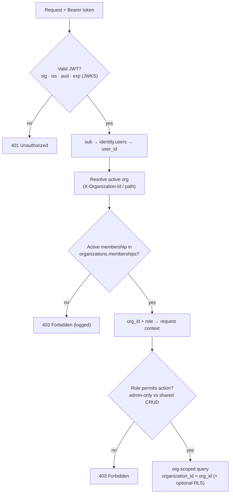

# Authentication, Authorization & Offline Login

> **Status:** High-Level Design (HLD) for v1 — the target the M0 build realizes; refined toward
> as-built as services land. Builds on
> [service-decomposition.md](service-decomposition.md) and
> [data-model.md](data-model.md). Intent lives in [../../requirements/](../../requirements/).

**Issue:** #109 · **Epic:** #103 (EPIC-DESIGN) · **Milestone:** M0
**Requirements:** NFR-SEC-1, NFR-ROL-1, NFR-ROL-2, FR-TEN-1, FR-TEN-2, FR-ONB-1/2/3, FR-OF-1, NFR-AI-4
**Decisions:** [D-7](../../requirements/decisions.md#d-7--identity--auth-keycloak-self-hosted) (Keycloak),
[D-3](../../requirements/decisions.md) (org creator = admin, invite by email),
[D-5](../../requirements/decisions.md) (Flutter/Go/React), [D-10](../../requirements/decisions.md) (PWA-first)
**Resolves:** [Q-AUTH](../../requirements/open-questions.md), [Q-ROLE](../../requirements/open-questions.md)
**Depends on:** #104, #105 · **ADR:** [0003-authn-authz](../adr/0003-authn-authz.md)

---

## 1. Scope

How a user **proves who they are** (authentication) and **what they may do** (authorization) in
v1, plus **offline login**. Concretely, this document specifies:

- the **Keycloak** realm, clients and role model (NFR-ROL, D-7);
- **JWT validation via JWKS** in the shared Go middleware (the authN every service runs);
- the **app-layer, org-scoped authorization** model — membership + resource ownership (FR-TEN) —
  that sits **on top of** Keycloak's coarse roles, and **how `organization_id` is derived from the
  token + membership** (the hand-off [ADR-0002](../adr/0002-multi-tenancy.md) and
  [data-model.md §5](data-model.md#5-multi-tenancy-model-fr-ten) defer here);
- **offline-login** token/JWKS caching and the **grace window** (D-7) — a **native-phase** concern
  (D-10), designed now so the architecture everyone depends on is settled;
- the lifecycle pieces that close **Q-AUTH**: email verification, password reset, token lifetimes.

It **does not** build anything — physical realm config, the middleware code, and tests are built in
**EPIC-00 / EPIC-01** ([#24](https://github.com/TiagoJVO/beekeepingit/issues/24),
[#28](https://github.com/TiagoJVO/beekeepingit/issues/28),
[#30](https://github.com/TiagoJVO/beekeepingit/issues/30)) and **EPIC-14**
([#15](https://github.com/TiagoJVO/beekeepingit/issues/15), secrets + SMTP). This design **de-risks**
the authZ middleware every domain service depends on.

---

## 2. The two-layer model at a glance

Authentication and authorization are **deliberately split** across two systems of record, so each
concern is owned where it belongs:

| Layer | Question | System of record | Mechanism |
|---|---|---|---|
| **AuthN** (identity) | *Is this a valid, authenticated user?* | **Keycloak** (D-7) | OIDC login → signed **JWT**; services verify it via **JWKS** |
| **AuthZ** (org-scoped) | *In which org, with what role, may they touch this resource?* | **`organizations` service** (`memberships`) | **App-layer** check on every request — derive `organization_id` + role, scope every query |

**Why split it:** Keycloak realm roles are **global to a user**, but our access rules are
**per-organization** (a person can be **admin of org A and a plain user of org B** in the multi-org
future, Context [C-1](../../requirements/context.md#c-1--single-organization-now-multi-organization-later)).
Org **membership and resource ownership are domain data** owned by the `organizations` service
([service-decomposition.md §3](service-decomposition.md#3-bounded-contexts--services)) and change
often (invite/remove/promote). Encoding them in the IdP would couple the domain to Keycloak and go
**stale** against cached/offline tokens. So Keycloak does **authN + identity (+ a coarse global
role)**; the **org-scoped role and tenancy** are resolved in the app from the database — exactly
D-7's *"app-level org-scoped authorization layered on top (FR-TEN)."*

This authZ layer is **the producer of the `organization_id`** that the whole multi-tenancy model
([ADR-0002](../adr/0002-multi-tenancy.md)) consumes: *layer 1 app-scoping*, *layer 2 optional RLS*,
and the *org-scoped sync slice* all key off the `organization_id` resolved here.

---

## 3. Keycloak — realm, clients & roles (D-7, NFR-ROL)

### 3.1 Realm

One realm — **`beekeepingit`** — self-hosted on the k8s cluster (D-7,
[subchart `keycloak`](service-decomposition.md#7-single-cluster-topology--helm-subchart-list-nfr-arc-3--d-6)).
It is the platform realm for **all** end users and is **social/SSO-ready later** (add identity
providers without touching services, since services only ever see standard OIDC tokens). Realm
config (login theme, password policy, required actions, token lifetimes, SMTP) is managed as
infrastructure in **EPIC-14** ([#15](https://github.com/TiagoJVO/beekeepingit/issues/15)); no realm
secrets live in the repo (NFR-SEC, EPIC-14).

### 3.2 Clients

| Client | Type | Flow | Used by |
|---|---|---|---|
| `beekeepingit-pwa` | **public** (no secret) | **Authorization Code + PKCE** | Flutter **PWA** now, native app later — same flow (`openid_client`/`oauth2` on web, `flutter_appauth` on native, per [tech-stack.md](../../requirements/tech-stack.md#client--flutter-webpwa-first)) |
| `beekeepingit-admin` | **public** (no secret) | **Authorization Code + PKCE** | React **Admin App** (online-only, NFR-ROL-2) |

**Domain services are OAuth2 _resource servers_, not login clients** — they **validate** bearer
tokens (§4) and never initiate a login. A **confidential service-account client** is introduced
**only** where a service must call the Keycloak **Admin API** (e.g. `organizations` triggering a
Keycloak-side invite email, if we choose Keycloak over our own SMTP for invitations — otherwise not
needed). Public clients + PKCE (no embedded secret) is the correct choice for a SPA/PWA and a mobile
app, where a client secret cannot be kept confidential.

### 3.3 Roles — coarse in Keycloak, org-scoped in the app

> **Key decision.** Keycloak carries only a **coarse, global** role; the **admin/user distinction
> that matters is per-organization** and lives in `organizations.memberships.role`, **not** in the
> token. See [ADR-0003](../adr/0003-authn-authz.md).

- **Keycloak realm roles** are kept minimal: every end user is simply an **authenticated user**. An
  optional **`platform-operator`** realm role exists for **operations/superadmin** (managing
  Keycloak/infra) — this is an **ops concern, not a v1 application role**, and is out of the app's
  authZ path.
- **The application role `admin` / `user` (NFR-ROL-1) is the _membership_ role** — a property of the
  **(user, organization)** pair in `organizations.memberships` (see
  [data-model.md §3](data-model.md#3-entityrelationship-model)). It is **resolved per request**
  against the **active organization** (§5), never read from the token.
- **Role management (NFR-ROL-1 "assign roles to users")** is therefore **membership management** in
  the **`organizations` service**, surfaced in the **Admin App** (NFR-ROL-2) — not Keycloak
  role-assignment for end users. (Keycloak's own role admin is an ops/console task.)

This satisfies NFR-ROL-1 ("every user has a role; roles `admin`/`user`; manage role assignment")
while keeping the **org-scoped** semantics FR-TEN needs, and leaves NFR-ROL-1's "more roles may exist
later" open (add membership roles, or adopt ReBAC — §5.5 — without re-plumbing authN).

### 3.4 Token & claims

Services consume the **access token** (JWT, **RS256**). We rely on **standard OIDC claims** and
**deliberately keep org/role _out_ of the token**:

| Claim | Use |
|---|---|
| `sub` | Keycloak subject → maps to `identity.users.keycloak_sub` ([data-model.md](data-model.md#3-entityrelationship-model)) — the stable user identity |
| `email`, `email_verified` | profile (FR-ONB-1); gate on verification if required |
| `preferred_username`, `name`, `locale` | profile / i18n (EN-PT, NFR-I18N) |
| `iss`, `aud`/`azp`, `exp`, `nbf`, `iat`, `kid` | validation inputs (§4) |

**Why no `organization_id` / org-role claim:** membership is **domain data that changes** and a token
is **long-ish lived and cached offline** — an embedded org/role would go **stale** (e.g. a removed
member would keep access until token expiry). The **active org is also a per-request choice** in the
multi-org future. So the app resolves org + role from the **database** on each request (§5), keeping
the `organizations` service authoritative. *(Alternative — a Keycloak protocol mapper that injects
memberships — is weighed and rejected in [ADR-0003](../adr/0003-authn-authz.md).)*

---

## 4. AuthN — JWT validation via JWKS in the shared Go middleware

Every domain service is an **OAuth2 resource server** and validates the bearer token on **every**
request, in the **shared service-template middleware** (so validation is identical everywhere — the
template mandated by [coding-standards](../../.claude/rules/coding-standards.md)). Validation uses
`coreos/go-oidc` over the realm's OIDC discovery document
(`/.well-known/openid-configuration` → JWKS at `/protocol/openid-connect/certs`), per
[tech-stack.md](../../requirements/tech-stack.md#backend--go-microservices).

**On each request the middleware checks:**

1. **Signature** — RS256 against the realm **JWKS**; keys are **cached** and refreshed periodically
   and **on an unknown `kid`** (so Keycloak **key rotation** is handled without downtime). The cached
   JWKS is also what makes **offline validation** possible (§7).
2. **Issuer** (`iss` = the realm URL), **audience** (`aud`/`azp` = the expected client), and
   **time** (`exp`/`nbf`/`iat` within skew).
3. **Required claims present** (`sub` at minimum); optionally **`email_verified`** where a flow
   demands it.

On success it builds a **security context** (`sub`, `user_id`, email, raw claims) and passes it to
the **authZ** stage (§5). On failure → **401 Unauthorized**.

**Edge + per-service (defense in depth).** The **gateway** may validate the JWT at the edge (fail
fast, NFR-ARC), but **each service still validates** — services **do not trust** the network or the
edge alone (zero-trust between services). This finalizes the "JWT validation at the edge and/or per
service" left open in
[service-decomposition.md §6](service-decomposition.md#6-c4-view--level-2-container).

```mermaid
sequenceDiagram
    actor U as Beekeeper
    participant C as Flutter PWA
    participant KC as Keycloak (OIDC)
    participant GW as API Gateway
    participant S as Domain service (Go)
    participant DB as Postgres

    U->>C: open app
    C->>KC: Authorization Code + PKCE (redirect)
    KC-->>C: ID + access + refresh tokens (JWT)
    Note over C: cache tokens in secure storage
    C->>GW: REST + Bearer access token (+ X-Organization-Id)
    GW->>S: forward (optional edge JWT check)
    S->>KC: fetch JWKS (cached; refetch on new kid)
    S->>S: verify JWT — sig / iss / aud / exp → sub
    S->>DB: resolve membership (sub → user, active org)
    alt no active membership for that org
        S-->>C: 403 Forbidden
    else active member
        Note over S: org_id + role in request context
        S->>DB: org-scoped query (organization_id = org_id)
        S-->>C: 200 data
    end
```

---

## 5. AuthZ — app-layer, org-scoped authorization (FR-TEN)

This is the layer **beyond Keycloak's coarse roles** that the issue calls for. It runs **after** a
valid token (§4) and decides org scope, role, and resource access.

### 5.1 Deriving `organization_id` from token + membership

This is the precise mechanism that [ADR-0002](../adr/0002-multi-tenancy.md#follow-ups) and
[data-model.md §5](data-model.md#5-multi-tenancy-model-fr-ten) defer to #109:

1. **Token → user.** The verified `sub` maps to `identity.users` (by `keycloak_sub`) → `user_id`.
2. **Pick the active organization.** The request carries the **active org** — an `X-Organization-Id`
   header (or `:orgId` path segment for org-scoped routes). With a **single org per user** (v1, C-1)
   it defaults to the user's only org; the explicit selector is what makes **multi-org** work later
   without redesign.
3. **Resolve membership.** Look up `organizations.memberships` for **(`user_id`, active
   `organization_id`, `status = active`)**. **No active membership → 403** (and the denial is logged,
   per [#28](https://github.com/TiagoJVO/beekeepingit/issues/28)). A match yields the authoritative
   **`organization_id`** and **role** (`admin`/`user`).
4. **Inject org context.** `organization_id` + `role` go into the request context; the **typed query
   layer scopes every query** by `organization_id` (ADR-0002 **layer 1**), optionally setting
   `app.current_org` for **RLS** (ADR-0002 **layer 2**). A query without an org filter is a bug.

Membership resolution is a hot path → **cache** it briefly (short TTL, per-instance) keyed by
(`user_id`, `organization_id`); invalidate on membership change. Whether services call the
`organizations` service or read a replicated membership projection is an
[#108](https://github.com/TiagoJVO/beekeepingit/issues/108)/`#28` build detail — the **rule** (active
membership ⇒ org + role) is fixed here.

### 5.2 The authorization pipeline



### 5.3 Role capabilities — `admin` vs `user` (resolves Q-ROLE)

**`admin` is org-scoped** (D-3: the org creator is its first admin). Within an organization:

| Capability | `user` | `admin` |
|---|---|---|
| Full CRUD on **apiaries, activities, journeys, todos** (org-shared data) | ✓ | ✓ |
| Use the **AI assistant**; view **history** (FR-HIS) | ✓ | ✓ |
| Manage **members** — invite / remove (FR-ONB-3, D-3) | — | ✓ |
| Assign **membership roles** (promote/demote `admin`/`user`) | — | ✓ |
| Edit **organization** settings; manage **invitations** | — | ✓ |
| Manage **quotas / rate-limits** (NFR-RL-1) | — | ✓ *(deferred D-4)* |

The **canonical management surface** is the **Admin App** (NFR-ROL-2, web, online-only); the
PWA/native client focuses on field features. **Admin-only operations are rejected for non-admins**
([#28](https://github.com/TiagoJVO/beekeepingit/issues/28) AC). There is **no system-wide application
admin** in v1 — a platform super-admin is the **`platform-operator`** ops role (§3.3), not an app
role; NFR-ROL-1's "more roles later" can add one when needed. *This resolves
[Q-ROLE](../../requirements/open-questions.md) (admin = org-scoped).*

### 5.4 Resource ownership (FR-TEN-2)

Isolation is at the **organization** level, not per user (Q-TEN, settled in
[FR-TEN-2](../../requirements/functional-requirements.md#tenancy--data-ownership-fr-ten)): **all
members share the org's data**. So a member may **edit another member's** apiary/activity — but every
change **records the actor** in history (FR-HIS-1), and each activity is still stamped with the
**performing user** (`activities.performed_by`). The org-scoping in §5.1 is itself the primary
ownership control: a resource from another org **isn't visible**, so cross-org access is denied
(403/404). A stricter *per-record* rule (e.g. only the performer or an admin may edit a given
activity) is **not v1** but fits this model as a future per-resource policy.

### 5.5 When app-layer scoping isn't enough (future)

If fine-grained **sharing** appears (e.g. sharing one apiary across orgs, per-resource ACLs,
relationship-based access), adopt a dedicated **ReBAC** service — **OpenFGA / Ory Keto** — already
flagged in [tech-stack.md](../../requirements/tech-stack.md#identity--keycloak). It slots **after**
authN as an extra authZ check; the org-scoping here remains the baseline. **Not needed for v1.**

---

## 6. Offline login — token & JWKS caching + grace window (D-7)

> **Phase note (D-10).** Offline *data capture* works in **every** phase via the replicated slice
> (§6.4). Offline **login** — opening the app with **no connectivity at all** — is a **native-phase**
> concern (the PWA still needs an online redirect for a *fresh* login). Per the issue, it is
> **designed now** so the token/JWKS handling everyone builds on is settled.

### 6.1 PWA phase vs native phase

- **PWA (now):** login is an **OIDC redirect to Keycloak → online**. Once authenticated, the
  **refresh token** + replicated data let the app **work offline**, but a **cold first login** needs
  connectivity. Browser/PWA **token persistence** (IndexedDB/OPFS, weakest on iOS) is the risk to
  validate — tracked with **SP-1** PWA-persistence in
  [tech-stack.md](../../requirements/tech-stack.md#open-spikes).
- **Native (later):** full **offline login** via secure on-device token + JWKS caching, below.

### 6.2 What is cached, and where

On a successful **online** login the client caches, in **platform secure storage**
(Keychain / Keystore via `flutter_secure_storage`) — **never** plain local storage:

- the **refresh token** and current **access token**;
- the **OIDC discovery document + JWKS** (Keycloak's **public** signing keys);
- the **user identity** (`sub`, profile, last-known **membership/role** for the active org).

### 6.3 Grace window & refresh

- **App open, online:** silently **refresh** the access token (refresh-token rotation) and re-pull
  **JWKS**. Normal path.
- **App open, offline:**
  - **valid (unexpired) access token** → use it;
  - **expired but within the offline grace window** → **validate the cached token's signature against
    the cached JWKS locally** and check the cached identity; treat the session as valid for
    **reads + local writes** (writes **queue** to the sync engine, D-6).
  - **grace window exceeded, or refresh token expired/revoked** → **require interactive online
    re-login**.
- **Grace window (proposed default ≈ 14–30 days, configurable).** Field trips can be long
  (FR-OF-1, FR-UX), so the window is generous, balanced against security; tune in **EPIC-14** with
  security review. **JWKS** is refreshed whenever online; offline, an old key keeps validating within
  the window (Keycloak keys rotate slowly — acceptable).

### 6.4 Offline ≠ a server-authorization bypass (the security rule)

The grace window is a **local UX affordance, not server authorization.** Queued offline writes are
**re-authorized by the server at sync time** against the **then-current** token + membership — the
**server stays authoritative** ([ADR-0002](../adr/0002-multi-tenancy.md); atomic write-back D-12,
[#106](https://github.com/TiagoJVO/beekeepingit/issues/106)). Consequences:

- **Revocation is eventual:** a removed/disabled member retains **local** access until the grace
  window lapses or they reconnect, but **gains nothing server-side** — the next sync re-checks
  membership and **rejects** unauthorized pushes (notify-and-fix, FR-OF-2). This trade-off is
  explicit and acceptable for a field-first app.
- Tokens live **only** in the secure enclave; a compromised device is the threat model EPIC-14 owns.

### 6.5 Tenancy holds offline

Offline, the client reads its **replicated org slice**, which the sync engine already publishes
**org-scoped** (and user-scoped where activity ownership requires) — ADR-0002 **layer 3**. So **no
cross-org data is on the device** to begin with, and the **last-synced membership/role** governs the
offline UI; changes reconcile on the next sync. Tenancy is preserved **without** a server round-trip.

```mermaid
sequenceDiagram
    actor U as Beekeeper
    participant C as Flutter app (native)
    participant SS as Secure storage
    participant L as Local SQLite (org slice)

    U->>C: open app (offline)
    C->>SS: read cached access token + JWKS
    alt token valid OR within offline grace window
        C->>C: verify token signature vs cached JWKS; check identity
        C->>L: read replicated org-scoped slice
        C-->>U: app usable — reads + local writes
        Note over C,L: writes queue locally;<br/>server re-authorizes at next sync
    else grace window exceeded / refresh expired / revoked
        C-->>U: require online re-login
    end
```

---

## 7. Lifecycle details (closes Q-AUTH)

The remaining open items in [Q-AUTH](../../requirements/open-questions.md) (beyond the D-7 mechanism)
are settled by **using Keycloak's built-ins** plus the token policy above — **no custom auth build**:

| Item | Decision |
|---|---|
| **Email verification** | Keycloak **"Verify Email"** required action; SMTP configured in EPIC-14. App may gate sensitive flows on `email_verified`. |
| **Password reset** | Keycloak **"Forgot password"** flow (self-service, email link). |
| **Registration** | Keycloak credential auth; **first login** triggers **profile creation** (FR-ONB-1, `identity`) and **org create/join** (FR-ONB-2/3, D-3, `organizations`) — which creates the **membership** authZ depends on. |
| **Access-token lifetime** | **short, ≈ 5–15 min** (limits exposure; forces refresh). *Proposed; tune in EPIC-14.* |
| **Refresh / SSO session** | **sliding, ≈ 30 days** (field convenience). *Proposed; tune in EPIC-14.* |
| **Offline grace window** | **≈ 14–30 days** (native, §6.3). *Proposed; tune in EPIC-14.* |

> Lifetimes are **starting points**, to be confirmed against a **security review** (EPIC-14, #15) and
> field-UX testing — not hard requirements.

---

## 8. Open questions, risks & hand-offs

| Item | Effect on this design | Resolved / built in |
|---|---|---|
| [Q-AUTH](../../requirements/open-questions.md) | mechanism (D-7) + offline login, token lifetimes, verification/reset | **Resolved here** (§4, §6, §7) |
| [Q-ROLE](../../requirements/open-questions.md) | admin org-scoped vs system-wide; capability split | **Resolved here** (§5.3) — org-scoped |
| **Token-lifetime / grace values** | exact minutes/days need security sign-off | EPIC-14 ([#15](https://github.com/TiagoJVO/beekeepingit/issues/15)) |
| **PWA token persistence (iOS)** | durability of cached session in a PWA | SP-1 (PWA persistence), [#54](https://github.com/TiagoJVO/beekeepingit/issues/54) |
| **Membership read path** | services call `organizations` vs read a replicated projection | [#108](https://github.com/TiagoJVO/beekeepingit/issues/108) / [#28](https://github.com/TiagoJVO/beekeepingit/issues/28) |
| **Offline revocation latency** | removed member keeps **local** access within grace window | accepted (§6.4); server re-auth at sync |
| **Fine-grained sharing** | per-resource / cross-org ACLs | future — OpenFGA/Keto (§5.5), not v1 |

**Hand-off to build (this design de-risks them):**
[#24](https://github.com/TiagoJVO/beekeepingit/issues/24) (Keycloak realm/client + OIDC login),
[#28](https://github.com/TiagoJVO/beekeepingit/issues/28) (roles + org-scoped middleware),
[#30](https://github.com/TiagoJVO/beekeepingit/issues/30) (tenancy enforcement),
[#15 EPIC-14](https://github.com/TiagoJVO/beekeepingit/issues/15) (secrets, realm config, SMTP,
security review). The middleware here is also the **producer** of the `organization_id` consumed by
[#30](https://github.com/TiagoJVO/beekeepingit/issues/30) /
[data-model.md §5](data-model.md#5-multi-tenancy-model-fr-ten).

---

## 9. Acceptance-criteria traceability (#109)

- [x] **Keycloak realm + client + roles (`admin`/`user`)** documented (NFR-ROL) — §3
- [x] **JWT validation via JWKS** in the shared Go middleware specified — §4
- [x] **App-layer org-scoped authorization** (membership + resource ownership, FR-TEN) — beyond
  Keycloak's coarse roles — §2, §5
- [x] **Offline-login** token/JWKS caching + **grace-window** design (native-phase, designed now per
  D-7) — §6
- [x] **Design + ADR** in `docs/` — this doc + [ADR-0003](../adr/0003-authn-authz.md)

## 10. Links

- Builds on: [#104 service-decomposition](service-decomposition.md) ·
  [#105 data-model](data-model.md) · ADRs [0001](../adr/0001-service-decomposition.md),
  [0002](../adr/0002-multi-tenancy.md)
- ADR: [0003-authn-authz](../adr/0003-authn-authz.md)
- Intent: [`requirements/decisions.md` D-7](../../requirements/decisions.md#d-7--identity--auth-keycloak-self-hosted),
  [`requirements/tech-stack.md` — Identity](../../requirements/tech-stack.md#identity--keycloak)
- Next in EPIC-DESIGN: [#110](https://github.com/TiagoJVO/beekeepingit/issues/110)
  (walking-skeleton design — consolidates #104–#109)
