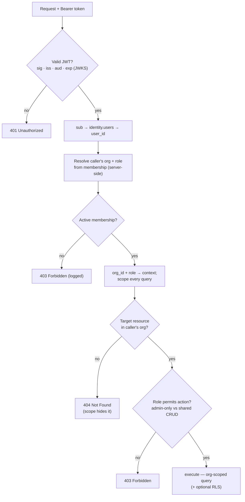

# Authentication, Authorization & Offline Login

> **Status:** High-Level Design (HLD) for v1 — the target the M0 build realizes; refined toward
> as-built as services land. Builds on
> [service-decomposition.md](service-decomposition.md), [data-model.md](data-model.md) and
> [api-contracts.md](api-contracts.md). Intent lives in [../../requirements/](../../requirements/).

**Issue:** #109 · **Epic:** #103 (EPIC-DESIGN) · **Milestone:** M0
**Requirements:** NFR-SEC-1, NFR-ROL-1, NFR-ROL-2, FR-TEN-1, FR-TEN-2, FR-ONB-1/2/3, FR-OF-1, NFR-AI-4
**Decisions:** [D-7](../../requirements/decisions.md#d-7) (Authentik, IdP-agnostic OIDC boundary),
[D-3](../../requirements/decisions.md) (org creator = admin, invite by email),
[D-5](../../requirements/decisions.md) (Flutter/Go/React), [D-10](../../requirements/decisions.md) (PWA-first),
[D-32](../../requirements/decisions.md) (two administration tiers — §5.3; platform tier **claim built (#465), authorization built (#466, ADR-0021)**, EPIC-18 #463)
**Resolves:** [Q-AUTH](../../requirements/open-questions.md), [Q-ROLE](../../requirements/open-questions.md)
**Depends on:** #104, #105, #108 · **ADR:** [0004-authn-authz](../adr/0004-authn-authz.md),
[0016-replace-keycloak-with-authentik](../adr/0016-replace-keycloak-with-authentik.md)
**Frozen integration contract:** [oidc-integration.md](oidc-integration.md) — the exact issuer,
discovery, `sub`/`aud`, endpoints, blueprint and naming every workstream builds against. This
document is the **provider-neutral design model**; that one pins the **Authentik** values.

---

## 1. Scope

How a user **proves who they are** (authentication) and **what they may do** (authorization) in
v1, plus **offline login**. Concretely, this document specifies:

- the **OIDC provider** (an Authentik application + OAuth2 provider, D-7) and its role model
  (NFR-ROL) — held behind an **IdP-agnostic boundary**: the app depends only on standard OIDC
  (discovery + JWKS + standard claims), so the provider is a **swappable deployment detail**
  ([ADR-0016](../adr/0016-replace-keycloak-with-authentik.md), [oidc-integration.md §1](oidc-integration.md));
- **JWT validation via JWKS** in the shared Go middleware (the authN every service runs);
- the **app-layer, org-scoped authorization** model — membership + resource ownership (FR-TEN) —
  that sits **on top of** the IdP's coarse identity, and **how `organization_id` is derived from the
  token + membership** (the hand-off [ADR-0002](../adr/0002-multi-tenancy.md) and
  [data-model.md §5](data-model.md#5-multi-tenancy-model-fr-ten) defer here);
- **offline-login** token/JWKS caching and the **grace window** (D-7) — a **native-phase** concern
  (D-10), designed now so the architecture everyone depends on is settled;
- the lifecycle pieces that close **Q-AUTH**: email verification, password reset, token lifetimes.

It **does not** build anything — physical provider config, the middleware code, and tests are built in
**EPIC-00 / EPIC-01** ([#24](https://github.com/TiagoJVO/beekeepingit/issues/24),
[#28](https://github.com/TiagoJVO/beekeepingit/issues/28),
[#30](https://github.com/TiagoJVO/beekeepingit/issues/30)) and **EPIC-14**
([#15](https://github.com/TiagoJVO/beekeepingit/issues/15), secrets + SMTP). This design **de-risks**
the authZ middleware every domain service depends on.

> **Provider swap (Keycloak → Authentik).** This design was originally written against Keycloak;
> [D-7](../../requirements/decisions.md#d-7) was revised to **Authentik** behind the same
> provider-agnostic OIDC boundary ([ADR-0016](../adr/0016-replace-keycloak-with-authentik.md)). The
> two-layer authZ + offline model below is **unchanged** — it never depended on the provider. Only
> the concretes moved: a Keycloak _realm_ → an **Authentik application + OAuth2 provider** provisioned
> by a **blueprint**; the `keycloak_sub` projection column → **`oidc_sub`**; logout from a
> refresh-token POST → a **front-channel `end_session` redirect**. The exact fixed values live in the
> frozen [oidc-integration.md](oidc-integration.md); this document describes the model neutrally and
> notes the Authentik specifics inline.

---

## 2. The two-layer model at a glance

Authentication and authorization are **deliberately split** across two systems of record, so each
concern is owned where it belongs:

| Layer                  | Question                                                      | System of record                            | Mechanism                                                                                 |
| ---------------------- | ------------------------------------------------------------- | ------------------------------------------- | ----------------------------------------------------------------------------------------- |
| **AuthN** (identity)   | _Is this a valid, authenticated user?_                        | **OIDC provider** (Authentik, D-7)          | OIDC login → signed **JWT**; services verify it via **JWKS**                              |
| **AuthZ** (org-scoped) | _In which org, with what role, may they touch this resource?_ | **`organizations` service** (`memberships`) | **App-layer** check on every request — derive `organization_id` + role, scope every query |

**Why split it:** an IdP's global roles/groups are **global to a user**, but our access rules are
**per-organization** (a person can be **admin of org A and a plain user of org B** in the multi-org
future, Context [C-1](../../requirements/context.md#c-1--single-organization-now-multi-organization-later)).
Org **membership and resource ownership are domain data** owned by the `organizations` service
([service-decomposition.md §3](service-decomposition.md#3-bounded-contexts--services)) and change
often (invite/remove/promote). Encoding them in the IdP would couple the domain to the provider and go
**stale** against cached/offline tokens. So the IdP does **authN + identity (+ a coarse global
marker)**; the **org-scoped role and tenancy** are resolved in the app from the database — exactly
D-7's _"app-level org-scoped authorization layered on top (FR-TEN)."_

This authZ layer is **the producer of the `organization_id`** that the whole multi-tenancy model
([ADR-0002](../adr/0002-multi-tenancy.md)) consumes: _layer 1 app-scoping_, _layer 2 optional RLS_,
and the _org-scoped sync slice_ all key off the `organization_id` resolved here.

---

## 3. OIDC provider — application, client & roles (D-7, NFR-ROL)

> The concrete values below (issuer, client id, blueprint) are **fixed in the contract**,
> [oidc-integration.md §3–§5](oidc-integration.md#3-provider-authentik-application--oauth2-provider).
> This section explains the **model**; that one is authoritative for the exact strings.

### 3.1 Application & realm-equivalent

The provider is **[Authentik](https://goauthentik.io/)** (D-7), self-hosted on the k8s cluster
([subchart `authentik`](service-decomposition.md#7-single-cluster-topology--helm-subchart-list-nfr-arc-3--d-6)).
Its unit of tenancy is an **application** (slug **`beekeepingit`**) fronting an **OAuth2 provider** —
the analogue of a Keycloak _realm + client_. It serves **all** end users and is **social/SSO-ready
later** (add federation sources without touching services, since services only ever see standard OIDC
tokens) — **now exercised**: #363 added Google as a federation source with **zero** service or token
changes (§8.13). The provider is provisioned declaratively by a **blueprint** (the analogue of a Keycloak
realm import — see §8.5, [oidc-integration.md §8](oidc-integration.md#8-deployment-infra)).
Provider config (login/branding flows, password policy, token lifetimes, SMTP) beyond that blueprint
is managed as infrastructure in **EPIC-14** ([#15](https://github.com/TiagoJVO/beekeepingit/issues/15));
no provider secrets live in the repo (NFR-SEC, EPIC-14).

### 3.2 Clients

| Client               | Type                   | Flow                          | Used by                                                                                                                                                                                          |
| -------------------- | ---------------------- | ----------------------------- | ------------------------------------------------------------------------------------------------------------------------------------------------------------------------------------------------ |
| `beekeepingit-pwa`   | **public** (no secret) | **Authorization Code + PKCE** | Flutter **PWA** now, native app later — same flow (`openid_client` core on web, `flutter_appauth` on native, per [tech-stack.md](../../requirements/tech-stack.md#client--flutter-webpwa-first)) |
| `beekeepingit-admin` | **public** (no secret) | **Authorization Code + PKCE** | React **Admin App** (online-only, NFR-ROL-2)                                                                                                                                                     |

The provider client id the services expect is **`beekeepingit-pwa`** — Authentik's default `aud`
is the client id, so `OIDC_AUDIENCE=beekeepingit-pwa` ([oidc-integration.md §4](oidc-integration.md#4-subject--audience--the-two-claim-decisions)).
The **`beekeepingit-admin`** client is provisioned as its own provider/application (#456); a
claim-override scope mapping rewrites its tokens' `iss`/`aud` to the same beekeepingit issuer +
`beekeepingit-pwa` audience, so the services accept admin tokens **without** any per-client change
([oidc-integration.md §3.1](oidc-integration.md#3-provider-authentik-application--oauth2-provider)).

**Domain services are OAuth2 _resource servers_, not login clients** — they **validate** bearer
tokens (§4) and never initiate a login. A **confidential service-account client** would be introduced
**only** where a service must call the provider's **admin API** (e.g. `organizations` triggering a
provider-side invite email, if we ever choose the IdP over our own SMTP for invitations — otherwise not
needed). Public clients + PKCE (no embedded secret) is the correct choice for a SPA/PWA and a mobile
app, where a client secret cannot be kept confidential.

### 3.3 Roles — coarse in the IdP, org-scoped in the app (+ a platform tier)

> **Key decision.** The IdP carries only a **coarse, global** marker; the **admin/user distinction
> that matters is per-organization** and lives in `organizations.memberships.role`, **not** in the
> token. See [ADR-0004](../adr/0004-authn-authz.md). The **platform tier** below
> ([D-32](../../requirements/decisions.md) — EPIC-18
> [#463](https://github.com/TiagoJVO/beekeepingit/issues/463)) is the one authority that _does_
> come from the IdP; it sits **above** membership and does not change the membership role model.
> Its token claim ships in [#465](https://github.com/TiagoJVO/beekeepingit/issues/465); the
> services that **act** on it are [#466](https://github.com/TiagoJVO/beekeepingit/issues/466).

- **IdP groups/roles** are kept minimal: every end user is simply an **authenticated user**. A
  **`platform-operator`** — an Authentik **group** (not a realm role, not a membership role) — is
  declared in the blueprint; the dev/CI seed user has been a member since the Authentik cut-over
  (#191), and it is also the **ops/infra marker** (managing the IdP/cluster).
  - **Built (#465):** it is the **platform tier's** source of authority
    ([D-32](../../requirements/decisions.md), §5.3.2) — surfaced as the verified
    **`platform_operator`** claim on **admin-app** tokens only
    ([oidc-integration.md §3.2](oidc-integration.md#32-platform-operator-claim-platform_operator-465--epic-18-463)).
    The claim is minted from real IdP group membership and can neither be requested nor injected
    by a client; it is **never** emitted for `beekeepingit-pwa`.
  - **Built (#466, [ADR-0021](../adr/0021-platform-operator-tenancy-carve-out.md)):** the
    `organizations` service's authorization path that **reads** the claim and carves out the
    tenancy rule for five existing routes (get/update organization, list/remove members, change
    role) — `requirePlatformOperatorOrOrgAdmin`/`requirePlatformOperatorOrOrgMember`, additive to
    the pre-existing `requireOrgMember`/`requireOrgAdmin` chokepoint. A caller without the claim is
    unaffected (same 404-not-403, proven by regression tests run unmodified).
  - The group **never** participates in the org-scoped `admin`/`user` decision below, and the
    **PWA**'s authZ path never reads it.
- **The application role `admin` / `user` (NFR-ROL-1) is the _membership_ role** — a property of the
  **(user, organization)** pair in `organizations.memberships` (see
  [data-model.md §3](data-model.md#3-entityrelationship-model)). It is **resolved per request**
  against the **active organization** (§5), never read from the token.
- **Role management (NFR-ROL-1 "assign roles to users")** is therefore **membership management** in
  the **`organizations` service**, surfaced in the **Admin App** (NFR-ROL-2) — not IdP
  role/group assignment for end users. (The IdP's own group admin is an ops/console task.)

This satisfies NFR-ROL-1 ("every user has a role; roles `admin`/`user`; manage role assignment")
while keeping the **org-scoped** semantics FR-TEN needs. NFR-ROL-1's "more roles may exist later"
hook is **now in use**: [D-32](../../requirements/decisions.md) spends it on the **platform tier**
above — a tier, not a third membership role — so the membership enum stays `admin`/`user` and authN
is unchanged. Further expansion (extra membership roles, or ReBAC — §5.5) remains open on the same
hook.

### 3.4 Token & claims

Services consume the **access token** (JWT, **RS256**). We rely on **standard OIDC claims** and
**deliberately keep org/role _out_ of the token**:

| Claim                                          | Use                                                                                                                                                                                                                                                                                                                                                                                                                            |
| ---------------------------------------------- | ------------------------------------------------------------------------------------------------------------------------------------------------------------------------------------------------------------------------------------------------------------------------------------------------------------------------------------------------------------------------------------------------------------------------------ |
| `sub`                                          | OIDC subject → maps to `identity.users.oidc_sub` ([data-model.md](data-model.md#3-entityrelationship-model)) — the stable user identity. Set via Authentik `sub_mode: user_upn` = an **app-assigned UUID** (contract §4)                                                                                                                                                                                                       |
| `email`, `email_verified`                      | profile (FR-ONB-1); gate on verification if required (`email_verified` caveat below)                                                                                                                                                                                                                                                                                                                                           |
| `preferred_username`, `name`, `groups`         | profile / i18n (EN-PT, NFR-I18N); `groups` carries the `platform-operator` marker but is **informational only** — it is emitted on **both** clients, so services must **never** authorize on it (§3.3)                                                                                                                                                                                                                         |
| `platform_operator`                            | **Admin-client tokens only** (#465): verified `platform-operator` membership as a boolean — the platform tier's authority ([oidc-integration.md §3.2](oidc-integration.md#32-platform-operator-claim-platform_operator-465--epic-18-463)). Absent ⇒ **false**. Emitted, and **read** by the `organizations` service on its platform-path-enabled routes (#466, [ADR-0021](../adr/0021-platform-operator-tenancy-carve-out.md)) |
| `iss`, `aud`/`azp`, `exp`, `nbf`, `iat`, `kid` | validation inputs (§4)                                                                                                                                                                                                                                                                                                                                                                                                         |

**Why no `organization_id` / org-role claim:** membership is **domain data that changes** and a token
is **long-ish lived and cached offline** — an embedded org/role would go **stale** (e.g. a removed
member would keep access until token expiry). The **active org is also a per-request choice** in the
multi-org future. So the app resolves org + role from the **database** on each request (§5), keeping
the `organizations` service authoritative. _(Alternative — an IdP protocol/property mapper that injects
memberships — is weighed and rejected in [ADR-0004](../adr/0004-authn-authz.md).)_

> **`sub` is provider-neutral, UUID-backed.** The app treats `sub` as an opaque stable identifier.
> Under Authentik it is set to each user's `attributes.upn` (an app-assigned UUID), which keeps it
> **stable, immutable, non-PII and reproducible** for the dev/CI seed — the reasoning and the seed
> value are pinned in [oidc-integration.md §4](oidc-integration.md#4-subject--audience--the-two-claim-decisions).
> `family_name`/`locale` are **absent** by default; the app collects profile (name/locale) during
> onboarding (FR-ONB-1) rather than depending on IdP profile claims.

---

## 4. AuthN — JWT validation via JWKS in the shared Go middleware

Every domain service is an **OAuth2 resource server** and validates the bearer token on **every**
request, in the **shared service-template middleware** (so validation is identical everywhere — the
template mandated by [coding-standards](../../.claude/rules/coding-standards.md)). Validation uses
`coreos/go-oidc` over the provider's **OIDC discovery document**
(`/.well-known/openid-configuration` → the `jwks_uri` it advertises), per
[tech-stack.md](../../requirements/tech-stack.md#backend--go-microservices). Nothing in the
middleware is provider-specific — no vendor URL scheme is hard-coded; endpoints are **read from
discovery** ([oidc-integration.md §1, §6](oidc-integration.md#6-backend-contract-go-services)).

**On each request the middleware checks:**

1. **Signature** — RS256 against the provider **JWKS**; keys are **cached** and refreshed periodically
   and **on an unknown `kid`** (so IdP **key rotation** is handled without downtime). The cached
   JWKS is also what makes **offline validation** possible (§7).
2. **Issuer** (`iss` = the provider's issuer URL), **audience** (`aud`/`azp` = the expected client
   `beekeepingit-pwa`), and **time** (`exp`/`nbf`/`iat` within skew).
3. **Required claims present** (`sub` at minimum); optionally **`email_verified`** where a flow
   demands it.

**Internal-discovery / external-issuer split.** A browser token's `iss` is the **external** auth-host
URL, which services can't reach in-cluster over HTTPS. So each service **fetches discovery from the
internal `authentik-server` Service** (plain HTTP, no forwarding headers) — Authentik **derives the
issuer from the request host**, so the internal fetch yields an **internal `jwks_uri`** (reachable
in-cluster) while the token's **external `iss` is still trusted**, bridged by go-oidc's
`InsecureIssuerURLContext`. This is the same split Keycloak needed, but **without any `KC_HOSTNAME`-style
config** — Authentik's request-host issuer removes the extra knob (env: `OIDC_ISSUER_URL` external,
`OIDC_DISCOVERY_URL` internal; [oidc-integration.md §6](oidc-integration.md#6-backend-contract-go-services)).

On success it builds a **security context** (`sub`, `user_id`, email, raw claims) and passes it to
the **authZ** stage (§5). On failure → **401 Unauthorized**.

**Edge + per-service (defense in depth).** The **gateway** may validate the JWT at the edge (fail
fast, NFR-ARC), but **each service still validates** — services **do not trust** the network or the
edge alone (zero-trust between services). This finalizes the "JWT validation at the edge and/or per
service" left open in
[service-decomposition.md §6](service-decomposition.md#6-c4-view--level-2-container).

```mermaid
sequenceDiagram
    actor U as Beekeeper
    participant C as Flutter PWA
    participant KC as Authentik (OIDC IdP)
    participant GW as API Gateway
    participant S as Domain service (Go)
    participant DB as Postgres

    U->>C: open app
    C->>KC: Authorization Code + PKCE (redirect)
    KC-->>C: ID + access + refresh tokens (JWT)
    Note over C: cache tokens (incl. id_token) in secure storage
    C->>GW: REST + Bearer access token
    GW->>S: forward (optional edge JWT check)
    S->>KC: fetch discovery + JWKS (internal Service; refetch on new kid)
    S->>S: verify JWT — sig / iss / aud / exp → sub
    S->>DB: resolve membership (sub → user) → org_id + role
    alt no org membership
        S-->>C: 403 Forbidden
    else member
        Note over S: org_id + role in request context
        S->>DB: org-scoped query (organization_id = org_id)
        S-->>C: 200 (or 404 if target is outside the org)
    end
```

---

## 5. AuthZ — app-layer, org-scoped authorization (FR-TEN)

This is the layer **beyond the IdP's coarse identity** that the issue calls for. It runs **after** a
valid token (§4) and decides org scope, role, and resource access.

### 5.1 Deriving `organization_id` from token + membership

This is the precise mechanism that [ADR-0002](../adr/0002-multi-tenancy.md#follow-ups) and
[data-model.md §5](data-model.md#5-multi-tenancy-model-fr-ten) defer to #109. It also honors the
contract rule that **tenancy is derived server-side, never a client parameter**
([api-contracts.md §9](api-contracts.md#9-auth--tenancy-in-the-contract-d-7-adr-0002)):

1. **Token → user.** The verified `sub` maps to `identity.users` (by `oidc_sub`) → `user_id`.
2. **Resolve the org from membership — server-side.** The caller's `organization_id` is **never a
   client parameter** (not a header, query, or body field). In v1 each user belongs to a **single
   organization** (C-1), so `organizations.memberships` resolves it unambiguously. The one place an
   org id appears in a URL is an org-**management** resource (`/organizations/{orgId}/…`), where the
   service **asserts `{orgId}` matches the caller's membership** — the path never _widens_ scope
   ([api-contracts.md §9](api-contracts.md#9-auth--tenancy-in-the-contract-d-7-adr-0002)). Multi-org
   "active org" selection is a deferred future concern and will still derive scope from membership,
   not a trusted client claim.
3. **Look up membership** for **(`user_id`, `status = active`)** → the authoritative
   **`organization_id`** and **role** (`admin`/`user`). A caller with **no active membership → 403**
   (logged, per [#28](https://github.com/TiagoJVO/beekeepingit/issues/28)); a resource **outside the
   caller's org → 404** (not 403) so the API never confirms its existence (api-contracts.md §9).
4. **Inject org context.** `organization_id` + `role` go into the request context; the **typed query
   layer scopes every query** by `organization_id` (ADR-0002 **layer 1**), optionally setting
   `app.current_org` for **RLS** (ADR-0002 **layer 2**). A query without an org filter is a bug.

Membership resolution is a hot path → **cache** it briefly (short TTL, per-instance) keyed by
(`user_id`, `organization_id`); invalidate on membership change. Whether services call the
`organizations` service or read a replicated membership projection is an
[#108](https://github.com/TiagoJVO/beekeepingit/issues/108)/`#28` build detail — the **rule** (active
membership ⇒ org + role) is fixed here.

### 5.2 The authorization pipeline

```mermaid
graph TD
    A["Request + Bearer token"] --> B{"Valid JWT?<br/>sig · iss · aud · exp (JWKS)"}
    B -- no --> R1["401 Unauthorized"]
    B -- yes --> C["sub → identity.users → user_id"]
    C --> D["Resolve caller's org + role<br/>from membership (server-side)"]
    D --> E{"Active membership?"}
    E -- no --> R2["403 Forbidden (logged)"]
    E -- yes --> F["org_id + role → context;<br/>scope every query"]
    F --> G{"Target resource<br/>in caller's org?"}
    G -- no --> R3["404 Not Found<br/>(scope hides it)"]
    G -- yes --> H{"Role permits action?<br/>admin-only vs shared CRUD"}
    H -- no --> R4["403 Forbidden"]
    H -- yes --> I["execute — org-scoped query<br/>(+ optional RLS)"]
```

### 5.3 Role capabilities — two administration tiers (resolves Q-ROLE)

Administration is **two-tier** ([D-32](../../requirements/decisions.md)). The tiers are distinct in
_who_ grants the authority and _how far_ it reaches:

| Tier                      | Authority comes from                                                            | Reaches                   | Status                                                                                                                                                                                                                                                                                              |
| ------------------------- | ------------------------------------------------------------------------------- | ------------------------- | --------------------------------------------------------------------------------------------------------------------------------------------------------------------------------------------------------------------------------------------------------------------------------------------------- |
| **Organization** (§5.3.1) | the caller's **membership role** `admin` in `organizations.memberships` (D-3)   | that **one** organization | **Built** (EPIC-10)                                                                                                                                                                                                                                                                                 |
| **Platform** (§5.3.2)     | membership of the IdP **`platform-operator`** group, as a verified claim (§3.3) | **every** organization    | **Built:** the five existing organization-scoped routes (#466, [ADR-0021](../adr/0021-platform-operator-tenancy-carve-out.md)), `GET /organizations` (list organizations, #467), and the cross-org membership lookup (#468) — EPIC-18 ([#463](https://github.com/TiagoJVO/beekeepingit/issues/463)) |

They are independent: a platform operator is **not** a member of the organizations it administers,
and an organization admin gains nothing outside its own org.

#### 5.3.1 Organization tier (built) — `admin` vs `user`

**`admin` is org-scoped** (D-3: the org creator is its first admin). Within an organization:

| Capability                                                               | `user` | `admin`            |
| ------------------------------------------------------------------------ | ------ | ------------------ |
| Full CRUD on **apiaries, activities, journeys, todos** (org-shared data) | ✓      | ✓                  |
| Use the **AI assistant**; view **history** (FR-HIS)                      | ✓      | ✓                  |
| Manage **members** — invite / remove (FR-ONB-3, D-3)                     | —      | ✓                  |
| Assign **membership roles** (promote/demote `admin`/`user`)              | —      | ✓                  |
| Edit **organization** settings; manage **invitations**                   | —      | ✓                  |
| Manage **quotas / rate-limits** (NFR-RL-1)                               | —      | ✓ _(deferred D-4)_ |

The **canonical management surface** is the **Admin App** (NFR-ROL-2, web, online-only); the
PWA/native client focuses on field features. **Admin-only operations are rejected for non-admins**
([#28](https://github.com/TiagoJVO/beekeepingit/issues/28) AC) — the **organizations** OpenAPI
contract already encodes this: `role` is the open enum `[admin, user]` and the member/invitation
endpoints are admin-only (`403` for a `user`), with `{orgId}` asserted against membership
([`organizations.openapi.yaml`](../../contracts/openapi/organizations.openapi.yaml)). **One deliberate
exception:** `GET .../members/names` — a least-privilege roster (`user_id` + display `name` only, no
role/status/email) — is readable by **any active member**, not just admins, because per-user
attribution (FR-TEN-2, [#44](https://github.com/TiagoJVO/beekeepingit/issues/44)) must resolve another
member's id to a real name and org data is shared across all members anyway; a non-member still gets
`404` (ADR-0002, never `403`).

#### 5.3.2 Platform tier (EPIC-18 #463 — authority minted, existing routes carved out, both new endpoints built)

> **Claim + enforcement built for this story's scope; one new endpoint now built too.** The
> **source of authority** shipped ([#465](https://github.com/TiagoJVO/beekeepingit/issues/465)): an
> admin-app token carries the verified **`platform_operator`** boolean, minted from real
> `platform-operator` group membership and never emitted for the PWA client
> ([oidc-integration.md §3.2](oidc-integration.md#32-platform-operator-claim-platform_operator-465--epic-18-463)).
> The **organizations service reads it**
> ([#466](https://github.com/TiagoJVO/beekeepingit/issues/466),
> [ADR-0021](../adr/0021-platform-operator-tenancy-carve-out.md)): a verified operator can reach
> `GET`/`PATCH /organizations/{orgId}`, `GET /organizations/{orgId}/members`, and
> `PATCH`/`DELETE /organizations/{orgId}/members/{userId}` for an organization it does not belong
> to, additive to the pre-existing membership-derived path (unchanged for everyone else — proven by
> regression tests run unmodified). **Also built:** `GET /organizations`
> ([#467](https://github.com/TiagoJVO/beekeepingit/issues/467)) — a NEW endpoint with no `{orgId}`
> to carve an exception into, so it calls `isPlatformOperator` directly and rejects a non-operator
> with an ordinary **`403`** (not `404` — there is no specific organization's existence to hide
> here; ADR-0021's Follow-ups section). It lists every organization's `id`/`name`/`member_count`
> only — no member roster, no invitation data, nothing from inside any organization. **Also
> built:** the cross-org membership lookup,
> `GET /organizations/platform/memberships?email=|user_id=` ([#468](https://github.com/TiagoJVO/beekeepingit/issues/468))
> — the same `isPlatformOperator`/`403` pattern, returning organization id/name/role/status
> only, never credentials or IdP internals (D-7). **Also built:** the persisted,
> distinguishable history record ([#470](https://github.com/TiagoJVO/beekeepingit/issues/470)) —
> `organizations.audit_log.actor_scope`, derived from `AuthorizedVia` (ADR-0021's
> Follow-ups). The rest of this section records the **intended** model
> ([D-32](../../requirements/decisions.md)) so the org tier above is not read as the whole story.

A **platform operator** — a member of the IdP **`platform-operator`** group (§3.3), typically **not
a member of any organization** — administers the platform **across** organizations: list
organizations, look up their members, and manage membership roles, expanding to further
administration features later. The intended shape:

| Property            | Platform tier                                                                                                                                                                                                                                                                                                                                                                                                                                                                                                                                                                                                                                                                                         |
| ------------------- | ----------------------------------------------------------------------------------------------------------------------------------------------------------------------------------------------------------------------------------------------------------------------------------------------------------------------------------------------------------------------------------------------------------------------------------------------------------------------------------------------------------------------------------------------------------------------------------------------------------------------------------------------------------------------------------------------------- |
| Source of authority | IdP group membership, surfaced as the **verified `platform_operator` boolean** on **admin-app** tokens only (**built**, [#465](https://github.com/TiagoJVO/beekeepingit/issues/465); shape in [oidc-integration.md §3.2](oidc-integration.md#32-platform-operator-claim-platform_operator-465--epic-18-463)) — never client-asserted, never derived from org membership. **Authorize on that claim, never on the `groups` array** (§3.4): `groups` is emitted on the PWA client too                                                                                                                                                                                                                   |
| Scope               | **Built:** the five existing organization-scoped routes (get/update organization, list/remove members, change role) — carved out per endpoint, [#466](https://github.com/TiagoJVO/beekeepingit/issues/466)/[ADR-0021](../adr/0021-platform-operator-tenancy-carve-out.md) — `GET /organizations`, the list-all-organizations endpoint ([#467](https://github.com/TiagoJVO/beekeepingit/issues/467)) — and the cross-org membership lookup, `GET /organizations/platform/memberships` ([#468](https://github.com/TiagoJVO/beekeepingit/issues/468)) — all reusing the same `isPlatformOperator(r)` claim check and rejecting a non-operator with `403` (no `{orgId}` to hide) on the two new endpoints |
| May do              | Administer organizations, their members and their **membership roles** (the same `admin`/`user` model, applied on behalf of an org)                                                                                                                                                                                                                                                                                                                                                                                                                                                                                                                                                                   |
| May **not** do      | Touch **accounts or credentials** — create/disable, password reset, MFA all stay at the IdP ([D-7](../../requirements/decisions.md#d-7--identity--auth-authentik-self-hosted-behind-a-provider-agnostic-oidc-boundary), unchanged)                                                                                                                                                                                                                                                                                                                                                                                                                                                                    |
| Accountability      | Platform actions are recorded in history, attributed to the operator's own identity (not the target org's admin — proven by test); a persisted, **distinguishable** marker on the history row itself is [#470](https://github.com/TiagoJVO/beekeepingit/issues/470) (FR-HIS-1), **done** — `organizations.audit_log.actor_scope`, derived from `AuthorizedVia` (ADR-0021's Follow-ups)                                                                                                                                                                                                                                                                                                                |
| Tenancy risk        | ADR-0002 returns **`404`, never `403`**, across org boundaries. The operator carve-out is deliberate, **narrow, per-endpoint and test-proven** — a **non**-operator still gets `404` on every carved-out route (regression-tested, #466). Its ADR is [ADR-0021](../adr/0021-platform-operator-tenancy-carve-out.md)                                                                                                                                                                                                                                                                                                                                                                                   |

**The organization tier is unaffected** — customers keep self-service member management exactly as
EPIC-10 shipped. The platform tier sits **above** it.

_This resolves [Q-ROLE](../../requirements/open-questions.md): **two tiers** — org-scoped `admin`
membership (built) plus a cross-organization `platform-operator` (its token claim built in #465,
its services-side enforcement still #466). It **supersedes** the earlier answer that there is no
system-wide application admin ([D-32](../../requirements/decisions.md))._

### 5.4 Resource ownership (FR-TEN-2)

Isolation is at the **organization** level, not per user (Q-TEN, settled in
[FR-TEN-2](../../requirements/functional-requirements.md#tenancy--data-ownership-fr-ten)): **all
members share the org's data**. So a member may **edit another member's** apiary/activity — but every
change **records the actor** in history (FR-HIS-1), and each activity is still stamped with the
**performing user** (`activities.performed_by`). The org-scoping in §5.1 is itself the primary
ownership control: a resource from another org **isn't visible**, so cross-org access returns
**`404`** (not `403` — the API doesn't confirm the resource exists;
[api-contracts.md §9](api-contracts.md#9-auth--tenancy-in-the-contract-d-7-adr-0002)). A stricter
_per-record_ rule (e.g. only the performer or an admin may edit a given activity) is **not v1** but
fits this model as a future per-resource policy.

### 5.5 When app-layer scoping isn't enough (future)

If fine-grained **sharing** appears (e.g. sharing one apiary across orgs, per-resource ACLs,
relationship-based access), adopt a dedicated **ReBAC** service — **OpenFGA / Ory Keto** — already
flagged in [tech-stack.md](../../requirements/tech-stack.md#identity--authentik-behind-a-provider-agnostic-oidc-boundary).
It slots **after** authN as an extra authZ check; the org-scoping here remains the baseline. **Not
needed for v1.**

---

## 6. Offline login — token & JWKS caching + grace window (D-7)

> **Phase note (D-10).** Offline _data capture_ works in **every** phase via the replicated slice
> (§6.4). Offline **login** — opening the app with **no connectivity at all** — is a **native-phase**
> concern (the PWA still needs an online redirect for a _fresh_ login). Per the issue, it is
> **designed now** so the token/JWKS handling everyone builds on is settled.

### 6.1 PWA phase vs native phase

- **PWA (now):** login is an **OIDC redirect to the provider → online**. Once authenticated, the
  **refresh token** + replicated data let the app **work offline**, but a **cold first login** needs
  connectivity. Browser/PWA **token persistence** (IndexedDB/OPFS, weakest on iOS) is the risk to
  validate — tracked with **SP-1** PWA-persistence in
  [tech-stack.md](../../requirements/tech-stack.md#open-spikes).
- **Native (later):** full **offline login** via secure on-device token + JWKS caching, below.

### 6.2 What is cached, and where

On a successful **online** login the client caches, in **platform secure storage**
(Keychain / Keystore via `flutter_secure_storage`) — **never** plain local storage:

- the **refresh token**, current **access token**, and the **`id_token`** (needed as the
  `id_token_hint` for front-channel logout, §7);
- the **OIDC discovery document + JWKS** (the provider's **public** signing keys);
- the **user identity** (`sub`, profile, last-known **membership/role** for the active org).

### 6.3 Grace window & refresh

- **App open, online:** silently **refresh** the access token (refresh-token rotation) and re-pull
  **JWKS**. Normal path.
- **App open, offline:**
  - **valid (unexpired) access token** → use it;
  - **expired but within the offline grace window** → **validate the cached token's signature against
    the cached JWKS locally** and check the cached identity; treat the session as valid for
    **reads + local writes** (writes **queue** to the sync engine, D-6).
  - **grace window exceeded, or refresh token expired/revoked** → **require interactive online
    re-login**.
- **Grace window (proposed default ≈ 14–30 days, configurable).** Field trips can be long
  (FR-OF-1, FR-UX), so the window is generous, balanced against security; tune in **EPIC-14** with
  security review. **JWKS** is refreshed whenever online; offline, an old key keeps validating within
  the window (IdP signing keys rotate slowly — acceptable).

### 6.4 Offline ≠ a server-authorization bypass (the security rule)

The grace window is a **local UX affordance, not server authorization.** Queued offline writes are
**re-authorized by the server at sync time** against the **then-current** token + membership — the
**server stays authoritative** ([ADR-0002](../adr/0002-multi-tenancy.md); atomic write-back D-12,
[#106](https://github.com/TiagoJVO/beekeepingit/issues/106)). Consequences:

- **Revocation is eventual:** a removed/disabled member retains **local** access until the grace
  window lapses or they reconnect, but **gains nothing server-side** — the next sync re-checks
  membership and **rejects** unauthorized pushes (notify-and-fix, FR-OF-2). This trade-off is
  explicit and acceptable for a field-first app.
- Tokens live **only** in the secure enclave; a compromised device is the threat model EPIC-14 owns.
  (Today, ahead of that EPIC-14 hardening: the refresh/id token persist in browser `localStorage`,
  not yet a secure enclave — an accepted interim trade-off for the offline-first boot flow, #390,
  oidc-integration.md §7.)
- **The local-data replica is bounded separately from the token grace window:** losing org
  membership also **purges the on-device local store** (not just the cached token) at the next
  app start or reconnect — [sync.md §3.5](sync.md#35-local-data-lifecycle--purge-on-logout--membership-loss-125)
  (#125). The two mechanisms are independent: a token can still be within its grace window while
  the replicated data it would have unlocked is already gone.

### 6.5 Tenancy holds offline

Offline, the client reads its **replicated org slice**, which the sync engine already publishes
**org-scoped** (and user-scoped where activity ownership requires) — ADR-0002 **layer 3**. So **no
cross-org data is on the device** to begin with, and the **last-synced membership/role** governs the
offline UI; changes reconcile on the next sync. Tenancy is preserved **without** a server round-trip.

```mermaid
sequenceDiagram
    actor U as Beekeeper
    participant C as Flutter app (native)
    participant SS as Secure storage
    participant L as Local SQLite (org slice)

    U->>C: open app (offline)
    C->>SS: read cached access token + JWKS
    alt token valid OR within offline grace window
        C->>C: verify token signature vs cached JWKS; check identity
        C->>L: read replicated org-scoped slice
        C-->>U: app usable — reads + local writes
        Note over C,L: writes queue locally;<br/>server re-authorizes at next sync
    else grace window exceeded / refresh expired / revoked
        C-->>U: require online re-login
    end
```

---

## 7. Lifecycle details (closes Q-AUTH)

The remaining open items in [Q-AUTH](../../requirements/open-questions.md) (beyond the D-7 mechanism)
are settled by **using the provider's built-in flows** plus the token policy above — **no custom auth
build**. Under Authentik, **email verification + SMTP (#361, §8.10) and self-service registration
(#366, §8.11) are built**;
recovery/password-reset remains **provider flow config in EPIC-14**; the fixed contract values are in
[oidc-integration.md §5, §7](oidc-integration.md#7-client-contract-flutter-web-pwa):

| Item                          | Decision                                                                                                                                                                                                                                                                                                                                                                                                                                                                                                                                                                                                                                                                                                                                     |
| ----------------------------- | -------------------------------------------------------------------------------------------------------------------------------------------------------------------------------------------------------------------------------------------------------------------------------------------------------------------------------------------------------------------------------------------------------------------------------------------------------------------------------------------------------------------------------------------------------------------------------------------------------------------------------------------------------------------------------------------------------------------------------------------- |
| **Email verification**        | **Built (#361, §8.10):** a login-time **email stage** in the authentication flow gates unverified, non-superuser users on an emailed one-time link; completion stamps the `email_verified` user attribute, and a **custom scope mapping** emits that genuine state as the `email_verified` claim (replacing the built-in's hardcoded constant — `true` before Authentik 2025.10, `false` since, either way cosmetic). SMTP is wired via `AUTHENTIK_EMAIL__*` (dev/CI: the Mailpit sink; prod: a real relay, credentials as infra config). App flows gate on `email_verified` (§3.4) — it now means something.                                                                                                                                |
| **Password reset**            | An **Authentik recovery flow** (self-service, email link) — **not built in v1**; provisioned in EPIC-14 ([#15](https://github.com/TiagoJVO/beekeepingit/issues/15)) with SMTP. No recovery flow ships by default.                                                                                                                                                                                                                                                                                                                                                                                                                                                                                                                            |
| **Registration**              | **Built (#366, §8.11):** self-service username/email/password **enrollment flow** at the provider, linked from the login page. A fresh registration is held **unverified** on an emailed one-time link (§8.10's machinery) — no session, and no invitation match, before inbox control is proven; "registration disabled" is no longer the control, the **real `email_verified` signal is**. **First login** (unchanged) triggers **profile creation** (FR-ONB-1, `identity`) and **org create/join** (FR-ONB-2/3, D-3, `organizations`) — which creates the **membership** authZ depends on. Creating an organization is **open to any self-registered user with a verified email**, with no invitation or approval gate (D-3/#362, §8.12). |
| **Upstream federation**       | **Built (#363, §8.13):** Google as an Authentik **OAuth source**, offered as "Continue with Google" on the app's sign-in screen and on the provider's own login card. Credentials are infrastructure config (an out-of-band Secret env-mounted into the worker, read by the blueprint's `!Env`), never repo values or ConfigMap contents. **Account creation stays invitation-only** — the source has no `enrollment_flow` (#365 opens it). Domain services are unchanged: the minted token's `iss`/`aud`/`sub` are identical to a password login's (D-7).                                                                                                                                                                                   |
| **Account linking**           | **Built (#364, §8.14):** an already-linked identity resolves on the upstream's stable **subject** alone. A first, unlinked sign-in links **only** when the upstream's own verification flag is strictly `true` **and** exactly one active, non-superuser, already-`email_verified` local account claims that address — as its current address or in `attributes.known_emails`, the per-account history of addresses this deployment has itself seen verified (written solely by §8.10's stamp). Every ambiguity — unknown, duplicate, unverified either side — is the same `DENY`, creating nothing. No claim, contract or service changes; no user's `sub` ever changes.                                                                    |
| **Account / password change** | The client links out to Authentik's user settings — **`OIDC_ACCOUNT_URL` = `https://auth.beekeepingit.local:8443/if/user/#/settings`** (a config value, not a derived path), replacing Keycloak's `/account` console.                                                                                                                                                                                                                                                                                                                                                                                                                                                                                                                        |
| **Access-token lifetime**     | **short, ≈ 15 min** (limits exposure; forces refresh). Blueprint validity **`minutes=15`** (Django-timedelta string). _Exact value still tuned/security-reviewed in EPIC-14._                                                                                                                                                                                                                                                                                                                                                                                                                                                                                                                                                                |
| **Refresh / SSO session**     | **≈ 30 days** (field convenience). Blueprint validity **`days=30`**. _Exact value still tuned/security-reviewed in EPIC-14._                                                                                                                                                                                                                                                                                                                                                                                                                                                                                                                                                                                                                 |
| **Offline grace window**      | **≈ 14–30 days** (native, §6.3). _Proposed; tune in EPIC-14._ Native-phase (D-10) — out of scope for the PWA-phase hardening pass.                                                                                                                                                                                                                                                                                                                                                                                                                                                                                                                                                                                                           |
| **Logout**                    | **Front-channel `end_session` redirect** — a **GET** to the provider's `end_session_endpoint` with `id_token_hint` (the persisted `id_token`, §6.2) + `post_logout_redirect_uri`, clearing the **server-side SSO cookie** at the IdP. Local state is cleared **first** so offline logout still degrades to locally-logged-out. This **replaces Keycloak's refresh-token POST**. Logout also invalidates the local PowerSync database so a second user on the same shared device doesn't see the previous session's replicated rows before the next sync.                                                                                                                                                                                     |

> Lifetimes are **starting points**, to be confirmed against a **security review** (EPIC-14, #15) and
> field-UX testing — not hard requirements. The blueprint sets these as concrete validities rather
> than provider defaults, but they remain **subject to EPIC-14 sign-off**.

---

## 8. Open questions, risks & hand-offs

| Item                                           | Effect on this design                                                | Resolved / built in                                                                                                     |
| ---------------------------------------------- | -------------------------------------------------------------------- | ----------------------------------------------------------------------------------------------------------------------- |
| [Q-AUTH](../../requirements/open-questions.md) | mechanism (D-7) + offline login, token lifetimes, verification/reset | **Resolved here** (§4, §6, §7)                                                                                          |
| [Q-ROLE](../../requirements/open-questions.md) | admin org-scoped vs system-wide; capability split                    | **Resolved here** (§5.3) — **two tiers** (D-32): org-scoped `admin` **built**, platform operator **planned** (#463)     |
| **Token-lifetime / grace values**              | exact minutes/days need security sign-off                            | EPIC-14 ([#15](https://github.com/TiagoJVO/beekeepingit/issues/15))                                                     |
| **PWA token persistence (iOS)**                | durability of cached session in a PWA                                | SP-1 (PWA persistence), [#54](https://github.com/TiagoJVO/beekeepingit/issues/54)                                       |
| **Membership read path**                       | services call `organizations` vs read a replicated projection        | [#108](https://github.com/TiagoJVO/beekeepingit/issues/108) / [#28](https://github.com/TiagoJVO/beekeepingit/issues/28) |
| **Offline revocation latency**                 | removed member keeps **local** access within grace window            | accepted (§6.4); server re-auth at sync                                                                                 |
| **Fine-grained sharing**                       | per-resource / cross-org ACLs                                        | future — OpenFGA/Keto (§5.5), not v1                                                                                    |

**Hand-off to build (this design de-risks them):**
[#24](https://github.com/TiagoJVO/beekeepingit/issues/24) (provider application/client + OIDC login),
[#28](https://github.com/TiagoJVO/beekeepingit/issues/28) (roles + org-scoped middleware),
[#30](https://github.com/TiagoJVO/beekeepingit/issues/30) (tenancy enforcement),
[#15 EPIC-14](https://github.com/TiagoJVO/beekeepingit/issues/15) (secrets, provider flow config, SMTP,
security review). The middleware here is also the **producer** of the `organization_id` consumed by
[#30](https://github.com/TiagoJVO/beekeepingit/issues/30) /
[data-model.md §5](data-model.md#5-multi-tenancy-model-fr-ten).

---

## 8.5 As built (Authentik) — and the #24 Keycloak baseline it replaced

> **As built on Authentik (D-7 → Authentik, [ADR-0016](../adr/0016-replace-keycloak-with-authentik.md)).**
> #24 originally hardened this slice **against Keycloak** (a realm import, an RP-initiated
> refresh-token-POST logout). The provider swap re-lands the same guarantees on **Authentik**, now
> merged across all three code workstreams — **infra** (WS-A blueprint), **backend** (WS-B `oidc_sub`
> rename), and **client** (WS-C discovery-driven OIDC + front-channel logout). The rows below reflect
> the Authentik reality; the frozen values are in [oidc-integration.md](oidc-integration.md).

| §7/§3.3 item                                    | Where it landed                                                                                                                                                                                                                                                                                                                                                                                                                                                                                                                                                                                                                                                                    |
| ----------------------------------------------- | ---------------------------------------------------------------------------------------------------------------------------------------------------------------------------------------------------------------------------------------------------------------------------------------------------------------------------------------------------------------------------------------------------------------------------------------------------------------------------------------------------------------------------------------------------------------------------------------------------------------------------------------------------------------------------------- |
| **Logout — server-side SSO revoke (NFR-SEC-1)** | [`client/lib/core/auth/auth_controller.dart`](../../client/lib/core/auth/auth_controller.dart) `logout()` revokes the **server-side SSO session**, not just local tokens, and degrades to local-only clearing offline (D-10). It performs a **front-channel `end_session` GET** to the **discovered** `end_session_endpoint` with `id_token_hint` (the persisted `id_token`, §6.2) + `post_logout_redirect_uri`, clearing local state first — driven off OIDC discovery, not a hard-coded path (replacing #24's refresh-token POST to Keycloak's logout endpoint).                                                                                                                 |
| **PowerSync disconnect on logout**              | Same `logout()` invalidates [`powerSyncProvider`](../../client/lib/core/sync/powersync_service.dart) (its existing `onDispose` already calls `disconnect()`+`close()`) so a second user on shared hardware doesn't see stale replicated rows before the next sync                                                                                                                                                                                                                                                                                                                                                                                                                  |
| **Defensive local-session sweep**               | `logout()` clears all local session-storage keys (PKCE verifier, OAuth state, tokens), not just the refresh token, covering an abandoned mid-flow login                                                                                                                                                                                                                                                                                                                                                                                                                                                                                                                            |
| **`platform-operator` group**                   | The Authentik **blueprint** ([`charts/authentik/files/beekeepingit.blueprint.yaml`](../../infra/helm/beekeepingit/charts/authentik/files/beekeepingit.blueprint.yaml)) declares a `platform-operator` **group** — ops-only, per §3.3 (**not** an app role, and **not** literal `admin`/`user` roles — see the AC note below). It is **not empty**: the dev/CI seed user has been a member since the Authentik cut-over (#191), and since **#465** that membership is surfaced to the admin app as the verified `platform_operator` claim (EPIC-18's platform tier — [oidc-integration.md §3.2](oidc-integration.md#32-platform-operator-claim-platform_operator-465--epic-18-463)) |
| **Email verification (mapping)**                | ~~Cosmetic default mapping~~ → **real state since #361 (§8.10)**: a custom scope mapping emits the `email_verified` **user attribute** the login-time verification flow sets; self-service registration (since #366, §8.11) reuses the same stages, so the attribute's only writer stays the restored-flow-token stamp                                                                                                                                                                                                                                                                                                                                                             |
| **Token lifetimes (blueprint validities)**      | Provider validity **`minutes=15`** (access) / **`days=30`** (refresh) in the blueprint (Django-timedelta strings) — the §7 proposed defaults, now concrete values; still subject to EPIC-14 security sign-off                                                                                                                                                                                                                                                                                                                                                                                                                                                                      |
| **Branding (narrow scope)**                     | Blueprint application title/branding; a custom login-flow theme is **out of scope** (design-owned effort, follow-up if needed)                                                                                                                                                                                                                                                                                                                                                                                                                                                                                                                                                     |
| **TLS to the IdP**                              | Local k3d dev serves the auth host over HTTPS at the gateway (`auth.beekeepingit.local:8443`, self-signed); some redirect URIs still allow plain `http://localhost` for dev. Trusted-CA TLS is EPIC-14                                                                                                                                                                                                                                                                                                                                                                                                                                                                             |
| **Client-side tests**                           | [`client/test/core/auth/auth_controller_test.dart`](../../client/test/core/auth/auth_controller_test.dart) (login/PKCE, code exchange incl. CSRF-state rejection, token refresh, refresh-rejected, logout incl. session-revoke + offline-degrade); logout widget interaction in `client/test/widget_test.dart`; logout e2e in [`client/e2e/tests/slice.spec.ts`](../../client/e2e/tests/slice.spec.ts)                                                                                                                                                                                                                                                                             |

**AC note (roles).** Issue #24's acceptance criteria literally reads "`admin` and `user` roles are
defined." Per §3.3's already-settled design (and ADR-0004), `admin`/`user` is the
**`organizations.memberships.role`** app-layer value, deliberately kept **out of** the IdP and out
of the token (staleness argument, §3.4) — adding them as literal IdP roles/groups would
contradict that design without adding capability. The AC's **intent** (a role model that supports
the admin/user distinction) is satisfied via the already-decided mechanism: only the ops-only
`platform-operator` group exists at the IdP layer; `admin`/`user` remains membership-scoped,
resolved server-side per request (§5.1).

---

## 8.6 As built (#26)

Organization creation (FR-ONB-2, FR-TEN-2, NFR-ROL-1) landed per §7's "Registration" row —
`POST /v1/organizations` creates the org and the creator's active `admin` membership in one DB
transaction (D-3), and `GET /v1/organizations/me`/`GET /v1/organizations/{orgId}` read it back.
One implementation detail worth recording here since it looks like it should use the shared
middleware but deliberately doesn't:

- **None of `organizations`' own `/v1` routes run behind `authn.NewOrgResolver`.** That
  middleware's second call (§5.1 step 3) is `GET /internal/memberships/active` on the
  **`organizations` service itself** — for every other domain service that's the correct
  east-west hop, but here it would be `organizations` calling back into its own process over
  HTTP to ask a question its own database already answers directly. Each handler instead
  resolves `sub → user_id` via one internal call to `identity` (§5.1 step 1) plus a direct
  `sqlc` lookup of `organizations.memberships` (step 3) — the same two facts, minus the
  redundant hop. See [`services/organizations/api/organizations.go`](../../services/organizations/api/organizations.go)'s
  package doc.
- This also sidesteps a real blocker: `NewOrgResolver` 403s a caller with **no** active
  membership, but `POST /organizations` must succeed for exactly that caller (a brand-new user
  onboarding). `GET /organizations/me` returning **404** (not 403) for "no org yet" is likewise
  deliberate — it's the signal the client's org-completion gate (mirrors the profile
  completeness probe, FR-ONB-1) distinguishes from every other failure.
- Membership invitations (FR-ONB-3, D-3's "invites others by email") land in #27 — see §8.7.

## 8.7 As built (#27)

Org membership listing + email invitations (FR-ONB-3, FR-TEN-2, NFR-ROL-1, D-3) landed as
`organizations.invitations` (new table, `data-model.md` §3's `INVITATIONS` shape) plus four
admin-only routes and one accept-on-login step:

- `GET /v1/organizations/{orgId}/members`, `GET`/`POST /v1/organizations/{orgId}/invitations`,
  `DELETE /v1/organizations/{orgId}/invitations/{invitationId}` — all require the caller to be
  an **active admin of exactly that org**: a different org (or no org at all) is 404 (§5.1's
  scope-hiding rule, unchanged), a same-org non-admin caller is 403 (§5.3's already-declared
  contract behavior — the OpenAPI spec listed this before either #26 or #27 had handlers).
- **Accept-on-login, not a separate "accept" endpoint.** FR-ONB-3's AC ("an invited user who
  logs in is joined to the inviting organization rather than prompted to create a new one") is
  implemented as a fallback inside `getMyOrganization` (§8.6): when the caller has no active
  membership, `organizations` looks up a pending invitation matching the caller's own email
  and, if found, accepts it and creates the membership at the invitation's role in one DB
  transaction — the same atomicity pattern as #26's create-org-and-membership. No client-visible
  "accept" operation exists; polling `GET /organizations/me` (which the org-completion gate
  already does) is what surfaces it.
- **The matched email is the JWT's verified `claims.Email` (+ `claims.EmailVerified` gate),
  never `identity.users.email`.** An earlier version of this matched against the internal
  `identity` resolve response's `email` field — but that field mirrors
  `identity.users.email`, the mutable profile value `PATCH /v1/profile` (#25) lets any caller
  set to an arbitrary string with no tie back to the IdP-verified identity. Matching on it would let a caller
  self-edit their profile email to someone else's pending invitation and auto-join that org at
  the invited role (including `admin`) without ever controlling that address — an
  unauthorized-org-join / privilege-escalation path found in #170 review. Fixed to use the
  token's verified `email` claim (§3.4) instead, gated on `email_verified` per §3.4's "gate
  sensitive flows on it" guidance: an unverified email is treated identically to "no pending
  invitation" (falls through to the ordinary 404), not a distinguishable error, so verification
  state isn't observable through this endpoint.
- **Single-org-per-user invariant, closed on both sides.** `POST /organizations` now checks
  for an existing active membership first and 409s rather than letting a direct API call give
  one user two active memberships (the client router gate already prevents the normal UI path
  from re-reaching org creation, but that's not a server-side guarantee by itself). The
  accept-on-login path only ever runs from the "caller has **no** active membership" branch,
  so it can't create a second membership for an already-a-member caller either.
- Member **removal**, invitation **expiry/re-invite**, and admin **transfer** are explicitly
  **not** built — D-3 and FR-ONB-3 both flag these as open detail beyond "implement the core
  invite/join now." `DELETE .../invitations/{id}` only revokes a still-**pending** invitation
  (not a way to remove an active member).
- History recording (FR-HIS-1) for invite/accept/revoke landed with #165 (closed) — audit
  rows are written for these events; the deferral this bullet originally recorded is done.

## 8.8 As built (#28)

Roles & permissions + the shared org-scoped authorization middleware (NFR-ROL-1, FR-TEN) landed
as a small addition on top of what #24–#27 already built, not a rebuild: §5.1's "role resolved per
request" was already implemented by `authn.NewOrgResolver` (`sub → user → active membership →
organization_id + role`, cached), and #27's `organizations/api/invitations.go` had already proved
out the role/org-scope check pattern (`requireOrgAdmin`) for its own admin-only routes. #28's job
was generalizing that pattern into a genuinely **shared** mechanism and closing the one real gap
— **denial logging** (§5.2's "403 Forbidden (logged)" was previously unimplemented; nothing in the
codebase logged an authz denial anywhere before this issue).

- **`authn.RequireRole(...roles)`** ([`services/servicetemplate/authn/authz.go`](../../services/servicetemplate/authn/authz.go)) —
  reusable role-gating middleware mounted after `NewOrgResolver`. Rejects a caller whose resolved
  `Claims.Role` isn't in the allow-list with `403` (§5.3: "admin-only operations are rejected for
  non-admins"); a request reaching it with no resolved role at all is a **wiring bug**, not a
  legitimate caller, and fails closed as `500` rather than silently admitting anyone. Every denial
  is logged via the request-scoped logger (`servicetemplate/logging.FromContext`), satisfying the
  AC's "the denial is logged" for the role dimension.
- **`authn.RequireOrgPath(orgIDParam, urlParam)`** (same file) — the generalized form of
  `requireOrgAdmin`'s "does `{orgId}` match my own resolved org" assertion (§5.1 step 2), for any
  future service exposing an org-management path parameter. Parses both sides as UUIDs before
  comparing (not a raw string match), matching every existing `{orgId}` handler. A mismatch is
  `404`, not `403` (ADR-0002 scope-hiding — the API never confirms another org's existence), and
  is logged the same way `RequireRole` is. `organizations/api/invitations.go`'s own
  `requireOrgAdmin` is left as-is (out of this issue's file ownership) — this is the mechanism new
  and future services build on, not a forced refactor of already-shipped, working code.
- **Denial logging also added to `NewOrgResolver` itself**
  ([`resolver.go`](../../services/servicetemplate/authn/resolver.go)): the two existing 403 cases
  (unknown user, no active membership) are now logged with the caller's verified `sub` and the
  problem detail — closing §5.2's "403 Forbidden (logged)" gap for the org-resolution step, not
  just the new role/path checks layered on top of it.
- **`services/apiaries`** wires `RequireRole("admin", "user")` into its middleware chain
  (`main.go`). Apiary CRUD is shared by both roles in v1 (§5.3 — there is no admin-only apiary
  operation), so this isn't gating any behavior differently than before; it's the explicit,
  auditable "the caller's role resolved to a known value" check the AC calls for, and it closes a
  latent gap where a wiring regression leaving `Role` unresolved would otherwise pass through
  unnoticed (the pre-existing `requireOrg` helper only ever checked `OrganizationID`).
  Cross-organization access attempts against `apiaries` — a second org's caller reading another
  org's apiary by id, listing apiaries, and attempting a sync-apply batch against another org's
  apiary id — are covered by new tests in
  [`services/apiaries/main_test.go`](../../services/apiaries/main_test.go)
  (`TestApiariesSlice_CrossOrg_*`); `apiaries` had org-scoped queries already (from the M0 slice)
  but no test had exercised the cross-org case before.
- **What #28 deliberately does not do:** it does not touch tenancy enforcement's own scope —
  `organization_id` on every owned row, the RLS decision, and tenancy-context propagation through
  the data layer are #30 (§8's hand-off table), tracked separately and building on the same
  `RequireRole`/`RequireOrgPath` mechanism where relevant.

## 8.9 As built (#30)

Tenancy enforcement (FR-TEN-2) closes out EPIC-01: confirming/automating what #28 already relied
on rather than building it fresh, and making the one call this design left open.

- **Every owned row carries `organization_id` — now automated, not just manually reviewed.**
  `dbaccess.UnscopedTables` ([`services/shared/dbaccess/tenancy.go`](../../services/shared/dbaccess/tenancy.go))
  queries `information_schema` for a service's schema and flags any base table missing the column
  (an exemption list covers the documented exceptions — a global identity table, or the tenant
  root itself). `services/apiaries`'s own test suite asserts this against its real migrated
  schema (`TestApiariesSchema_EveryOwnedTableCarriesOrganizationID`), so a future migration
  regresses in CI, not in a manual read. `identity`/`organizations` weren't touched (outside this
  issue's file ownership) — both were manually reviewed and are correctly scoped/exempt already
  (data-model.md §5's tenancy exception), but haven't yet adopted the automated check themselves;
  tracked in [#175](https://github.com/TiagoJVO/beekeepingit/issues/175).
- **Tenancy context propagation, end to end:** the verified token's `sub` → `authn.NewOrgResolver`
  → `Claims.OrganizationID` (§5.1) → each handler's own `requireOrg`-equivalent → an explicit
  `organization_id` parameter on every sqlc query. This path was already real (built alongside
  #23/#26–#28); #30's job was confirming and documenting it precisely, not introducing a new
  abstraction — a generic cross-service wrapper type would duplicate what sqlc's per-service
  generated params already enforce at compile time, for no added safety.
- **The RLS decision is made, not left silent:** deferred for v1, with the rationale recorded in
  [ADR-0002's RLS decision](../adr/0002-multi-tenancy.md#rls-decision-layer-2-resolved-in-30) and
  summarized in [data-model.md §5](data-model.md#5-multi-tenancy-model-fr-ten) — every service's
  DB role both owns its tables and runs its own queries (D-6's per-service role), so plain RLS
  would silently no-op for exactly the role executing every query; making it bind needs
  `FORCE ROW LEVEL SECURITY` plus separating table ownership from the query role, work this issue
  doesn't do given app-layer scoping (layer 1) and the sync publication (layer 3) are both already
  implemented and tested.
- **Cross-organization tests:** `services/apiaries/main_test.go`'s `TestApiariesSlice_CrossOrg_*`
  (added in #28, read/list/write) plus `services/organizations`'s existing
  `TestGetOrganization_OtherOrg_Returns404` together satisfy #30's "a user in organization A
  cannot read or modify organization B's data" AC across the services that own real domain data
  today. `activities`/`journeys`/`todos` don't exist yet (future EPICs) — their own cross-org
  tests land with those services, following this same pattern.

## 8.10 As built (#361) — real `email_verified` + outbound email

Closes §7's email-verification caveat (NFR-SEC-1, NFR-CMP-1, NFR-I18N-1; [ADR-0019](../adr/0019-outbound-email-and-real-email-verified.md)).
The forcing fact: on the pinned Authentik 2026.5.4 the built-in email scope mapping hardcodes
`email_verified: false` (changed from `true` in Authentik 2025.10 upstream) — so the #170
invitation accept-on-login gate (§8.7), which only matches invitations for a **verified** token
email, could never fire in a live environment. Either hardcoded constant is cosmetic; this issue
makes the claim mean something and revives that gate.

- **Claim = genuine state.** A custom scope mapping in the blueprint
  ([`charts/authentik/files/beekeepingit.blueprint.yaml`](../../infra/helm/beekeepingit/charts/authentik/files/beekeepingit.blueprint.yaml))
  replaces the managed `scope-email` on the provider and emits
  `request.user.attributes.get("email_verified", False) is True` — a strict boolean check, so
  attribute junk fails closed. The Go side already parsed the claim fail-closed
  (`servicetemplate/authn`); `TestMiddleware_EmailVerifiedClaim_FailsClosed` now pins that a
  missing/non-boolean claim parses as unverified.
- **Verification happens at login, for existing accounts.** When #361 shipped, registration was
  disabled and accounts were invite/admin-provisioned, so verification couldn't ride an enrollment
  flow. (#366 has since added a self-service enrollment flow that **rides these same stages** —
  §8.11 — and this login-time gate doubles as its abandoned-registration recovery path: the next
  login attempt re-sends a fresh link.) Instead the default
  authentication flow gains an **email stage** (order 40) + **user_write stage** (order 45), both
  policy-gated at stage time: an unverified, non-superuser login is held on an emailed one-time
  link (Authentik's built-in account-confirmation template, 30-min token), and the write stage
  stamps `attributes.email_verified: true` — **only** when the plan carries the restored
  flow-token evidence (`is_restored`) that the link was actually used, so no partial failure can
  mark an address verified without inbox control. Superusers bypass the stage (operator-lockout
  guard if SMTP is down; they never log into the PWA).
- **Self-service email change is disabled — the #170-shape guard.** A verified user re-pointing
  their own IdP email at a victim's pending invitation while keeping `email_verified: true` (the
  #170 shape one layer down) is blocked at the source: the default user-settings flow's own
  validation policy rejects any email change ("Not allowed to change email address.") unless
  `Tenant.default_user_change_email` is enabled, and on the pinned 2026.5.4 that setting
  **defaults to false** (`authentik/tenants/models.py` lines 64–66 — found live by this PR's
  e2e, whose email-change attempt was rejected by exactly this control). The setting **cannot be
  pinned in the blueprint**: the Tenant model subclasses `InternallyManagedMixin`, which
  `blueprints/v1/importer.py`'s `is_model_allowed` excludes from blueprint management; it exists
  on neither the Brand model nor any `AUTHENTIK_*` env at this version. The pin is therefore the
  **version pin + the live e2e** (which asserts the rejection through the real flow executor and
  that a same-email submit still completes) + the [oidc-integration.md §8](oidc-integration.md)
  watch-list. An earlier revision carried a reset-on-change policy on that flow's write binding
  (upstream identifiers verified: order 100 at 2026.5.4); it was removed as dead config — the
  validation rejects the change before the write stage could ever see a different address. If
  `default_user_change_email` is ever deliberately enabled, that reset policy becomes mandatory
  again (recover from PR #411 history; re-verify the binding identifiers first). **Accepted
  operator-trust boundary:** admin-driven email changes (admin API/UI) bypass the settings flow
  and do not reset verification — admins on this deployment are ops who could equally set the
  attribute directly; re-provisioned addresses verified out-of-band follow the documented seeding
  escape hatch.
- **SMTP as config, secrets out of git (NFR-SEC-1).** The upstream Authentik chart env-mounts every
  key of the `beekeepingit-authentik-config` Secret, so the umbrella's authentik subchart now
  renders `AUTHENTIK_EMAIL__*` connection keys from per-environment values — no change to the
  external gitops HelmRelease. Relay **credentials** are never values: when the out-of-band
  `beekeepingit-authentik-email-credentials` Secret exists in the namespace (created by ops for a
  real relay), the template merges `username`/`password` in via `lookup`, the same
  cluster-state-not-git idiom as the generated credentials.
- **Dev/CI mail sink.** New `charts/mailpit` subchart (SMTP `:1025`, message API/UI `:8025`,
  in-cluster only) captures all outbound mail — the flow is exercisable end to end with zero risk
  of dev/CI mail reaching real inboxes. Staging keeps the sink until a real relay/domain exists;
  prod disables it (`environments/prod.yaml`). NetworkPolicy grew an `ingressOnly` edge kind for
  it (Authentik's pods are excluded from default-deny, so only the sink-side ingress allow may
  render — the mirror of `egressOnly`).
- **EN/PT email content (NFR-I18N-1) — English-only today; a verified upstream limitation.**
  Authentik 2026.5.4 ships complete `en` **and `pt_PT`** catalogs for the account-confirmation
  template, and the stage subject is deliberately the catalog msgid `Account Confirmation`
  (pt_PT: "Confirmação de Conta") so translation engages the moment it can. But source-verifying
  the pinned 2026.5.4 (during the #361 review) shows flow-triggered mail **cannot render pt_PT**:
  the send translates per the **request's** negotiated language, not the recipient's saved locale
  (`stages/email/stage.py` renders with `language=pending_user.locale(request)`, and
  `core/models.py`'s `User.locale()` returns `request.LANGUAGE_CODE` whenever a request is
  present — the `attributes.settings.locale` fallback only applies to non-request sends), and a
  `pt-PT Accept-Language` can never negotiate to the shipped catalog (Django's default `LANGUAGES`
  has `pt`/`pt-br` but no `pt-pt`; Authentik ships a `pt_PT` catalog but no plain `pt` one) — so
  verification emails render in English regardless of browser or user locale. Fixing PT mail needs
  an upstream fix or a `LANGUAGES` override in the deployment — tracked in
  [#412](https://github.com/TiagoJVO/beekeepingit/issues/412); re-check on every version bump
  (the msgid subject choice stands either way). **Limitation (deliberate):** the mail is also
  Authentik-branded, not BeekeepingIT-branded — custom templates would have to be volume-mounted
  into the Authentik pods via the external HelmRelease; deferred until branding matters.
- **Seed users.** `test.beekeeper@…` is seeded **verified** (a dev/CI-provisioned trusted account;
  the walking-skeleton e2e login stays linear) — also the documented escape hatch for
  ops-provisioned, out-of-band-verified accounts. A second seed user `unverified.beekeeper@…`
  stays unverified for the verification-flow e2e.
- **Tests.** Go: the fail-closed claim-parsing table test (above) plus the existing #170
  verified/unverified invitation-gate suites (`organizations/invitations_test.go`) — unchanged,
  still green, now backed by a claim that reflects reality. Live e2e (`helm-e2e.yml`): the
  walking-skeleton spec asserts the seed user's id_token carries `email_verified: true` (proof the
  custom mapping applied); `verification.spec.ts` drives the full unverified journey — login held
  at the email stage → link fetched from Mailpit's (port-forwarded) API → flow completes →
  id_token claim true → a second fresh login sails through with no new email — **integrated with
  the invitation accept-on-login path** (the seeded admin invites the unverified address up
  front; the invitation stays `pending` while the login is held, and is auto-claimed by the first
  verified `GET /v1/organizations/me`, which the same run asserts from both sides), and a second
  test **attempts an email change through Authentik's real user-settings flow executor** (session
  - CSRF, the same API the settings UI posts to) and asserts it is **rejected** by the
    `default_user_change_email` control while a same-email submit completes — the live pin on the
    disabled-self-service-email-change control — and that a fresh login afterwards is untouched
    (still verified, no re-verification email). A workflow step additionally
    delivers a probe message through Authentik's configured Django email path (`ak shell` in the
    worker) and asserts Mailpit received it, isolating SMTP wiring from flow logic.

## 8.11 As built (#366) — self-service registration (verified-email gated)

Completes the registration story for users who don't use Google federation (FR-ONB-1/2/3,
FR-AU-1, NFR-SEC-1, NFR-I18N-1, NFR-TST-1): sign up with username/email/password at the IdP,
prove inbox control, then onboard exactly like any first sign-in. §7's "Registration" row is
updated accordingly — "registration disabled" is **no longer the control**; the control is the
**real `email_verified` signal** #361 built (§8.10): nothing issues a session, and nothing
matches an invitation, before the emailed one-time link is used.

- **Enrollment flow, config-as-code.** The blueprint
  ([`charts/authentik/files/beekeepingit.blueprint.yaml`](../../infra/helm/beekeepingit/charts/authentik/files/beekeepingit.blueprint.yaml))
  declares flow `beekeepingit-enrollment` (designation `enrollment`, `require_unauthenticated`):
  a prompt stage (username / email / password / repeat, with a **length-only ≥ 12** password
  policy — deterministic static rule; HIBP/zxcvbn deliberately off, and the final strength
  policy is EPIC-14 [#15](https://github.com/TiagoJVO/beekeepingit/issues/15) security-review
  scope) → `user_write` in `always_create` mode → the **same email stage** as §8.10's login-time
  verification (safe to share: at the pinned 2026.5.4 each send mints a flow token whose
  identifier embeds a fresh uuid4, so enrollment and login-time links never collide) → the
  **same policy-gated `user_write` stamp** (`attributes.email_verified: true` only on
  restored-flow-token proof) → the default user-login stage (session behavior identical to a
  normal login). Surfaced by setting the default identification stage's `enrollment_flow`: the
  login page renders "Need an account? Sign up.", and at 2026.5.4 that link **preserves the
  executor's stored `?next`** (`reverse_with_qs`), so a registration started from the app's
  OIDC redirect finishes **back in the app**, straight into onboarding — the client keeps its
  single sign-in action and only its login copy changed (pointing new users at that link).
- **Unverified at creation, guaranteed.** The prompt stage's declared field list is the write
  boundary: the prompt serializer only admits declared `field_key`s, and `user_write` blocks
  `groups`/`pk` writes and discards unknown keys (both source-verified at the pinned version).
  No declared field is an `attributes.*` key, so a registrant cannot inject
  `attributes.email_verified` (the #170 shape at enrollment); the upn policy strips it
  defensively anyway. The account is created **active but unverified** — deliberately not the
  upstream example's inactive-until-verified: an abandoned registration self-heals through
  §8.10's login-time gate (the next login re-sends a link) instead of dead-ending an account
  that can neither log in nor re-register with no recovery flow built yet (EPIC-14 #15). The
  session gate is the email stages, not `is_active` — both paths hold until the link is used.
- **`sub` assignment — closes [oidc-integration.md §4](oidc-integration.md)'s
  forward-requirement.** An expression policy on the enrollment `user_write` binding assigns
  `attributes.upn = uuid4()` at creation (the provider's `sub_mode: user_upn` reads it). Fail
  closed: a policy error skips `user_write`, so no account is ever created without a `upn`.
  (Relying on Authentik's silent `user.uuid` fallback instead would let a later admin-set `upn`
  change the user's `sub` and orphan their app identity.)
- **Collision posture (AC 2).** Duplicate **usernames** are rejected by the prompt's `username`
  field type — the account-existence signal that leaks is Authentik's own default for the field,
  accepted as-is. Duplicate **emails** are allowed (also the upstream default; adding a
  uniqueness policy would only create a NEW existence signal): the result is a second, unrelated
  account that can never produce a verified session without inbox control, and — with account
  linking not built ([#364](https://github.com/TiagoJVO/beekeepingit/issues/364)) — it never
  links to or merges with the original. E2e-pinned (below), including that the original account
  stays untouched. Known upstream caveat, watch-listed in [oidc-integration.md §8](oidc-integration.md):
  with duplicate emails, identification by email resolves first-match; accounts registered here
  always have a unique username to identify by.
- **Onboarding (AC 4).** After verification, the ordinary first-sign-in path takes
  over: `identity` creates the profile row on first sight (FR-ONB-1), and the org gate
  auto-claims a pending invitation for the now-verified address (FR-ONB-3, §8.7) or routes to
  org creation (FR-ONB-2; creator becomes `admin`, D-3). **No Go service code changed for
  #366** — the gates already keyed on the real claim. One client-side fix was needed for the
  brand-new-user case this issue made reachable: at boot the router's org fetch
  (`GET /v1/organizations/me`) races the identity-row-creating first `GET /v1/profile`, and the
  organizations service answers "can't resolve caller" with the same 404 as "no org" — a
  resolved answer the app caches, which permanently routed a freshly-registered invitee to org
  creation instead of auto-joining (trace-evidenced by the registration e2e's first red run).
  `profile_screen.dart`'s save now invalidates `organizationProvider` on completion — the first
  moment the identity row is guaranteed — so the org gate always recomputes from a resolvable
  caller (widget-tested; the e2e proves the journey). Org-creation
  policy for self-registered users is deliberately NOT restricted (spike
  [#362](https://github.com/TiagoJVO/beekeepingit/issues/362) exists but does not block this).
- **i18n (NFR-I18N-1) — same limitation class as §8.10's email finding.** Prompt
  labels/placeholders and flow titles are DB strings Authentik renders without a gettext
  lookup, and the flow executor UI's own strings translate only into the shipped **web**
  catalogs — which at the pinned 2026.5.4 include `pt-BR` but **no `pt-PT`** — so the
  registration screens render in English for a pt-PT browser today (tracked with the email
  limitation, [#412](https://github.com/TiagoJVO/beekeepingit/issues/412); re-check on version
  bumps). The verification email is §8.10's stage (msgid subject; English-rendering limitation
  documented there). The app's own screens (login copy, onboarding) are fully EN/PT via
  gen-l10n.
- **A11y (D-18).** The registration UI is Authentik's flow executor (PatternFly) — the same
  surface as §8.10's verification pages; its conformance is upstream's, documented as the
  accepted posture rather than re-audited per release. The app-side changes are copy plus a
  non-visual org-state refresh (no new tap targets; the login screen's single 56px primary
  action stands).
- **Tests (NFR-TST-1).** Live e2e
  ([`client/e2e/tests/registration.spec.ts`](../../client/e2e/tests/registration.spec.ts), run
  by `helm-e2e.yml` with the Mailpit port-forward; shared plumbing extracted to
  `client/e2e/tests/helpers.ts`): **(1)** register with no invitation → held at the email stage
  → a pre-created pending invitation stays `pending` and a plain login attempt with the new
  credentials is also held (and re-sends a link — the recovery path, proven live) → the emailed
  link completes enrollment → the id_token carries the real `email_verified: true` → profile
  onboarding → the invitation is auto-claimed (`role: user`, asserted from both the user's and
  the admin's side); **(2)** register → verify → full onboarding to a **new** organization →
  `role: admin` (D-3); **(3)** register with an existing account's email → distinct `sub`,
  `GET /v1/organizations/me` 404 (nothing inherited), and the original account still logs in
  unchanged (same `sub`, no forced re-verification). Go tests are unchanged (no service code
  touched); the #170 invitation-gate suites keep pinning the server side.

## 8.12 As built (#362) — organization-creation policy for self-registered users

The policy question §8.11 deliberately left open is decided in
[`requirements/decisions.md` D-3](../../requirements/decisions.md#d-3) (extended 2026-07-28,
user-confirmed) and lands here as one server-side change plus one recorded limitation.
**Organization creation is unrestricted** — a self-registered user creates an organization with no
invitation prerequisite, no operator approval and no pending/limited organization state (FR-ONB-2,
D-3). What bounds the surface is what already ships:

- **A verified email is the precondition, and `POST /v1/organizations` now asserts it itself.**
  The handler rejects a caller whose token lacks `email_verified: true` with `403`
  (`auth.forbidden`, RFC 9457 envelope; the contract documents it), checked **before** the request
  body is decoded or any identity/DB work happens. Nothing reaches this route unverified today —
  §8.10/§8.11 hold every session behind the emailed one-time link — which is exactly why the check
  is **defense in depth**: a precondition that lives only in IdP flow configuration is one
  blueprint edit, or one new federation source (#363/#365), away from silently disappearing, and
  an unverified-address account-takeover path is the same shape as the #170 invitation escalation.
  Unlike §8.7's accept-on-login gate (where unverified is deliberately **indistinguishable** from
  "no pending invitation", so verification state can't be probed), this answers a plain `403`: the
  caller is asking about their **own** account state, not another organization's existence, and
  the client's onboarding needs a distinguishable "verify your address first" signal.
- **One organization per account stays the cap** — `idx_memberships_one_active_per_user`
  (organizations migration `00004`, §8.7) makes it 1 by construction, so no separate per-account
  limit is needed.
- **Abuse response is the platform tier, not a new gate** — an operator lists every organization
  with its member count (#467, D-32) and disables the offending account at the IdP (D-7).
  Per-address organization caps and disposable-address policy are NFR-RL-1's mechanism, deferred
  by D-4; revisit at public launch. Throttling the **sign-up endpoint** itself is a separate,
  already-tracked concern — [#416](https://github.com/TiagoJVO/beekeepingit/issues/416) under
  EPIC-14, whose §8.11 abuse-posture AC this decision does not displace.
- **The single-active-membership dead end is now recorded, not emergent.** A user who already has
  an active membership and is **then** invited elsewhere never joins: §8.7's accept-on-login
  fallback only runs for a caller with **no** active membership, there is no self-service accept
  endpoint, and the last-admin guard (§5.3, D-3) forbids a sole admin — which an organization's
  only member always is — removing themselves. The invitation stays `pending` indefinitely. That
  is the correct outcome for the invariant; making it **exitable** (a sole member may leave, then
  the ordinary accept-on-login path joins them to the inviting org) is tracked as
  [#506](https://github.com/TiagoJVO/beekeepingit/issues/506), scheduled before public
  launch and out of M1.1 scope.
- **Tests (NFR-TST-1).** `services/organizations/organization_creation_email_verified_test.go` —
  a table test over a verified and an unverified caller (`201` vs `403`, the `403` validated
  against the OpenAPI contract), plus a regression that a rejected create writes **no**
  organization and **no** membership row. The service's own test fixture now defaults every
  subject to a verified claim (the ordinary caller), with unverified subjects named explicitly —
  the #170 invitation-gate suites keep pinning the accept-on-login side unchanged.

## 8.13 As built (#363) — Google federation

Google is added as an **upstream federation source** on Authentik, and the app's sign-in screen
gains its own **"Continue with Google"** action (FR-ONB-1, FR-TEN-1, NFR-SEC-1, NFR-I18N-1,
NFR-TST-1, D-7, D-18). **No Go service changed, and no token changed** — that is the point, not a
convenience: a federated login still resolves to a **local Authentik user**, and the provider
still mints the same standard OIDC token from **our own** issuer with `sub` = that user's
`attributes.upn` (`sub_mode: user_upn`, §3.4). Services validating `iss`/`aud`/`sub` cannot tell
the two paths apart, which is precisely the "social/SSO-ready later" property D-7 reserved
(§3.1). Everything below is config-as-code in the blueprint
([`charts/authentik/files/beekeepingit.blueprint.yaml`](../../infra/helm/beekeepingit/charts/authentik/files/beekeepingit.blueprint.yaml)).

- **The source.** An `authentik_sources_oauth.oauthsource` with `provider_type: google`,
  `promoted: true` (a prominent block button on the login card rather than a small icon), bound
  onto the default identification stage's `sources`. Authentik's `GoogleType` hardcodes the
  authorization/token/profile/JWKS URLs and is not `urls_customizable`, so the blueprint sets
  none of them. The upstream's OAuth client must be configured to redirect to
  **`https://<auth-host>/source/oauth/callback/google/`** (trailing slash included — the same
  reverse authentik uses when building the outbound request and when rebuilding it for the token
  exchange; a mismatch fails the exchange). Ops steps: [`infra/README.md`](../../infra/README.md).
- **Credentials: not in git, and not in a ConfigMap either (NFR-SEC-1).** The client id/secret
  reach Authentik as **process environment**, read by the blueprint's own `!Env` tag in the worker
  at import time. They are deliberately **not** Helm-interpolated: the blueprint renders into a
  **ConfigMap**, and a ConfigMap is not a Secret — an interpolated client secret would be readable
  by anything in the namespace and visible in `helm get manifest`. Instead
  `charts/authentik/templates/config-secret.yaml` merges the out-of-band Secret
  `beekeepingit-authentik-google-credentials` (keys `client-id`, `client-secret`) into
  `beekeepingit-authentik-config` via `lookup` — the identical cluster-state-not-git idiom §8.10
  uses for the SMTP relay — and the upstream chart env-mounts every key of that Secret on the
  server and the worker. **Side effect worth naming:** because the condition lives in the
  blueprint rather than in Helm, the blueprint file stays **static**, so `helm template` renders it
  byte-for-byte and the posture guard below can assert on the real thing.
- **Absent credentials must deploy cleanly, and that is load-bearing.** The source entry (and the
  entry binding it to the login card) carry `conditions:` on both variables. `BlueprintEntry`
  conditions are evaluated by `Importer._validate_single` **before** the model is resolved or the
  serializer runs, so a credential-less cluster skips the entry outright. Two failures avoided:
  `consumer_key`/`consumer_secret` are non-blank-required, so a rendered-but-empty entry would
  raise — and **one invalid entry invalidates the whole blueprint**, meaning nothing in the file
  applies (the PR #414 failure mode: OIDC discovery 404s forever, with the only evidence on the
  `BlueprintInstance` status). And `OAuthSourceSerializer.validate` performs **live outbound HTTP**
  for a `google` source — it falls back to `GoogleType`'s own `oidc_well_known_url`/`oidc_jwks_url`
  constants even when the blueprint sets neither — so dev/CI bring-up would otherwise depend on
  Google being reachable.
- **Account posture — invitation-only still holds, provably.** `enrollment_flow` is **deliberately
  unset**. At the pinned 2026.5.4, `SourceFlowManager.handle_enroll` returns
  `bad_request_message("Source is not configured for enrollment.")` — an **HTTP 400** — _before_
  `_prepare_flow`, and the connection row is only ever persisted later by `PostSourceStage`. So an
  unknown Google identity creates **no `User` row and no connection row**. This issue changes _how
  an existing user authenticates_, not _who may obtain an account_; opening registration via Google
  is [#365](https://github.com/TiagoJVO/beekeepingit/issues/365).
- **Identity keys on the provider's stable subject, never the email.** _(Matching mode
  **superseded by §8.14**; the reasoning below is why, and still holds.)_ `user_matching_mode:
identifier` is stated explicitly because it is a security decision, not a default to inherit:
  authentik's Google type returns **only** `{email, name}` from userinfo — Google's
  `verified_email` is **dropped** — so any `email_*` matching mode would link an existing local
  account from an **unverified** upstream address. That is the #170 account-takeover shape one
  layer out, and the epic's own rule ("an email match links only when that address is genuinely
  verified") cannot be satisfied with the data this source type surfaces. Subject-keyed linking
  plus a known-email history is [#364](https://github.com/TiagoJVO/beekeepingit/issues/364).
- **So how does anyone get linked today?** _(**Superseded by §8.14** — #364 opened the
  verified-email first link; the native path below still works and is still the only way to link
  an account this deployment has never seen verified.)_ Through Authentik's **native "Connected
  services"** page (`/if/user/#/settings;page-sources` — already the app's `OIDC_ACCOUNT_URL`
  target, §7): `get_action` returns `LINK` for an already-authenticated session and
  `handle_existing_link` saves the connection. **Consequence, stated plainly:** until #364 lands,
  "Continue with Google" works only for a user who has connected Google there first; everyone else
  lands on the normal login form. That is the deliberate, issue-scoped posture — not an oversight —
  and it is what keeps invitation-only intact without inventing an unverified-email link.
- **`email_verified` and the #361 gate.** The source's `authentication_flow` is upstream's
  `default-source-authentication`, **unchanged**. It is not extended with §8.10's login-time email
  stage, and the reason is structural rather than an omission: its `user_login` stage sits at
  **order 0**, and `unique_together (target, stage, order)` means a blueprint cannot move an
  upstream binding (an upgrade would re-assert it anyway). It does not need extending — reaching
  the linking page requires a **completed password login**, which is exactly what already passes
  the #361 gate, so a federated login is by construction only ever available to an account that
  already proved inbox control. _(**That last argument expires with §8.14**, which links accounts
  the browser never password-authenticated. #364 replaces it with an explicit precondition inside
  the resolver — an account is only linkable if it already carries `attributes.email_verified:
true` — so the invariant survives without extending this flow.)_ That flow also has **no
  `user_write` stage**, which is the property
  guaranteeing Google can never overwrite the local user's `email`, `attributes.upn` (the app-facing
  `sub`) or `attributes.email_verified`. Nothing writes the verification attribute but §8.10's
  restored-flow-token-gated stamp.
- **One hop from the app, without putting a vendor URL in client code.** Authentik has **no
  IdP-hint parameter**, and its source login URL cannot carry the return context by itself:
  `OAuthRedirect.get_redirect_url` reads no `?next`, and the post-login landing comes from
  `request.session[SESSION_KEY_GET]["next"]` — session state only `FlowExecutorView.dispatch`
  writes. A browser sent straight to `/source/oauth/login/<slug>/` therefore dead-ends on the IdP's
  user page. The built chain instead is: the app appends **one extension parameter**
  (`beekeepingit_idp=google`) to the **standard** authorize request
  ([oidc-integration.md §7](oidc-integration.md#7-client-contract-flutter-web-pwa)) → the
  unauthenticated authorize view redirects into the authentication flow with
  `next=<the authorize path, relative>` → an expression policy reads that stored `next`, resolves
  the slug **against enabled sources in Authentik's own database**, and sets
  `redirect_stage_target` → a `RedirectStage` at order 5 emits an `xak-flow-redirect` challenge the
  web executor **auto-follows** → after the upstream returns, `SourceFlowManager` restores the same
  `next` and the user lands back on the pending authorize request, in the app. The client stays
  discovery-only: no vendor URL scheme, no second client id, no second issuer, **no change to the
  token contract**.
  - **The hint is honoured when the authentication flow is _planned_, not on every request.**
    `FlowExecutorView.dispatch` **continues** an existing plan for the same flow rather than
    re-planning it, so a browser that already has a half-finished login in flight resumes at the
    stage it had reached and never revisits the order-5 redirect stage — the user simply gets the
    normal login page. Benign (never an error, never a wrong redirect) and invisible in the app,
    where either button starts a fresh authorize; but it is real, and it is what made the e2e
    flaky until the spec was fixed to start from a clean session. Worth knowing before adding a
    "retry with Google" affordance mid-flow.
  - **Rejected alternative**, recorded so it isn't re-litigated: Authentik's native
    `AutoRedirectController` (fires when an identification stage has empty `user_fields`, exactly
    one source and no passwordless flow) driven by a **second OAuth2 provider** whose
    `authentication_flow` points at such a flow. It needs no policy — but a second provider means a
    second `client_id` and a second per-provider issuer, so its tokens would carry the wrong
    `aud`/`iss` unless the admin-client-style iss/aud override mapping (§3.2) were duplicated onto
    it. That is a change to the **frozen** token contract plus another public client, traded for a
    UX detail. Declined.
  - **Safety.** This binds a stage into the **default authentication flow**, so a mistake would
    hijack every login. Four independent guards: `evaluate_on_plan: false` +
    `re_evaluate_policies: true` (the policy runs at stage time — `SESSION_KEY_GET` does not exist
    at plan time; same flags and rationale as §8.10's email bindings); the policy returns **false
    on any doubt** and a raising expression policy evaluates to the binding's `failure_result`
    (false), which **skips** the stage; `target_static` is a deliberately unresolvable path, dead
    config by construction, so a lost override 404s rather than redirecting somewhere useful; and
    **CI proves the negative case live** — the stand-in below makes this stage real in dev/CI,
    and every password-login spec runs through it.
- **The app side (D-18, NFR-I18N-1).** `login({String? idpHint})` in
  [`auth_controller.dart`](../../client/lib/core/auth/auth_controller.dart) passes the hint through
  `openid_client`'s `additionalParameters`; PKCE, `state`, scopes, redirect URI and the code
  exchange are **byte-identically** the password path's, which is why the resulting token is the
  same. The login screen gains a `SecondaryActionButton` (`login-google-button`) beside the
  unchanged honey primary — same 56px gloves-friendly target and the same
  `Semantics`+`ExcludeSemantics` wrapper (WCAG 2.2 AA). The label is externalized EN/PT
  (`loginWithGoogleButton` — "Continue with Google" / "Continuar com a Google").
- **i18n limitation, same class as §8.10/§8.11.** The **provider-rendered** button is labelled
  `Continue with {source.name}`: `source.name` is a DB string Authentik never runs through gettext,
  and the surrounding template translates only into the web catalogs Authentik ships — which at
  2026.5.4 include `pt-BR` but **no `pt-PT`** — so the IdP's own login card renders in English for a
  pt-PT browser. Tracked with the existing limitations in
  [#412](https://github.com/TiagoJVO/beekeepingit/issues/412); re-check on version bumps. The app's
  own screens are fully EN/PT via gen-l10n.
- **Sign-out is unaffected (verified, not assumed).** Logout is a front-channel `end_session` GET
  with `id_token_hint` (§8.5), and federation changes neither the token nor the session model —
  the Authentik SSO session a federated login creates is the same session object a password login
  creates (`default-source-authentication`'s `user_login` stage is the _same stage object_ the
  default flow uses). The local PowerSync invalidation is client-side and untouched. The §7
  "Logout" row is unchanged. **Not** verified end-to-end through a real Google round-trip — see
  the honesty note below.
- **Testing (NFR-TST-1) — three layers, because no single one can cover this.** A live e2e through
  real Google is not automatable (consent screen + bot detection) and must never run in CI, so the
  path is proven in parts:
  1. **Config, offline.** [`scripts/check-federation-source-posture.sh`](../../scripts/check-federation-source-posture.sh)
     (`task repo:lint` → CI) asserts on the blueprint source that every federation source is
     enrollment-closed, `identifier`-matched, `!Env`-credentialed and conditions-gated, and that no
     identification-stage entry is left with empty `user_fields` (which would trip
     `AutoRedirectController` and remove every route to the password form).
  2. **The inbound half, live.** A **dev/CI stand-in source** — a generic `openidconnect` source
     with the **identical** posture, hermetic at apply time (with both `oidc_*` URL fields empty
     the serializer makes zero outbound calls) — plus
     [`infra/ci/authentik-federation-probe.py`](../../infra/ci/authentik-federation-probe.py), run
     by `helm-e2e.yml` through `ak shell` in the worker (the same idiom as §8.10's SMTP probe). It
     drives the **real `SourceFlowManager`** and asserts an unknown upstream identity yields
     `Action.ENROLL` → **HTTP 400 with no `User` and no connection row created**, while a linked
     identity yields `Action.AUTH` resolving to the existing seed user with an unchanged `upn`.
  3. **The outbound half, live.** [`client/e2e/tests/federation.spec.ts`](../../client/e2e/tests/federation.spec.ts):
     both actions render on the app's sign-in screen; a plain "Sign in" is **not** hijacked by the
     redirect stage; a hinted request reaches the upstream **in one hop** with a well-formed
     authorize request (`client_id`, `response_type`, the `/source/oauth/callback/<slug>/`
     redirect URI, `state`, `openid` scope); and an unknown hint falls through to the normal login
     form rather than erroring or redirecting anywhere a crafted value chose.
     Plus Flutter unit/widget tests for the hint parameter, the button, its EN/PT label and its tap
     target/semantics.
- **What is NOT tested, stated plainly.** No automated test completes a sign-in through a real
  Google account: the token exchange, Google's userinfo shape, the real callback and the
  end-to-end sign-out after a _federated_ login are covered only by the **manual verification
  checklist** in [`infra/README.md`](../../infra/README.md), which must be run once against a
  cluster with real credentials. The probe's "`upn` unchanged" assertion is also narrower than it
  looks — `get_action()` never touches the `User` row, so it proves the flow-manager path is
  non-mutating, not that a full federated login leaves `upn` alone; the guarantee there rests on
  `default-source-authentication` having no `user_write` stage, which the probe does not enforce.

## 8.14 As built (#364) — subject-keyed account linking, with a known-email history

§8.13 shipped federation with a deliberate hole: `user_matching_mode: identifier` links **only**
on a `UserSourceConnection` that already exists, so "Continue with Google" reached an account only
after the user had connected Google from Authentik's own Connected-services page. This closes that
(FR-ONB-1, FR-TEN-1, NFR-SEC-1, NFR-ROL-1, NFR-TST-1, D-7) **without** reintroducing the
unverified-email link #363 refused. **Again: no Go service changed, no client changed, and no token
changed** — the whole decision lives at the IdP, which is the only place it can gate session
issuance. Everything is config-as-code in the blueprint
([`charts/authentik/files/beekeepingit.blueprint.yaml`](../../infra/helm/beekeepingit/charts/authentik/files/beekeepingit.blueprint.yaml)).

- **The correction #363 did not need to make.** §8.13 states that Authentik's Google source type
  "drops" `verified_email`. That is true of `GoogleType.get_base_user_properties`, which returns
  `{email, name}` — but it is **not** true of the payload. `SourceFlowManager.__init__` hands the
  **raw** upstream userinfo to every attached **property mapping** as `info`
  (`SourceMapper.build_object_properties(..., **self.user_info)`), and Google's hardcoded
  `profile_url` (`https://www.googleapis.com/oauth2/v1/userinfo` — `GoogleType` is not
  `urls_customizable`) **does** return `verified_email`. An OIDC upstream returns `email_verified`
  in the same place. So the genuine verification signal the epic's rule requires **is** reachable;
  it is just not reachable through a matching **mode**. That is the whole design: use the provider's
  native matching for the lookup, and put the decision in a property mapping that can see what the
  mode cannot.
- **One resolver, `mapping-federation-account-link`.** An `oauthsourcepropertymapping` attached to
  every federation source. It returns `{"username": <the resolved local account's username>}` or
  `{"username": None}`, and **nothing else ever decides**. It refuses unless **all** of:
  the upstream's own flag is **strictly boolean `True`** (a string `"true"`, a `1`, a missing key
  and junk all refuse — §8.10's house pattern); the payload carries a plausible address; **exactly
  one** local account claims that address; that account is **active**, **not a superuser**, not a
  service account, and itself carries `attributes.email_verified: true`.
- **Why the mode is `username_link` and why that is not what it sounds like.** Read it as _"look
  the account up by its unique key"_, not _"trust the upstream's username"_. `SourceMatcher`
  (`authentik/core/sources/matcher.py`) resolves in a fixed order: an existing
  `UserSourceConnection` for `(source, identifier)` → `Action.AUTH` **before any property is
  consulted at all** — that is the subject match, and it is why an upstream address change never
  loses the account; otherwise it requires the mode's matchable property to be **non-empty (empty ⇒
  `Action.DENY`, not enroll)** and matches it with `__exact`. `username` is the **only** matchable
  property Django declares **unique**, so `matching_objects.first()` can never pick an arbitrary
  account out of several. `email_link` demonstrably can: this deployment **allows duplicate emails
  by design** (§8.11), so an `email_link` source would hand a matched address to `.first()`. And
  because Google's source type emits **no** `username` at all, a Google source whose resolver was
  ever detached **denies every login** rather than falling back to something upstream-controlled —
  fail-closed by construction. (The dev/CI stand-in is an `openidconnect` source, which _does_ emit
  a username from `preferred_username`; it would **not** fail closed the same way, which is exactly
  why the attachment is asserted statically rather than assumed.)
- **The known-email history lives in the IdP, and that is not a D-7 violation.** It is
  `attributes.known_emails` on the Authentik user — a bounded (10), de-duplicated,
  lowercase-normalized list of addresses **this deployment has itself seen verified**. Two reasons
  it cannot live app-side: the decision must happen **before** a session exists, and by the time any
  Go service sees a token the account has already been chosen and the session already issued —
  app-side state cannot gate that; and it is the same category of data as
  `UserSourceConnection.identifier` and `attributes.upn` (the app-facing `sub`), both already
  IdP-side. D-7's boundary is that **the app** depends only on standard OIDC — no service, no
  client, no claim and no contract value changes here, and swapping the IdP means re-implementing
  account linking exactly as it already means re-implementing `sub_mode: user_upn` and the
  verification flow.
- **One writer, at the one moment the proof exists.** `known_emails` is written **only** by §8.10's
  `beekeepingit-mark-email-verified` policy — the same expression, gated on the same restored
  flow-token evidence, that stamps `attributes.email_verified`. So an entry exists **only** for an
  address whose inbox control was actually proven. Nothing an upstream asserts can add one; the
  federated path never writes to the user at all (`default-source-authentication` still has no
  `user_write` stage, §8.13). The two dev/CI seed users that are seeded verified without running the
  stage have their history seeded too — the same documented escape hatch, one level down.
- **What the history actually buys, precisely.** The **subject** covers "my Google address changed
  after I linked" (the connection carries it; the email is never consulted). The **history** covers
  the other direction: my **local** address changed since I verified it, so a federated sign-in at
  the address I originally proved still reaches me. **What it deliberately does not cover:** a user
  whose upstream address changed **before they ever linked**, to an address this deployment has
  never seen verified. There is nothing tying those two identities together, and guessing is the
  takeover shape. Such a user links through Connected services (§8.13) exactly as before.
- **Every refusal is the same refusal — `Action.DENY`.** Unknown address, ambiguous address,
  unverified upstream, unverified local account, superuser: all identical from outside, so the
  endpoint is not an account-existence oracle. It also renders Authentik's own
  `AccessDeniedResponse` instead of #363's raw 400. `enrollment_flow` stays **unset** and is still
  statically guarded — belt and braces, since `Action.ENROLL` is now unreachable for these sources.
  **Note for [#365](https://github.com/TiagoJVO/beekeepingit/issues/365):** opening self-service
  registration via Google therefore needs a deliberate change **here**, not only an
  `enrollment_flow` — the resolver currently denies every no-candidate case.
- **Authorization is untouched (NFR-ROL-1, FR-TEN-1).** Linking picks **which account** a sign-in
  reaches; it never touches `organizations.memberships`. Org scope and role still resolve
  server-side per request (§5.1) from the same `sub` → `identity.users.oidc_sub` → membership
  chain, and the resolver has no write path to any of it. `attributes.upn` is never written by the
  federated path, so no existing user's `sub` can change (the frozen contract,
  [oidc-integration.md §4](oidc-integration.md#4-subject--audience--the-two-claim-decisions)).
- **The guard evolved rather than weakened.**
  [`scripts/check-federation-source-posture.sh`](../../scripts/check-federation-source-posture.sh)
  no longer asserts `identifier` — it asserts `username_link` **plus** that the resolver is attached
  by `!KeyOf` and is the source's **only** property mapping (a second one merges after it, in name
  order, and could re-set `username`), plus that the resolver entry exists exactly once as an
  `oauthsourcepropertymapping`. Everything #363 asserted — enrollment-closed, `!Env` credentials,
  `conditions:`-gated, non-empty `user_fields`, two-element `!Env`, no YAML anchors — is unchanged.
  Each new assertion was mutation-tested against a deliberately drifted copy of the blueprint before
  the blueprint was changed (mode flipped to `identifier` and to `email_link`, resolver detached,
  resolver referenced by `!Find`, a second mapping added, the resolver entry renamed,
  `enrollment_flow` set — all seven go red).
- **i18n / a11y — nothing new.** No new user-facing string and no new UI: the app's sign-in screen
  is unchanged (#363's `loginWithGoogleButton`, EN/PT, 56px target, WCAG 2.2 AA) and every refusal
  renders Authentik's own access-denied page, which carries the same upstream-owned localization
  posture already documented in §8.10/§8.11/§8.13 and tracked in
  [#412](https://github.com/TiagoJVO/beekeepingit/issues/412).
- **Testing (NFR-TST-1) — the probe is where this actually gets proven.** A live e2e through real
  Google remains unautomatable, so [`infra/ci/authentik-federation-probe.py`](../../infra/ci/authentik-federation-probe.py)
  (run by `helm-e2e.yml` through `ak shell` in the worker) grew from a posture check into the real
  test bed. It creates transient fixture accounts, drives the **real `SourceFlowManager`** — hence
  the real matcher and the real deployed resolver — and asserts, live:
  1. **Subject wins (AC1).** A linked identity resolves to its account by identifier alone, asserted
     with a **different and unverified** upstream email in the payload, and with `upn` unchanged.
  2. **Verified-email first link (AC4)** and **changed-address match via history (AC2/AC5)** —
     including Google's `verified_email` spelling as well as OIDC's `email_verified`.
  3. **Unverified never links (AC3)** — `false`, the string `"true"`, and an absent flag each
     `DENY`, creating no `User` and no connection row.
  4. **Every other ambiguity fails closed** — two accounts sharing the address, an account that
     never proved inbox control itself (which also makes email squatting harmless rather than a
     denial of service), a superuser, an unknown address.
  5. **The adversarial `username_link` case** — the upstream asserts a **real local username** in
     `preferred_username`; the resolver clears it and the attempt is denied. Without the resolver
     this is precisely the link the mode's name suggests.
  6. **The history is really written** — the deployed `beekeepingit-mark-email-verified` policy is
     evaluated for real and asserted to append, de-duplicate, lowercase and bound the list, and to
     write **nothing** without the restored-flow-token proof.

  The static guard above pins the config offline in `task repo:lint`, and #363's browser spec
  ([`client/e2e/tests/federation.spec.ts`](../../client/e2e/tests/federation.spec.ts)) still covers
  the outbound half unchanged.

- **What is NOT tested, stated plainly.**
  - **No automated test completes a sign-in through a real Google account.** Everything above runs
    against the dev/CI stand-in source with a **synthesized** userinfo payload. That the field
    Google actually returns is `verified_email` (and that it is a JSON boolean) is
    **source-verified against the pinned 2026.5.4 and Google's documented v1 userinfo shape, not
    observed**. If Google's payload differed, the resolver would deny every Google login — visibly
    broken, not silently permissive — but it is unverified until the manual checklist in
    [`infra/README.md`](../../infra/README.md) runs against a real Google client. **That checklist
    now has more to cover than #363 left it**: a first sign-in that links by verified email, and a
    second that resolves by subject.
  - **`Action.LINK` returns an _unsaved_ connection.** That the link is remembered for next time is
    `PostSourceStage`'s job, inside the flow the probe does not execute — proven by reading upstream
    code, not by a test here.
  - **The changed-address journey is proven at the resolver, not end to end.** A real Google address
    cannot be changed in CI, and #361 deliberately disabled self-service email change at the
    provider — so the "returning user whose address changed" case is exercised by seeding a history
    entry and asserting the resolver reunites it, plus by driving the real stamp policy that writes
    such entries. The two halves are each genuinely tested; the seam between them (a real user
    verifying at address A, an operator later changing them to B, then signing in with Google at A)
    is **not** exercised by any single run.
  - **The `is_superuser` and service-account exclusions are belt-and-braces**, not load-bearing:
    nothing in this deployment gives such an account an org membership, so linking one would not
    widen authorization. They are probe-covered but exist to shrink blast radius, not to close a
    known path.

## 9. Acceptance-criteria traceability (#109)

- [x] **OIDC provider application + client + roles (`admin`/`user`)** documented (NFR-ROL) — §3
- [x] **JWT validation via JWKS** in the shared Go middleware specified — §4
- [x] **App-layer org-scoped authorization** (membership + resource ownership, FR-TEN) — beyond
      the IdP's coarse identity — §2, §5
- [x] **Offline-login** token/JWKS caching + **grace-window** design (native-phase, designed now per
      D-7) — §6
- [x] **Design + ADR** in `docs/` — this doc + [ADR-0004](../adr/0004-authn-authz.md),
      [ADR-0016](../adr/0016-replace-keycloak-with-authentik.md)

## 10. Links

- Builds on: [#104 service-decomposition](service-decomposition.md) ·
  [#105 data-model](data-model.md) · [#108 api-contracts](api-contracts.md) ·
  ADRs [0001](../adr/0001-service-decomposition.md), [0002](../adr/0002-multi-tenancy.md),
  [0003-api-contract-conventions](../adr/0003-api-contract-conventions.md)
- ADR: [0004-authn-authz](../adr/0004-authn-authz.md) ·
  Contracts: [`contracts/openapi/`](../../contracts/openapi/)
- Intent: [`requirements/decisions.md` D-7](../../requirements/decisions.md#d-7),
  [`requirements/tech-stack.md` — Identity](../../requirements/tech-stack.md#identity--authentik-behind-a-provider-agnostic-oidc-boundary)
- Frozen contract: [`docs/architecture/oidc-integration.md`](oidc-integration.md) ·
  ADR: [0016-replace-keycloak-with-authentik](../adr/0016-replace-keycloak-with-authentik.md)
- Next in EPIC-DESIGN: [#110](https://github.com/TiagoJVO/beekeepingit/issues/110)
  (walking-skeleton design — consolidates #104–#109)
