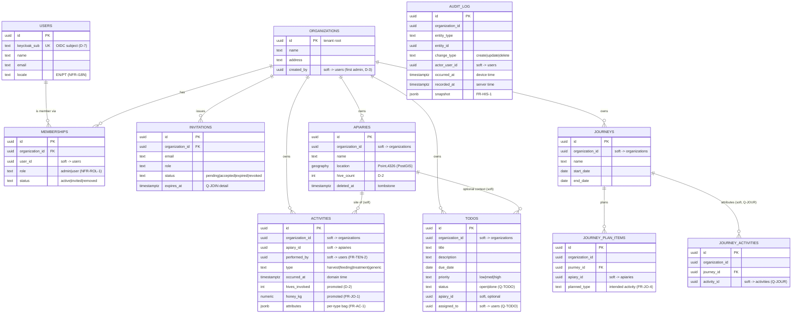

# Logical Data Model & Multi-Tenancy

> **Status:** High-Level Design (HLD) for v1 — the target the M0 build realizes; refined toward
> as-built as services land. Builds on
> [service-decomposition.md](service-decomposition.md). Intent lives in
> [../../requirements/](../../requirements/).

**Issue:** #105 · **Epic:** #103 (EPIC-DESIGN) · **Milestone:** M0
**Requirements:** FR-TEN-1, FR-TEN-2, FR-AP-1, FR-AC-1, FR-HIS-1, FR-AP-2/5
**Decisions:** [D-2](../../requirements/decisions.md) (hive count, not entity),
[D-6](../../requirements/decisions.md) (Postgres + PostGIS, schema-per-service, sync)
**Depends on:** #104 · **ADR:** [0002-multi-tenancy](../adr/0002-multi-tenancy.md)

---

## 1. Scope

The logical data model for **all v1 entities**, mapped to the **schema-per-service** ownership
from [#104](service-decomposition.md), with the **multi-tenancy** model (FR-TEN) and **PostGIS**
geo usage (FR-AP-2/5). Physical DDL, migrations, and the typed query layer (pgx/sqlc) are built
per-service in EPIC-00 #20 / EPIC-13; the **sync** write path and **history** capture mechanism
are designed in #106 / #107 — this doc defines the *shapes* they operate on.

---

## 2. Modeling conventions

These conventions apply to every table and exist to make the model **offline-first**,
**tenant-safe**, and **split-later** (per [#104](service-decomposition.md) rules).

| Convention | Rule | Why |
|---|---|---|
| **Primary keys** | `UUID` (v7 preferred), **client-generatable** | Offline-first: a device creates records offline with no server round-trip; v7 keeps keys time-ordered for index locality |
| **Tenancy key** | every **org-owned** row carries `organization_id` | FR-TEN-2 isolation, RLS, and org-scoped sync slice (see §5) |
| **Cross-schema refs** | references to data owned by another service are **soft** (ID only, no FK, no cross-schema join) | [#104](service-decomposition.md) rule 2 — preserves boundaries & split-later |
| **Timestamps** | `created_at`, `updated_at` (`timestamptz`); domain time (e.g. `occurred_at`) separate from system time | LWW clock (Q-SYNC) and correct offline ordering (device vs server time) |
| **Deletes** | soft-delete `deleted_at` (nullable) → acts as the **tombstone** for sync | deletes must propagate to devices; detail in #106 |
| **Extensible enums** | open sets (activity `type`, `role`) as `text` + check/lookup, **not** rigid PG `enum` | FR-AC-1 "extensible in the future" without enum-migration churn |
| **Flexible attributes** | per-activity-type attributes in **`JSONB`**; values that are aggregated/indexed promoted to typed columns | D-6 + FR-AC-1; keeps journey stats (FR-JO-1) fast |

> **`organization_id` is itself a soft cross-schema reference** to `organizations.id` — it is
> carried on every owned row for scoping/RLS, but enforced in app logic, not by a cross-schema FK.

---

## 3. Entity–relationship model

Relationships drawn below are **logical**; those crossing a schema boundary are **soft
references** (no database FK). Schema ownership is in [§4](#4-schema-ownership).

`AUDIT_LOG` relates to every entity polymorphically by (`entity_type`, `entity_id`) — drawn
separately to keep the ERD legible; capture mechanism is **#107**.

---

## 4. Schema ownership

One Postgres cluster; **one schema per service**; a service writes **only** its own schema
([#104](service-decomposition.md) / D-6).

| Schema | Service | Tables | Notes |
|---|---|---|---|
| `identity` | identity | `users`, `user_settings`, `entitlements`(stub) | **`users` is global** (not org-owned → no `organization_id`); `entitlements` is the D-4 feature-toggle stub |
| `organizations` | organizations | `organizations`, `memberships`, `invitations` | `organizations` is the **tenant root** (its `id` is the tenant key); membership carries the role (NFR-ROL-1) |
| `apiaries` | apiaries | `apiaries` | PostGIS `location`; `hive_count` (D-2) |
| `activities` | activities | `activities` | JSONB `attributes` + promoted `hives_involved`/`honey_kg` |
| `journeys` | journeys | `journeys`, `journey_plan_items`, `journey_activities` | planned-vs-actual; attribution is **Q-JOUR** |
| `todos` | todos | `todos` | lifecycle/assignment/area are **Q-TODO** |
| `ai` | ai | `ai_consents`, `ai_query_log`, `ai_action_log` | **no domain data, no direct writes** (D-11 / NFR-AI-4): consent (Q-AICLOUD) + audit of NL→query (D-8) **and** NL→**proposed actions** (FR-AI-2). A confirmed action executes via the **owning** service's API — `ai` never writes another schema |
| `history` | history | `audit_log` | append-only; retention/immutability **Q-HIS** (#107) |

**Tenancy exception:** `identity.users` is a *global* identity (a person, not org property);
org membership lives in `organizations.memberships`. Every **other** owned table carries
`organization_id`.

---

## 5. Multi-tenancy model (FR-TEN)

**Decision (see [ADR-0002](../adr/0002-multi-tenancy.md)):** shared schemas with an
**`organization_id` discriminator on every owned row**, enforced by **mandatory app-layer
scoping**, with **optional Postgres Row-Level Security (RLS)** as defense-in-depth.

**Enforcement layers (defense in depth):**

1. **Application (primary):** a shared Go middleware derives the caller's `organization_id` from
   the verified token + membership (authZ detail → [auth.md](auth.md) / [ADR-0004](../adr/0004-authn-authz.md)) and **every query is org-scoped**. No
   query runs without an org filter.
2. **Database (optional RLS):** session var `SET app.current_org = $org`; RLS policies
   `USING (organization_id = current_setting('app.current_org')::uuid)` on owned tables — a
   backstop if a code path forgets the filter.
3. **Sync slice:** the engine's publication is **org-scoped** (and user-scoped where activity
   ownership requires), so a device only ever receives its organization's rows (D-6, #106).

**Why org-id-on-every-row (not schema/db-per-tenant):** it is the standard pattern that serves
**one org now and many later with no rework** (Context C-1), keeps the **single cluster**
(NFR-ARC-3) and the **consolidated sync publication** simple, and the **split-later** path
([#104](service-decomposition.md)) stays open. Alternatives are weighed in
[ADR-0002](../adr/0002-multi-tenancy.md).

---

## 6. Geo / PostGIS (FR-AP-2, FR-AP-5)

- `apiaries.location` is **`geography(Point, 4326)`** with a **GIST index**.
- **Proximity list (FR-AP-2):** server orders by `location <-> :user_point` (KNN) /
  `ST_Distance`; **offline**, the client computes **haversine** over the replicated apiaries
  slice — both paths needed because the list is a field feature (FR-OF-1).
- **Distance between two apiaries (FR-AP-5):** `ST_Distance(a.location, b.location)` —
  **straight-line** per the [Q-DIST](../../requirements/open-questions.md) recommended default;
  driving distance (routing, online-only) is out of v1 scope.
- **Search (FR-AP-6):** name search via trigram index (`pg_trgm`); spatial/attribute search
  composes with the geo index. Search scope (offline/online, which entities) is **Q-SEARCH**.

---

## 7. Notable modeling decisions

- **Activity attributes — hybrid:** keep the open per-type bag in `JSONB` (FR-AC-1 extensibility)
  but **promote** the two values journeys aggregate — `hives_involved` (D-2) and `honey_kg` —
  to **typed, indexable columns**. Keeps FR-JO-1 stats fast without giving up type flexibility.
- **Client-generated UUIDs:** essential for offline create (no server round-trip); v7 for index
  locality. This also makes the sync upload idempotent on PK.
- **Journey attribution as a link table** (`journey_activities` in the `journeys` schema, soft
  ref to `activities`): keeps the journeys concern out of the `activities` schema; the
  **manual-vs-auto** attribution rule is **Q-JOUR** (resolved in EPIC-04 / #110).
- **History is occurred-at vs recorded-at aware:** `audit_log` records both device time and
  server time so history stays correct across offline edits + late sync (#107).
- **AI is propose-only, never a writer** (D-11 / NFR-AI-4): the `ai` schema holds **no domain
  data and no write access** to other schemas. It logs NL→query (D-8) and NL→**proposed actions**
  (FR-AI-2) in `ai_query_log` / `ai_action_log`; a *confirmed* action is executed by the **owning
  domain service's** validated, audited API — inheriting `organization_id` scoping, validation and
  history (FR-HIS) — so the untrusted-LLM blast radius is a **proposal, never a direct mutation**.

---

## 8. Open questions & hand-offs

| Item | Effect on the model | Resolved in |
|---|---|---|
| [Q-SYNC](../../requirements/open-questions.md) | tombstones, LWW clock (`updated_at`), upload idempotency | #106 + SP-1 (#54) |
| [Q-HIS](../../requirements/open-questions.md) | `audit_log` retention/immutability; capture (events/outbox/triggers) | #107 |
| [Q-JOUR](../../requirements/open-questions.md) | journey↔activity attribution; "how much is missing" | EPIC-04, #110 |
| [Q-TODO](../../requirements/open-questions.md) | todo status set, assignment, "area" semantics | EPIC-05 |
| [Q-JOIN](../../requirements/open-questions.md) | invitation expiry/re-invite, member removal, admin transfer | EPIC-01 |
| [Q-AICLOUD](../../requirements/open-questions.md) | `ai_consents` fields (DPA version, scope, residency) | EPIC-08 |
| [Q-PERF](../../requirements/open-questions.md) | concrete indexes beyond the keys/GIST noted here | per-service build |

## 9. Acceptance-criteria traceability (#105)

- [x] Logical data model (ERD) for all v1 entities — §3
- [x] Schema-per-service mapping (one cluster, clean boundaries) — §4
- [x] Multi-tenancy: `organization_id` on every owned row; scoping + optional RLS — §5 + ADR-0002
- [x] PostGIS geo (proximity/distance) specified — §6
- [x] ERD + schema-ownership table in `docs/`, ADR for tenancy — this doc + [ADR-0002](../adr/0002-multi-tenancy.md)

## 10. Links

- Prev: [#104 service-decomposition](service-decomposition.md) · ADR:
  [0002-multi-tenancy](../adr/0002-multi-tenancy.md)
- Next in EPIC-DESIGN: #106 (sync/conflict) → #107 (history) → #108 (contracts) → #109
  (authN/authZ) → #110 (walking-skeleton design)
