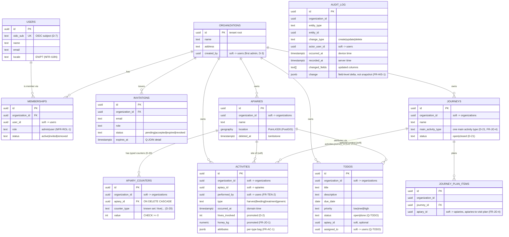

# Logical Data Model & Multi-Tenancy

> **Status:** High-Level Design (HLD) for v1 — the target the M0 build realizes; refined toward
> as-built as services land. Builds on
> [service-decomposition.md](service-decomposition.md). Intent lives in
> [../../requirements/](../../requirements/).

**Issue:** #105 · **Epic:** #103 (EPIC-DESIGN) · **Milestone:** M0
**Requirements:** FR-TEN-1, FR-TEN-2, FR-AP-1, FR-AC-1, FR-HIS-1, FR-AP-2/5
**Decisions:** [D-2](../../requirements/decisions.md) (hive count, not entity),
[D-6](../../requirements/decisions.md) (Postgres + PostGIS, schema-per-service, sync)
**Depends on:** #104 · **ADR:** [0002-multi-tenancy](../adr/0002-multi-tenancy.md)

---

## 1. Scope

The logical data model for **all v1 entities**, mapped to the **schema-per-service** ownership
from [#104](service-decomposition.md), with the **multi-tenancy** model (FR-TEN) and **PostGIS**
geo usage (FR-AP-2/5). Physical DDL, migrations, and the typed query layer (pgx/sqlc) are built
per-service in EPIC-00 #20 / EPIC-13; the **sync** write path and **history** capture mechanism
are designed in #106 / #107 — this doc defines the _shapes_ they operate on.

---

## 2. Modeling conventions

These conventions apply to every table and exist to make the model **offline-first**,
**tenant-safe**, and **split-later** (per [#104](service-decomposition.md) rules).

| Convention              | Rule                                                                                                      | Why                                                                                                                      |
| ----------------------- | --------------------------------------------------------------------------------------------------------- | ------------------------------------------------------------------------------------------------------------------------ |
| **Primary keys**        | `UUID` (v7 preferred), **client-generatable**                                                             | Offline-first: a device creates records offline with no server round-trip; v7 keeps keys time-ordered for index locality |
| **Tenancy key**         | every **org-owned** row carries `organization_id`                                                         | FR-TEN-2 isolation, RLS, and org-scoped sync slice (see §5)                                                              |
| **Cross-schema refs**   | references to data owned by another service are **soft** (ID only, no FK, no cross-schema join)           | [#104](service-decomposition.md) rule 2 — preserves boundaries & split-later                                             |
| **Timestamps**          | `created_at`, `updated_at` (`timestamptz`); domain time (e.g. `occurred_at`) separate from system time    | LWW clock (Q-SYNC) and correct offline ordering (device vs server time)                                                  |
| **Deletes**             | soft-delete `deleted_at` (nullable) → acts as the **tombstone** for sync                                  | deletes must propagate to devices; detail in #106                                                                        |
| **Extensible enums**    | open sets (activity `type`, `role`) as `text` + check/lookup, **not** rigid PG `enum`                     | FR-AC-1 "extensible in the future" without enum-migration churn                                                          |
| **Flexible attributes** | per-activity-type attributes in **`JSONB`**; values that are aggregated/indexed promoted to typed columns | D-6 + FR-AC-1; keeps journey stats (FR-JO-1) fast                                                                        |

> **`organization_id` is itself a soft cross-schema reference** to `organizations.id` — it is
> carried on every owned row for scoping/RLS, but enforced in app logic, not by a cross-schema FK.

---

## 3. Entity–relationship model

Relationships drawn below are **logical**; those crossing a schema boundary are **soft
references** (no database FK). Schema ownership is in [§4](#4-schema-ownership).

`AUDIT_LOG` relates to every entity polymorphically by (`entity_type`, `entity_id`) — drawn
separately to keep the ERD legible. It is **not a single central table**: each owning service holds
its **own** append-only `audit_log` in its **own** schema, written in the same local transaction as
the change (capture mechanism + retention/immutability decided in **#107** → [history.md](history.md)
/ [ADR-0007](../adr/0007-history-audit.md)).

**As built (#27):** `INVITATIONS` landed without the `expires_at` column shown above —
invitation expiry/re-invite is explicitly still-open detail (D-3, FR-ONB-3), so #27 implements
only `pending|accepted|revoked` (no automatic `expired` transition, no expiry column to drive
it yet). `invited_by` (soft ref → `identity.users`, the inviting admin) was added instead,
needed to populate the invitation record but not shown in the ERD above. A partial unique index
on `(organization_id, lower(email))` scoped to `status = 'pending'` enforces "at most one
pending invite per address per org" without needing an `expires_at`-driven cleanup job.

---

## 4. Schema ownership

One Postgres cluster; **one schema per service**; a service writes **only** its own schema
([#104](service-decomposition.md) / D-6).

| Schema          | Service       | Tables                                         | Notes                                                                                                                                                                                                                                            |
| --------------- | ------------- | ---------------------------------------------- | ------------------------------------------------------------------------------------------------------------------------------------------------------------------------------------------------------------------------------------------------ |
| `identity`      | identity      | `users`, `user_settings`, `entitlements`(stub) | **`users` is global** (not org-owned → no `organization_id`); `entitlements` is the D-4 feature-toggle stub                                                                                                                                      |
| `organizations` | organizations | `organizations`, `memberships`, `invitations`  | `organizations` is the **tenant root** (its `id` is the tenant key); membership carries the role (NFR-ROL-1)                                                                                                                                     |
| `apiaries`      | apiaries      | `apiaries`, `apiary_counters`                  | PostGIS `location`; typed 1-N counters (`apiary_counters`, D-20 — hive count is a counter row, not an `apiaries` column) — §7                                                                                                                    |
| `activities`    | activities    | `activities`                                   | JSONB `attributes` + promoted `hives_involved`/`honey_kg`                                                                                                                                                                                        |
| `journeys`      | journeys      | `journeys`, `journey_plan_items`               | planned-vs-actual; attribution is the **direct, nullable `activities.journey_id`** column (owned by the `activities` schema, not a `journeys`-owned link table) — resolved by **D-21**                                                           |
| `todos`         | todos         | `todos`                                        | lifecycle/assignment/area are **Q-TODO**                                                                                                                                                                                                         |
| `ai`            | ai            | `ai_consents`, `ai_query_log`, `ai_action_log` | **no domain data, no direct writes** (D-11 / NFR-AI-4): consent (Q-AICLOUD) + audit of NL→query (D-8) **and** NL→**proposed actions** (FR-AI-2). A confirmed action executes via the **owning** service's API — `ai` never writes another schema |

**History is per-service, not a schema of its own.** Each owning service carries its **own**
append-only `audit_log` (and the conflict sibling `sync_conflict_log`) **inside its own schema**,
written in the same local transaction as the change — this is what honors ownership rule 1 (a
service writes only its own schema) while keeping history atomic. There is no central `history`
service in v1. Model, capture, immutability, retention and the FR-HIS view are decided in
[history.md](history.md) / [ADR-0007](../adr/0007-history-audit.md) (#107).

**Tenancy exception:** `identity.users` is a _global_ identity (a person, not org property);
org membership lives in `organizations.memberships`. Every **other** owned table carries
`organization_id`.

---

## 5. Multi-tenancy model (FR-TEN)

**Decision (see [ADR-0002](../adr/0002-multi-tenancy.md)):** shared schemas with an
**`organization_id` discriminator on every owned row**, enforced by **mandatory app-layer
scoping**, with **optional Postgres Row-Level Security (RLS)** as defense-in-depth.

**Enforcement layers (defense in depth):**

1. **Application (primary, implemented, #28/#30):** the shared `authn.NewOrgResolver` middleware
   derives the caller's `organization_id` from the verified token + membership (authZ detail →
   [auth.md](auth.md) / [ADR-0004](../adr/0004-authn-authz.md)) and **every query is org-scoped** —
   every owned table's sqlc queries take `organization_id` as an explicit parameter, and
   `dbaccess.UnscopedTables` (`services/shared/dbaccess/tenancy.go`) automates checking that every
   base table in a service's schema carries the column in the first place, so a future migration
   can't silently drop the precondition this layer depends on. No query runs without an org filter.
2. **Database (optional RLS — decided deferred, #30):** session var `SET app.current_org = $org`;
   RLS policies `USING (organization_id = current_setting('app.current_org')::uuid)` on owned
   tables would be a backstop if a code path forgets the filter — **deferred for v1, not enabled**,
   with a concrete rationale recorded in [ADR-0002's RLS decision](../adr/0002-multi-tenancy.md#rls-decision-layer-2-resolved-in-30):
   every service's DB role both owns its tables and runs its queries, so plain RLS would be
   silently bypassed for owner queries without `FORCE ROW LEVEL SECURITY` plus a table-ownership
   change this issue's scope doesn't include.
3. **Sync slice (implemented):** the PowerSync `by_organization` bucket definition
   (`infra/helm/beekeepingit/charts/powersync/values.yaml`) parameterizes every synced row on the
   sync token's `organization_id` claim, so a device only ever receives its organization's rows
   (D-6, #106).

**Why org-id-on-every-row (not schema/db-per-tenant):** it is the standard pattern that serves
**one org now and many later with no rework** (Context C-1), keeps the **single cluster**
(NFR-ARC-3) and the **consolidated sync publication** simple, and the **split-later** path
([#104](service-decomposition.md)) stays open. Alternatives are weighed in
[ADR-0002](../adr/0002-multi-tenancy.md).

---

## 6. Geo / PostGIS (FR-AP-2, FR-AP-5)

- `apiaries.location` is **`geography(Point, 4326)`** with a **GIST index**. Set via the
  client's map-pin picker or "use current location" (#252) — both the REST write path
  (`write.go`) and the offline sync-apply path (`sync.go`'s `apiaryData`) accept it, so an
  apiary created entirely offline gets the same coordinates an online create would.
- **Proximity list (FR-AP-2):** server orders by `location <-> :user_point` (KNN) /
  `ST_Distance`; **offline**, the client computes **haversine** over the replicated apiaries
  slice — both paths needed because the list is a field feature (FR-OF-1). The list also shows
  each row's distance from the device (FR-AP-2, #253), locale-formatted (NFR-I18N-1).
- **Distance between two apiaries (FR-AP-5):** `ST_Distance(a.location, b.location)` —
  **straight-line** per the [Q-DIST](../../requirements/open-questions.md) recommended default;
  driving distance (routing, online-only) is out of v1 scope.
- **Search (FR-AP-6, D-17):** client-side over the locally-synced apiary set, matching on
  **name** and, since #252/#254, **`place_label`** — an apiary's optional free-text place name
  (below), diacritic-insensitive (PT "São" ≈ "sao"). Not server-side trigram search: D-17
  resolved FR-AP-6's scope to client-side/apiaries-only, so the `q` query param
  `contracts/openapi/apiaries.openapi.yaml` still accepts is a documented no-op server-side
  (`api/apiaries.go`'s `listApiaries`), not backed by a `pg_trgm` index.
- **`place_label`** (#252): an optional free-text place name (e.g. "Montargil"), independent of
  `location`'s coordinates and of the apiary's own `name` — a plain nullable `TEXT` column
  (migration `00006_add_apiary_place_label.sql`), capped at 200 chars like a short label, not
  free-form prose (unlike `notes`'s 10,000-char cap). Threaded through the same write paths as
  `location` (REST + sync-apply) and the PowerSync sync-rules bucket/client schema.

---

## 7. Notable modeling decisions

- **Apiary counters — typed 1-N child table, not a column** (D-20, #256, FR-AP-7): an apiary's
  countable current-state quantities (hives first; nucs/supers/queens conceivable later) live in
  **`apiaries.apiary_counters`** — `(id, organization_id, apiary_id → apiaries ON DELETE CASCADE,
counter_type text, value int CHECK ≥ 0)` with **`UNIQUE (apiary_id, counter_type)`** so an
  apiary can never hold two counters of the same type. Hive count was a plain `apiaries.hive_count`
  column (the original D-2 shape); every future countable would have meant altering the `apiaries`
  table, so it is **decoupled** into this child table and the column retired (migration in the
  apiaries service; the sync-rules bucket, the REST/sync wire shape, and the client schema were
  coordinated in the same change — walking-skeleton phase, no legacy clients). `counter_type` is
  an **open set validated in the owning service** (initially `['hive']`), **not** a DB
  enum/CHECK — the same "extensible enums" convention (§2) as activity `type`/membership `role`,
  so adding a type is a code-only append (server + client constants), no migration. **Relation to
  D-2:** D-2's split still holds — a counter is the apiary's **current state** (how many hives are
  there now), while an activity's `hives_involved` (a promoted JSONB attribute, above) is an
  **event record** (how many hives a given harvest touched); the two are complementary, not
  redundant. Writes ride the offline-sync path as their own `apiary_counter` op (record-level LWW
  keyed by `(apiary_id, counter_type)`, upsert semantics) and are audited in `apiaries.audit_log`
  under `entity_type = 'apiary_counter'` like any other change (FR-HIS). The client's REST/sync
  reads still expose a top-level `hive_count` field (resolved from the counter, 0 when absent) so
  the decoupling is invisible to API consumers.
- **Activity attributes — hybrid:** keep the open per-type bag in `JSONB` (FR-AC-1 extensibility)
  but **promote** the two values journeys aggregate — `hives_involved` (D-2) and `honey_kg` —
  to **typed, indexable columns**. Keeps FR-JO-1 stats fast without giving up type flexibility.
- **Client-generated UUIDs:** essential for offline create (no server round-trip); v7 for index
  locality. This also makes the sync upload idempotent on PK.
- **Journey attribution — a direct nullable FK column on `activities`, not a link table**
  (**D-21**, supersedes this doc's earlier pre-D-21 design of a separate `journey_activities`
  link table in the `journeys` schema): an activity carries a **stored, nullable
  `activities.journey_id`** (added in `activities`' own schema/migration ahead of the `journeys`
  service existing, #38/#39) rather than the reverse — a `journeys`-owned join table would have
  needed the `journeys` schema to reference `activities` rows, which is backwards from how every
  other cross-schema reference in this model is drawn (the _dependent_ row carries the soft
  reference, not the referenced-by side). The **smart auto-select with manual override** UX (D-21)
  pre-fills a matching **open** journey's id into a new activity's `journey_id`, with the user able
  to deselect/switch/create-on-the-spot/attach-to-closed from the activity form (#46); journey
  statistics (FR-JO-1) and "how much is missing" are computed from these **stored** links, not a
  live re-match. **One main activity type per journey** (a plain column on `journeys` itself, per
  D-21's narrowing of FR-JO-4) replaces the earlier idea of a per-plan-item `planned_type` on
  `journeys.journey_plan_items` — a manual per-apiary planned-activity list is an explicitly
  deferred future extension, not this milestone's (M4) scope.
- **History is occurred-at vs recorded-at aware:** `audit_log` records both device time and
  server time so history stays correct across offline edits + late sync; it is **append-only**,
  **per-service**, and **pseudonymous** (actor = internal user ID only) — [history.md](history.md)
  / [ADR-0007](../adr/0007-history-audit.md) (#107).
- **AI is propose-only, never a writer** (D-11 / NFR-AI-4): the `ai` schema holds **no domain
  data and no write access** to other schemas. It logs NL→query (D-8) and NL→**proposed actions**
  (FR-AI-2) in `ai_query_log` / `ai_action_log`; a _confirmed_ action is executed by the **owning
  domain service's** validated, audited API — inheriting `organization_id` scoping, validation and
  history (FR-HIS) — so the untrusted-LLM blast radius is a **proposal, never a direct mutation**.

---

## 8. Open questions & hand-offs

| Item                                              | Effect on the model                                                                                                                        | Resolved in                                                                               |
| ------------------------------------------------- | ------------------------------------------------------------------------------------------------------------------------------------------ | ----------------------------------------------------------------------------------------- |
| Q-SYNC (**resolved**)                             | tombstones, LWW clock (`updated_at`), upload idempotency                                                                                   | [sync.md](sync.md) / [ADR-0006](../adr/0006-sync-conflict-resolution.md) (#106, SP-1 #54) |
| Q-HIS (**resolved**)                              | `audit_log` capture (per-service, in-transaction), immutability, retention, GDPR, visibility                                               | [history.md](history.md) / [ADR-0007](../adr/0007-history-audit.md) (#107)                |
| Q-JOUR (**resolved**)                             | journey↔activity attribution (`activities.journey_id`, direct nullable FK, no link table); "how much is missing" derived from stored links | [D-21](../../requirements/decisions.md), EPIC-04 (#45/#46)                                |
| [Q-TODO](../../requirements/open-questions.md)    | todo status set, assignment, "area" semantics                                                                                              | EPIC-05                                                                                   |
| [Q-JOIN](../../requirements/open-questions.md)    | invitation expiry/re-invite, member removal, admin transfer                                                                                | EPIC-01                                                                                   |
| [Q-AICLOUD](../../requirements/open-questions.md) | `ai_consents` fields (DPA version, scope, residency)                                                                                       | EPIC-08                                                                                   |
| [Q-PERF](../../requirements/open-questions.md)    | concrete indexes beyond the keys/GIST noted here                                                                                           | per-service build                                                                         |

## 9. Acceptance-criteria traceability (#105)

- [x] Logical data model (ERD) for all v1 entities — §3
- [x] Schema-per-service mapping (one cluster, clean boundaries) — §4
- [x] Multi-tenancy: `organization_id` on every owned row; scoping enforced + RLS deferral decided
      and documented (#30) — §5 + [ADR-0002](../adr/0002-multi-tenancy.md#rls-decision-layer-2-resolved-in-30)
- [x] PostGIS geo (proximity/distance) specified — §6
- [x] ERD + schema-ownership table in `docs/`, ADR for tenancy — this doc + [ADR-0002](../adr/0002-multi-tenancy.md)

## 10. Links

- Prev: [#104 service-decomposition](service-decomposition.md) · ADR:
  [0002-multi-tenancy](../adr/0002-multi-tenancy.md)
- Next in EPIC-DESIGN: #106 (sync/conflict → [sync.md](sync.md)) → #107 (history →
  [history.md](history.md)) → #108 (contracts) → #109 (authN/authZ) → #110 (walking-skeleton design)
