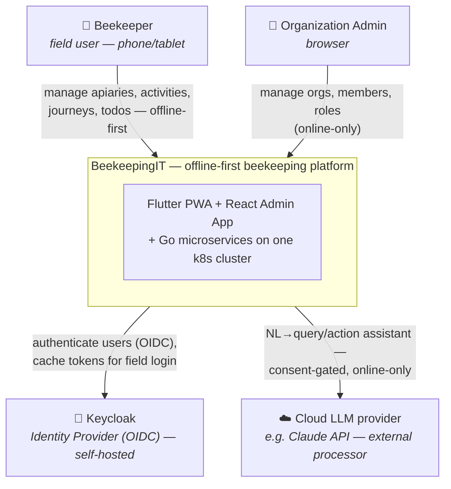
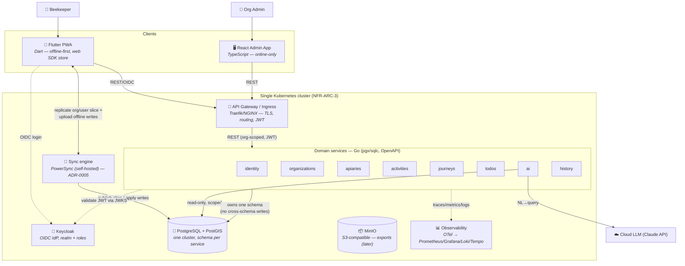

# Service Decomposition & Bounded Contexts

> **Status:** High-Level Design (HLD) for v1 — the target the M0 build realizes. As services
> are implemented this document is refined toward the **as-built** state (see
> [../README.md](../README.md)). Intent it derives from lives in
> [../../requirements/](../../requirements/).

**Issue:** #104 · **Epic:** #103 (EPIC-DESIGN) · **Milestone:** M0
**Requirements:** NFR-ARC-1, NFR-ARC-2, NFR-ARC-3, FR-TEN, FR-HIS, NFR-ROL-1, NFR-OBS-1
**Decisions:** [D-1](../../requirements/decisions.md#d-1--v1-uses-a-full-microservices-architecture) (full microservices), [D-2](../../requirements/decisions.md) (hive count, not entity), [D-5](../../requirements/decisions.md) (Flutter/Go/React), [D-6](../../requirements/decisions.md) (Postgres + schema-per-service + sync), [D-7](../../requirements/decisions.md) (Keycloak), [D-9](../../requirements/decisions.md) (monorepo), [D-10](../../requirements/decisions.md) (PWA-first)
**ADR:** [0001-service-decomposition](../adr/0001-service-decomposition.md)

---

## 1. Purpose & scope

This is the **first-class service-decomposition task** that [D-1](../../requirements/decisions.md#d-1--v1-uses-a-full-microservices-architecture)
calls for: turn the *intent* in [`requirements/tech-stack.md`](../../requirements/tech-stack.md)
into a concrete set of **services, owned data, and boundaries** the rest of M0 builds onto.

**This document decides:** the bounded contexts and their service mapping, what data each
service owns, the data-ownership rules between them, the C4 context/container views, and the
single-cluster topology (incl. the Helm subchart list EPIC-13 needs).

**This document defers** (to its sibling EPIC-DESIGN tasks — it sets their boundaries, not
their internals):

| Concern | Designed in |
|---|---|
| Logical data model / ERD, multi-tenancy enforcement detail | #105 |
| Sync & conflict-resolution architecture (write path, LWW + conflict log) | #106 → [sync.md](sync.md) / [ADR-0006](../adr/0006-sync-conflict-resolution.md) (engine pick: SP-1 #54) |
| History/audit capture mechanism (events / outbox / triggers) | #107 |
| API & inter-service contract conventions (REST + OpenAPI) | #108 |
| AuthN/AuthZ & offline-login detail | #109 |
| Walking-skeleton slice design (consolidates the above) | #110 |

---

## 2. Architectural approach

### 2.1 Full microservices (D-1) — with eyes open

[D-1](../../requirements/decisions.md#d-1--v1-uses-a-full-microservices-architecture) commits
v1 to **full microservices from day one**, knowingly going beyond Context
[C-1](../../requirements/context.md#c-1--single-organization-now-multi-organization-later)
("single org now, don't over-build") and the
[Q-SCALE](../../requirements/decisions.md#d-1--v1-uses-a-full-microservices-architecture)
recommended-default (modular monolith). We honor that decision here; the cost/over-engineering
trade-off and the **modular-monolith migration escape hatch** are recorded in
[ADR-0001](../adr/0001-service-decomposition.md).

### 2.2 The offline-first ⨉ microservices reconciliation (D-6)

Offline sync wants a *consolidated, replicable* store; microservices want *per-service* stores.
For a single-org v1 we reconcile them exactly as
[tech-stack.md](../../requirements/tech-stack.md) prescribes:

- **One PostgreSQL + PostGIS cluster**; **each service owns a separate schema** — clean
  boundaries, **no cross-schema writes**, **no cross-schema foreign keys**.
- The **sync engine replicates only the client-relevant slice** to each device, scoped by
  `organization_id` (and by user where activity ownership requires it).
- Splitting a schema into its own database later is a **migration, not a rewrite**.

This keeps service boundaries logically clean today while leaving the physical "one cluster"
(NFR-ARC-3) and the offline slice tractable.

---

## 3. Bounded contexts → services

Per [D-1](../../requirements/decisions.md#d-1--v1-uses-a-full-microservices-architecture)'s
named contexts. Each domain service is a **Go** service (D-5) owning **one Postgres schema**
(D-6), exposing a **REST + OpenAPI** contract through the gateway (conventions → #108).

| # | Service (schema) | Responsibility | Owns | Key requirements |
|---|---|---|---|---|
| 1 | **identity** (`identity`) | App-side user **profile** & account settings; maps the Keycloak subject → app user. AuthN itself is Keycloak. Holds the subscription **feature-toggle stub** (no billing). | `users` (profile, keyed by Keycloak `sub`), account settings, feature-toggle flags | FR-ONB-1, FR-AU-1, FR-AU-2 (stub, D-4) |
| 2 | **organizations** (`organizations`) | Organization CRUD; **membership** (user↔org + role); **invitations**; system of record for **org-scoped authorization** (who is in which org, with what role). | `organizations`, `memberships`, `invitations` | FR-ONB-2, FR-ONB-3, FR-TEN-1/2, NFR-ROL-1 (D-3) |
| 3 | **apiaries** (`apiaries`) | Apiary CRUD; **hive count** (D-2); **geo** (PostGIS) for proximity ordering & distance; search. | `apiaries` (incl. `location geography(Point)`, `hive_count`) | FR-AP-1..7 |
| 4 | **activities** (`activities`) | Activity CRUD with **per-type JSONB attributes**; recorded against the **performing user** and referencing an apiary. | `activities` (`apiary_id` ref, `performed_by` ref, `type`, `attributes jsonb`) | FR-AC-1..6 (D-2) |
| 5 | **journeys** (`journeys`) | Journey CRUD; **planned-vs-actual aggregation** (apiaries visited, hives harvested, honey collected, missing). | `journeys`, journey↔activity attribution (model is **Q-JOUR**, open) | FR-JO-1..4 |
| 6 | **todos** (`todos`) | Todo CRUD + lifecycle; association to apiary/area; filters. | `todos` (`org_id`, due date, priority, status, optional `apiary_id`/assignee) | FR-TD-1 (lifecycle **Q-TODO**, open) |
| 7 | **ai** (`ai`) | NL→**query & action** assistant; **cloud LLM** (D-8); org/apiary/journey-scoped. Reads are parameterized; writes are **proposed** (user-confirmed, owner-executed) — **no direct write access**. Online-only (PWA phase). | Minimal: consent records / query **+ action** logs. **Owns no domain data.** | FR-AI-1/2, NFR-AI-1/4 (consent **Q-AICLOUD**, gating) |
| 8 | **history** (`history`) | **Append-only** change history (actor + timestamp) for every create/update/delete; per-entity history views; must survive offline edits + sync. | `audit_log` (append-only; `entity_type`, `entity_id`, `org_id`, `actor`, `change`, `ts`) | FR-HIS-1 (capture mechanism → #107; retention **Q-HIS**) |

### "admin" is a client, not a new domain service

The **admin** bounded context (NFR-ROL-2) is realized by the **React Admin App** (a client
container, online-only) consuming the **management endpoints of `identity` + `organizations`**
through the gateway — not by a dedicated admin microservice. The admin app **owns no domain
data**, so a separate service would add operational cost without a data boundary to justify it.
Rationale recorded in [ADR-0001](../adr/0001-service-decomposition.md). (A thin admin BFF can be
added later if response composition becomes awkward — it stays a boundary, not a data owner.)

### Not v1 services (kept as boundaries)

- **Import/Export** (FR-IE-1/2, EPIC-09, M3) — a **cross-cutting capability** exposed per
  owning service (or a small export composer later), not an M0 service. Touches MinIO + GDPR
  export (NFR-CMP).
- **Billing / subscriptions / quotas** ([D-4](../../requirements/decisions.md)) — **deferred**;
  only the feature-toggle *mechanism* lives in `identity` (FR-AU-2). EPIC-90/91 stubs.
- **On-device AI** ([D-4](../../requirements/decisions.md)/[D-10](../../requirements/decisions.md))
  — native phase only; the PWA ships cloud AI via the `ai` service.

---

## 4. Data-ownership rules

These rules make "no cross-service data-ownership ambiguity" (AC) concrete:

1. **One schema per service; a service writes only its own schema.** No cross-schema writes,
   no cross-schema foreign keys.
2. **Cross-context references are by ID, not FK.** `activities.apiary_id`,
   `activities.performed_by`, `todos.apiary_id`, `journeys`↔`activities` are **soft references**
   to IDs owned elsewhere; referential integrity at those seams is enforced in application
   logic, not the database.
3. **No cross-schema joins for reads.** Composite reads are satisfied either by the **client's
   replicated slice** (the Flutter app holds apiaries+activities+journeys+todos locally and
   joins on-device — the offline-first default) or by **API composition**. Server-side
   cross-domain joins are avoided to preserve the split-later property.
4. **Tenancy is universal.** Every owned row carries `organization_id`; every query is
   org-scoped; optional Postgres **RLS** as defense-in-depth (detail → #105/#109).
5. **The `ai` service never writes domain data directly (the "AI write-safety guarantee").** Its
   own DB access is **read-only**, scoped and parameterized. It can **propose** a create/update/
   delete, but the change executes only after **explicit user confirmation** and **through the
   owning service's normal API** — inheriting that service's validation, authz, tenancy and
   history. `ai` holds no write credentials to any other schema (D-11; FR-AI-2; NFR-AI-4).
6. **The sync engine replicates the org slice**; the **write-back path** (how queued offline
   edits reach the authoritative tables while respecting per-service ownership and validation)
   must not bypass ownership rules. It is **atomic per push** (all-or-nothing), with
   **client-side validation parity** and a **notify-and-fix** flow on rejection (D-12, FR-OF-2).
   Because a multi-service push **can't share one DB transaction** (rule 1), atomicity is
   orchestrated behind a **single server-side write-back endpoint** via **validate-first +
   idempotent forward-retry** — designed in [sync.md](sync.md) §6 /
   [ADR-0006](../adr/0006-sync-conflict-resolution.md) (#106).

---

## 5. C4 view — Level 1: System Context

**Actors:** field **Beekeepers** (offline-first PWA) and **Organization Admins** (online-only
web app). **Supporting systems:** **Keycloak** (authN; D-7) and an **external Cloud LLM**
(the AI assistant's processor; D-8 — gated by consent/DPA per
[Q-AICLOUD](../../requirements/open-questions.md#q-aicloud--cloud-ai-privacy--gdpr-now-near-term-per-d-8)).

---

## 6. C4 view — Level 2: Container

**Notes on the container view**

- **Two clients, one gateway.** Both the PWA and the Admin App reach domain services through
  the gateway (TLS + routing; JWT validation at the edge and/or per service — finalized in [auth.md](auth.md) §4).
- **Offline path is special.** The Flutter PWA's local store is fed by the **sync engine**, not
  by direct REST reads, for the replicated slice. REST is used for online actions and for the
  Admin App. The write-back contract is **#106**.
- **AI reads (scoped) but never writes domain tables directly** — it proposes writes the user
  confirms and the owning service executes (rule 5); it is the only service talking to an
  external system. (So `ai → pg` stays read-only; confirmed writes flow `pwa → gateway →
  owning service`, the path already drawn above.)
- **Observability** (NFR-OBS-1): every service exports OTel signals to the collector → the
  Prometheus/Grafana/Loki/Tempo stack (EPIC-13 #87).

---

## 7. Single-cluster topology & Helm subchart list (NFR-ARC-3 / D-6)

All components run on **one k8s cluster** for v1 (NFR-ARC-3), deployed via the EPIC-13 **Helm
umbrella chart** (#83). This decomposition yields the umbrella's **subchart list** (the explicit
hand-off #104 owes EPIC-13):

**Domain service subcharts (Go):** `identity` · `organizations` · `apiaries` · `activities` ·
`journeys` · `todos` · `ai` · `history`

**Platform/infra subcharts:**

| Subchart | Purpose | Requirement / source |
|---|---|---|
| `gateway` | Ingress, TLS, routing, edge JWT | NFR-ARC, #84 |
| `keycloak` | OIDC IdP, realm + roles | D-7, #84 |
| `postgres` | PostgreSQL + **PostGIS**, schema-per-service | D-6, #84 |
| `sync-engine` | **PowerSync** (self-hosted, Open Edition) | D-6, ADR-0005 (SP-1 #54) |
| `minio` | S3-compatible object storage (exports later) | NFR-ARC-2, #84 |
| `observability` | OTel Collector + Prometheus + Grafana + Loki + Tempo | NFR-OBS-1, #87 |
| `admin-app` | Static React bundle (served via gateway/CDN) | NFR-ROL-2 |
| `pwa` | Static Flutter-web bundle + service worker | D-10, EPIC-15 #93 |

Infrastructure is kept **behind logical components** (NFR-ARC-2): object storage via an
S3-compatible interface (MinIO now, cloud later) and DB access via a typed query layer
(pgx/sqlc) so the database/cloud can be swapped without touching domain logic.

---

## 8. Open questions, risks & deferred scope

| Item | Impact on this design | Where it's resolved |
|---|---|---|
| [Q-SCALE](../../requirements/decisions.md#d-1--v1-uses-a-full-microservices-architecture) | Full microservices may be over-built for one org; mitigated by the schema-per-service **split-later** path + modular-monolith escape hatch | [ADR-0001](../adr/0001-service-decomposition.md) |
| Q-SYNC (**resolved**) | Write-back respects ownership **and is atomic per push** (validate-first + forward-retry) + client validation parity + notify-and-fix (D-12) — was the biggest cross-service risk | [sync.md](sync.md) / [ADR-0006](../adr/0006-sync-conflict-resolution.md) (#106, SP-1 #54) |
| [Q-AICLOUD](../../requirements/open-questions.md#q-aicloud--cloud-ai-privacy--gdpr-now-near-term-per-d-8) | `ai` sends org data to an external processor → consent/DPA/no-training/EU-residency gate **before** AI build | EPIC-08, NFR-CMP |
| [Q-JOUR](../../requirements/open-questions.md#q-jour--journey-planned-vs-actual-model) | `journeys`↔`activities` attribution (and "how much is missing") undefined | #105/#110, EPIC-04 |
| [Q-TODO](../../requirements/open-questions.md#q-todo--todo-lifecycle--associations) | `todos` lifecycle/assignment/area association | EPIC-05 |
| Q-ROLE (admin scope) — **resolved** | "admin" is **org-scoped** (the membership role); shapes `organizations` authZ | [auth.md](auth.md) §5.3 / [ADR-0004](../adr/0004-authn-authz.md) |

**Coupling risk to watch:** `apiaries` + `activities` + `journeys` form one tightly-coupled
**core domain** (activities belong to apiaries; journeys aggregate activities). They are split
per D-1; if inter-service chatter hurts, merging them into one "field-records" service is the
first consolidation to consider (see [ADR-0001](../adr/0001-service-decomposition.md) §Consequences).

---

## 9. Acceptance-criteria traceability (#104)

- [x] Bounded contexts identified & mapped to services (the 8 domain services + admin-as-client) — §3
- [x] Each service's responsibility, owned data, and public interface documented; no
  data-ownership ambiguity — §3 + §4
- [x] C4 **context** and **container** diagrams committed — §5, §6
- [x] Single-cluster topology (services + shared Postgres schema-per-service, gateway, sync
  engine) captured — §7
- [x] ADR recording the decomposition & trade-offs — [ADR-0001](../adr/0001-service-decomposition.md)
- [x] Output usable by EPIC-13: the umbrella **subchart list** — §7

## 10. Links

- Intent: [`requirements/tech-stack.md`](../../requirements/tech-stack.md),
  [`requirements/decisions.md`](../../requirements/decisions.md)
- ADR: [0001-service-decomposition](../adr/0001-service-decomposition.md)
- Next in EPIC-DESIGN: #105 (data model) → #106 (sync) → #107 (history) → #108 (contracts) →
  #109 (authN/authZ) → #110 (walking-skeleton design)
