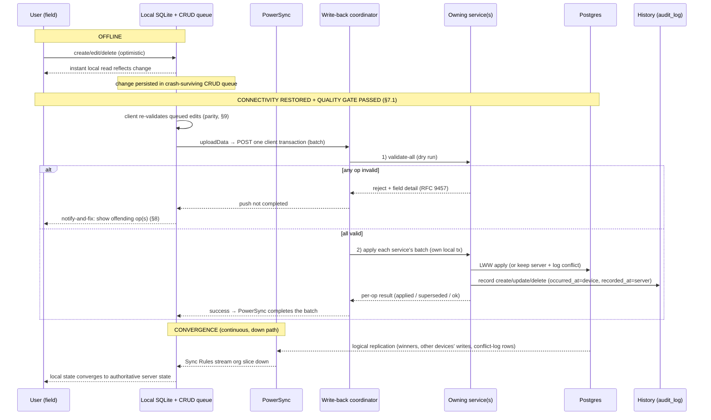

# Sync & Conflict-Resolution Architecture

> **Status:** High-Level Design (HLD) for v1 — the target the M0 build realizes; refined toward
> as-built as the sync path lands. Builds on
> [service-decomposition.md](service-decomposition.md), [data-model.md](data-model.md) and the
> **engine pick** ([ADR-0005](../adr/0005-sync-engine-choice.md) → **PowerSync**). Intent lives
> in [../../requirements/](../../requirements/).

**Issue:** #106 · **Epic:** #103 (EPIC-DESIGN) · **Milestone:** M0
**Requirements:** FR-OF-1, FR-OF-2, FR-OF-3, FR-HIS-1, FR-TEN-2, NFR-ARC-1, NFR-ARC-3
**Decisions:** [D-6](../../requirements/decisions.md#d-6--data--offline-sync-postgresql--postgis-sqlite-on-device-managed-sync) (sync engine + shape),
[D-12](../../requirements/decisions.md#d-12--offline-sync-write-back-atomic-validation-parity-notify-and-fix) (write-back integrity),
[D-11](../../requirements/decisions.md) (AI writes via owning service), [D-10](../../requirements/decisions.md) (PWA-first), [D-5](../../requirements/decisions.md) (Flutter)
**Questions:** resolves [Q-SYNC](../../requirements/decisions.md) (removed from open-questions; this doc + [ADR-0006](../adr/0006-sync-conflict-resolution.md) are its place of record)
**Depends on:** #104, #105, #54 (SP-1) · **ADR:** [0006-sync-conflict-resolution](../adr/0006-sync-conflict-resolution.md) (+ [0005](../adr/0005-sync-engine-choice.md) engine)

---

## 1. Scope

How the offline-first client (D-10 PWA now, native later) stays in sync with the
authoritative Postgres services (D-6), and how concurrent edits reconcile. Concretely, this
document decides the five things #106 owes:

1. the **replicated client slice** — what data reaches each device, and how it is scoped (§3);
2. the **conflict-resolution policy** — server-authoritative record-level **last-write-wins +
   conflict log** (§4);
3. the **sync-publication contract** every owning service must honor (§5);
4. the **cross-service write-back atomicity mechanism** (the open part of D-12) (§6);
5. the **offline → online reconciliation flow**, including history (FR-HIS) (§7) and the
   **connection-quality push gate** (§7.1, FR-OF-3), plus the **notify-and-fix** UX (§8) and
   **client↔server validation parity** (§9).

The **engine is already chosen** — PowerSync, self-hosted (Open Edition), in
[ADR-0005](../adr/0005-sync-engine-choice.md); the [SP-1 report](../spikes/sp-1-powersync-vs-electricsql.md)
proved create → offline edit → sync + server-authoritative LWW/conflict-log end-to-end. This
design is **engine-aware but isolates engine specifics behind the contract in §5**, so the sync
engine remains swappable (NFR-ARC-2).

**When any of this actually runs.** The conflict/atomicity machinery is a property of the
**offline-deferred push** only: writes made while a device is disconnected and replayed later.
**Online writes go straight through the normal service API** and conflict at the database like
any concurrent request (`409`/`If-Match`, [api-contracts.md](api-contracts.md) §4). Two users
editing the _same_ record inside overlapping _offline_ windows is rare — the design is
deliberately **optimized for "rare": cheapest viable path now, with the stronger options kept
open** (§6, §10).

---

## 2. Mental model

```text
   ┌─────────────────────────── device (offline-first) ───────────────────────────┐
   │  Flutter app  ──writes──▶  local SQLite  ──▶  PowerSync CRUD upload queue      │
   │      ▲                     (OPFS/IndexedDB on web; native SQLite on mobile)    │
   │      │ reads (offline)            │ crash-surviving, FIFO, one client tx/unit  │
   └──────┼──────────────────────────┼─────────────────────────────────────────────┘
          │ ▲ replicate down          │ ▲ upload up (only when online)
   slice  │ │ (Sync Rules)            │ │ (uploadData → one server endpoint)
          ▼ │                         ▼ │
   ┌──────────────── cluster ─────────────────────────────────────────────────────┐
   │  PowerSync service ──logical replication──▶ Postgres (publication "powersync") │
   │        ▲ org-scoped bucket per device                     ▲ owns each schema   │
   │        │                                                  │ (no cross-schema tx)│
   │  write-back coordinator ──validate-all, then apply──▶ owning services' APIs ───┘
   │        ▲ (single client-facing endpoint = the seam, §6)                        │
   └────────┴──────────────────────────────────────────────────────────────────────┘
```

- **Down (read path):** PowerSync **Sync Rules** replicate the **org-scoped slice** into the
  device's local SQLite. The client reads/queries locally — offline by default (§3).
- **Up (write path):** local writes land in SQLite immediately (optimistic) and queue in
  PowerSync's persistent CRUD queue. When online **and the link clears the quality gate
  (§7.1, FR-OF-3)**, `uploadData` posts each **client transaction**
  to **one** server endpoint (§6); the owning services apply it authoritatively (§5), and the
  result replicates back **down**, so the client converges (§4, §7).

---

## 3. The replicated client slice (what syncs)

### 3.1 Scoping — organization-first, user is attribution only

Per [FR-TEN-2](../../requirements/functional-requirements.md), **the organization is the unit of
ownership and all members share its data**. So the slice is **org-scoped**: a device receives
**every row of its active organization** for the syncable entities below — not a per-user subset.

The "**and by user for activity ownership**" in [D-6](../../requirements/decisions.md#d-6--data--offline-sync-postgresql--postgis-sqlite-on-device-managed-sync)
is about **attribution, not slice filtering**: `activities.performed_by` records _who_ did each
activity (stamped server-side from the verified identity), but every org member still syncs and
sees **all** the org's activities. No per-user narrowing is applied in v1. (A user-scoped stream
is the reserved extension point should any per-user-private entity appear later — none exists
today.)

### 3.2 What replicates down

| Entity (owning service)                                | Syncs to device                           | Direction            | Why                                                                                                                          |
| ------------------------------------------------------ | ----------------------------------------- | -------------------- | ---------------------------------------------------------------------------------------------------------------------------- |
| `organizations` (the **active** org)                   | that one row                              | read-only on device¹ | tenant root, names/settings for the UI                                                                                       |
| `memberships`, `users` (org roster, minimal profile)   | the org's members                         | read-only            | display `performed_by` / `assigned_to` names offline                                                                         |
| `apiaries`                                             | all org rows                              | read-write           | core field entity (incl. PostGIS location for offline proximity, [data-model.md](data-model.md) §6)                          |
| `activities`                                           | all org rows                              | read-write           | core field entity; `performed_by` attribution                                                                                |
| `journeys`, `journey_plan_items`, `journey_activities` | all org rows                              | read-write           | planned-vs-actual in the field                                                                                               |
| `todos`                                                | all org rows                              | read-write           | field task capture                                                                                                           |
| `audit_log` (recent window)                            | recent history for the org's entities     | read-only            | "view history" works offline for **recent** changes (§7); deep history is an online read ([history.md](history.md) §6, #107) |
| `sync_conflict_log` (own org)                          | conflict rows touching the device's edits | read-only            | surface "your offline edit was superseded" (§4, §8)                                                                          |

¹ _Read-only on device_ = the app has no UI path to edit it offline; org/membership admin is an
**online** Admin-App concern (NFR-ROL-2). It still replicates down for display.

### 3.3 What does **not** sync

- **`ai` schema** (`ai_consents`, `ai_query_log`, `ai_action_log`) — the assistant is
  **cloud + online-only** in the PWA phase (D-8/D-10); nothing AI is available offline. A
  _confirmed_ AI action becomes an ordinary edit and then syncs like any edit (D-11).
- **`invitations`** — an online admin flow (email round-trip); not a field entity.
- **`identity.entitlements`** — feature-toggle flags **may** replicate down **read-only** (small,
  useful offline for gating UI), but are never client-writable (D-4 stub).
- Keycloak internals, PowerSync bucket-storage DB, and any other service's private schema.

### 3.4 How the slice is defined & scoped — PowerSync Sync Rules + a short-lived sync token

The slice is expressed as **PowerSync Sync Rules**: a **parameterized, org-scoped stream** whose
bucket key is the caller's **active `organization_id`**, so a device only ever receives its org's
rows (the on-device projection of the tenancy model, [data-model.md](data-model.md) §5,
[ADR-0002](../adr/0002-multi-tenancy.md)).

PowerSync parameterizes the slice off **JWT claims**, but [auth.md](auth.md) §3.4 **deliberately
keeps `organization_id` / role out of the long-lived Keycloak access token** (membership is
mutable domain data; a cached token would go stale). We reconcile this cleanly:

> **A separate, short-lived PowerSync _sync token_** is minted server-side by the connector's
> auth endpoint (`GET /v1/sync/token`), which resolves the caller's **active org from the
> database** (the same membership lookup as every request, [auth.md](auth.md) §5) and stamps it
> into a **short-TTL** token (minutes, auto-refreshed by the SDK).

Because the sync token is **short-lived**, it can't go stale — which is exactly the reasoning
[auth.md](auth.md) uses to justify keeping org out of the _long-lived_ token. The two invariants
coexist: **long-lived access token stays org-free; org is resolved from the DB and carried only
in the ephemeral sync token.** A member removed from an org stops getting a fresh sync token
within one TTL.

---

## 4. Conflict-resolution policy

**Policy (finalizes the [Q-SYNC](../../requirements/decisions.md) default, validated by
[SP-1](../spikes/sp-1-powersync-vs-electricsql.md)):** **server-authoritative, record-level
last-write-wins (LWW) + a conflict log.**

### 4.1 Record-level LWW

The **owning service** is authoritative. On write-back, for each incoming row it compares the
incoming `updated_at` against the stored `updated_at`:

```text
if stored is null:                      insert            # offline create
elif incoming.updated_at > stored:      apply update      # client is newer → wins
else:                                   keep server value + write a conflict-log row
```

- **Comparator = `updated_at`** (see §4.3). Comparison is **strict**: an incoming row wins only
  if it is **strictly newer**; on an equal timestamp the **server value is kept** (deterministic,
  server-authoritative, no clock-equal thrash) and the loser is logged.
- **Granularity = the whole record.** The winning row replaces the losing row's columns.
- This is [SP-1](../spikes/sp-1-powersync-vs-electricsql.md)'s proven behavior (older offline
  edit lost to a newer server value; conflict logged; client converged).

### 4.2 Conflict log

Every LWW loss writes a row to **`sync_conflict_log`** — owned by the losing write's service,
**co-located in its own schema and written in the same apply transaction as the history row**
(the per-service, in-transaction capture decided in [history.md](history.md) §6, #107):

`{ id, organization_id, entity_type, entity_id, winning_payload, losing_payload, winner (server|client), actor_user_id, occurred_at (device), recorded_at (server) }`

The conflict log is the safety net that makes LWW **non-destructive**: no edit is silently thrown
away — the losing payload is retained, replicated **down read-only** (§3.2), and surfaced to the
user ("your offline change to _Serra Norte_ was superseded by a newer value"; §8). It is **also
our telemetry**: if it grows for a particular entity, that is the signal to add field-level merge
there (§4.4) — we measure before we build.

### 4.3 Clock source (a [Q-SYNC](../../requirements/decisions.md) sub-question, decided here)

- **v1 uses the device wall-clock `updated_at`** as the LWW comparator — set on the device at
  edit time, so it works fully offline and needs no server round-trip. The server **also** stamps
  `recorded_at` (server receive time) on every applied row for audit and ordering (matches
  [data-model.md](data-model.md) §2's device-time-vs-server-time split).
- **Known limitation:** device clock skew can mis-order genuinely concurrent offline edits.
  Accepted for v1 because (a) concurrent same-record _offline_ edits are rare (§1) and (b) the
  conflict log makes any mis-order recoverable, not lost.
- **Documented upgrade path:** replace the comparator with a **hybrid logical clock (HLC)** if
  the conflict log shows skew-driven mis-ordering hurts. HLC is a comparator swap **inside the
  owning service** — no client, slice, or contract change (§6's seam property).

### 4.4 Field-level merge — deferred, noted where it would help

Record-level LWW is **lossy when two users edit _different_ fields** of the same record offline
(e.g. one corrects an apiary's `name`, another updates its `hive_count`): the older push loses
the **whole** record, not just its field. v1 **accepts this** (rare; logged; recoverable) rather
than build per-field merge everywhere.

**Where it would matter first** (candidates for later per-field LWW, driven by the conflict log):
`apiaries` (profile fields vs `hive_count` edited independently) and long-lived `journeys`. Adding
per-field merge is, again, a **change inside the owning service's apply step** — the seam (§6)
keeps it a local change.

### 4.5 Deletes & tombstones

Deletes are **soft-deletes**: setting `deleted_at` ([data-model.md](data-model.md) §2). A tombstone
is just another field-set, so it **participates in LWW like any update** and replicates down; the
client hides tombstoned rows. Physical purge (and tombstone retention) is a history/retention
concern ([history.md](history.md) §7.2, deferred to EPIC-14). This is what makes deletes propagate to every device rather than resurrect
on the next sync.

---

## 5. The sync-publication contract (what every owning service must honor)

This is the **engine-agnostic contract** that isolates PowerSync behind a boundary (NFR-ARC-2). A
service is "syncable" iff it honors **both** halves.

### 5.1 Down — make a table replicable (publish)

Every syncable owned table MUST:

1. carry **`organization_id`** on every row (tenancy + org-scoped stream key, §3.1);
2. use a **client-generatable `UUID` (v7) PK** — offline create with no server round-trip; also
   the natural **idempotency anchor** for upload ([api-contracts.md](api-contracts.md) §4);
3. carry **`created_at`, `updated_at`** (`timestamptz`) — `updated_at` is the LWW comparator (§4);
4. use **soft-delete `deleted_at`** as the tombstone (§4.5);
5. be included in the Postgres **`powersync` publication** and mapped by a **Sync-Rules stream**
   into the org bucket (§3.4);
6. keep its **row shape additive-only** — no rename/retype/removal within a major version
   ([api-contracts.md](api-contracts.md) §8), so a slow-updating field client never desyncs.

These are exactly the [data-model.md](data-model.md) §2 conventions — the model was built for this.

### 5.2 Up — accept write-back (apply)

Each owning service exposes an **internal sync-apply endpoint** that accepts a batch of CRUD ops
**for its own tables only** and, in **one local transaction**:

- **validates** each op against the **same rules as its online write path** (no privileged sync
  bypass) — returning field-level detail on failure ([api-contracts.md](api-contracts.md) §7,
  RFC 9457);
- **authorizes + org-scopes** via the caller's resolved org (rule 4, [auth.md](auth.md));
- applies **record-level LWW + conflict log** (§4);
- **records history** (create/update/delete → `audit_log`, with device `occurred_at` + server
  `recorded_at`, FR-HIS, mechanism #107);
- is **idempotent** on `(PK, op)` via `Idempotency-Key` — a re-sent create/update is a no-op that
  returns the original result (essential for the forward-retry in §6);
- **captures prior state** so the apply is **reversible** — not used in v1, but it is the hook
  that keeps compensation (§6, §10) a later change rather than a rewrite;
- returns a **per-op result**: `applied` · `superseded` (lost LWW) · `rejected` (+ reason `code`).

**The `ai` service is not exempt from ownership** — it never has a sync-apply endpoint for
another schema. A confirmed AI action executes through the _owning_ service's normal API and then
syncs like any edit (D-11, rule 5).

---

## 6. Cross-service write-back atomicity (the open part of D-12)

[D-12](../../requirements/decisions.md#d-12--offline-sync-write-back-atomic-validation-parity-notify-and-fix)
requires a client→server push to be **atomic** (reject one change → the whole push rolls back),
but **ownership rule 1 forbids a single DB transaction across schemas**. A push that spans
services therefore cannot be one transaction. Here is how we get the _effect_ of atomicity
without one — and, crucially, **without foreclosing any stronger option later**.

### 6.1 The invariant that preserves the future: a single server-side seam

> **The client always POSTs the whole client transaction to ONE server-side write-back endpoint.**
> Everything about _how_ it is applied lives **behind** that endpoint.

This seam is the most important decision in this section, because it is the expensive-to-change
one. With it, the apply mechanism — per-service-only, validate-first, compensation, even 2PC or a
durable workflow engine later — is swappable **with zero client change** across PWA/Android/iOS.
The **rejected** alternative of **client-side fan-out** (the device routing each op to its owning
service) is the _only_ option that would bake routing + partial-failure handling into three client
platforms and thus **soft-block** the future; we avoid it for that reason (full weighing in
[ADR-0006](../adr/0006-sync-conflict-resolution.md)).

```text
  client (uploadData)
      │  one POST: the whole client transaction (a batch of CRUD ops)
      ▼
  write-back coordinator  ── owns no domain data; groups ops by owning service ──┐
      │  1. VALIDATE-ALL  (every involved service dry-checks its ops)            │
      │        └─ any reject → abort push, nothing written  ────────────────────┤→ notify-and-fix (§8)
      │  2. APPLY         (each service applies its batch in its OWN local tx)   │
      │        └─ transient failure after validation → idempotent FORWARD-RETRY ─┘
      ▼
  owning services' sync-apply endpoints (§5.2)   →   Postgres (per-schema)
```

### 6.2 The v1 mechanism: validate-first + idempotent forward-retry ("A-lite")

1. **Validate-all first.** The coordinator asks **every** involved service to validate its ops
   **before any service writes**. Nearly all rejections (validation, authz, business rules)
   happen here — **before any durable write**, so there is nothing to roll back. This is the
   common rejection path, and it dovetails with **client-side parity** (§9), which catches most
   of it before the push even leaves the device.
2. **Apply.** If all validated, each service applies its batch in **its own local transaction**
   (record-level LWW + conflict log + history, §5.2).
3. **Forward-retry, not rollback.** The _only_ way an apply fails **after** passing validation is
   a **transient/infra fault** (a service momentarily down, a lost connection). Because ops are
   **idempotent on the client UUID PK**, PowerSync's normal retry of the whole batch simply
   **rolls forward to completion**: already-applied services no-op, the previously-failed one now
   applies. No partial _incorrect_ state is ever committed, and no compensation code is needed.

### 6.3 Why this honors D-12 — and what is deferred

- **Single-service push** (the overwhelming majority, §1): trivially atomic — one service, one
  local transaction, all-or-nothing.
- **Multi-service push** (rare, offline-only): **validate-first** guarantees a _validation_
  rejection touches **nothing**; a _post-validation_ failure is transient and **heals on
  idempotent forward-retry**. Either way there is no partial _wrong_ apply — which is D-12's real
  intent.
- **Deferred (specified, not built): compensation / true rollback.** The one case A-lite does not
  undo is "an op passes validation but then _permanently_ rejects at apply" — which good design
  avoids (validation is the gate). We therefore **do not build compensating actions in v1**; §5.2
  captures prior state so a **compensation step or a bounded saga can be added later without a
  client or contract change** (§10). The [ADR](../adr/0006-sync-conflict-resolution.md) records
  client-fan-out, 2PC/prepared-transactions, choreographed (event) saga, and a durable
  workflow-engine saga as **alternatives rejected for v1**, each reachable _behind the seam_ if
  telemetry ever justifies it.

### 6.4 Where the coordinator lives

A thin, **stateless** component behind the gateway (it may start as a gateway/BFF route and be
extracted later). It **owns no domain data** and holds **no write credentials to any schema** — it
only orchestrates calls to the owning services' sync-apply endpoints (§5.2), preserving ownership
rule 1. One client transaction = one atomic _unit of intent_ = one coordinator invocation.

---

## 7. Offline → online reconciliation flow (incl. history)



**History (FR-HIS-1).** Every applied create/update/delete is recorded in `audit_log` by the
owning service **in the same apply transaction**, with **both** the device `occurred_at` and the
server `recorded_at` ([history.md](history.md) §4, #107) — so the history view stays **correct
across late sync**: a change made offline on Monday and synced Wednesday reads as _occurred Monday,
recorded Wednesday_, not backdated or lost. **LWW losers** are preserved in `sync_conflict_log`
(§4.2) and surfaced as `superseded` events in the entity's history/timeline. Recent history
replicates down (§3.2) so it is viewable offline; deep history is an online query
([history.md](history.md) §6).

### 7.1 When the client pushes — the connection-quality gate (FR-OF-3)

**"Connectivity restored" is necessary but not sufficient to start a sync attempt.** Field
sites often get **short windows of very weak signal**; a push attempted there stalls or fails
mid-transfer, repeatedly dropping the client into the reconnect/retry path. Per **FR-OF-3**,
the client gates sync on **measured link quality**, not the mere presence of a connection:

- **Trigger rule.** The client connects the sync stream / flushes the upload queue only when
  (a) connectivity exists **and** (b) a **quality probe** passes — roughly _"usable 3G or
  better."_
- **Measurement.** The portable primary signal is a **tiny probe request** to the gateway's
  health endpoint (RTT + hard timeout). Where available, the Network Information API
  (`effectiveType` / `downlink`) serves as a cheap _hint_ — but it is Chromium-only, so the
  probe is the decision-maker on every platform.
- **Thresholds are configurable** (probe timeout / RTT ceiling), with defaults tuned in
  EPIC-06 field testing — not hard-coded guesses.
- **Backoff.** Failed probes and failed pushes back off exponentially, so marginal-signal
  windows don't churn the radio and battery.
- **Manual override.** A user-triggered **"sync now"** always attempts once, gate or no gate —
  the beekeeper on the hill may know things the probe doesn't.
- **The gate is an optimization, never a correctness mechanism.** An interrupted push is
  already safe — atomic per push (§6), completed by idempotent forward-retry (§6.2). The gate
  exists to make that failure path **rare**: fewer aborted attempts, fewer
  `syncing → pending` flaps in the UI (§8), less battery burn.
- **Engine placement.** Implemented client-side around the engine's connect/upload lifecycle
  (with PowerSync: gate `connect()`/`disconnect()` and the `uploadData` trigger). It sits
  **outside** the §5 contract, so it survives an engine swap (NFR-ARC-2).

---

## 8. "Synced" status & notify-and-fix UX (FR-OF-2 / D-12)

The engine tracks queue state; the app surfaces it. Both are required by
[FR-OF-2](../../requirements/functional-requirements.md).

**Per-record sync status** shown in the UI:

| State        | Meaning                                                              |
| ------------ | -------------------------------------------------------------------- |
| `pending`    | edited offline, not yet uploaded                                     |
| `syncing`    | in an in-flight push                                                 |
| `synced`     | applied server-side and confirmed                                    |
| `superseded` | lost LWW to a newer value — surfaced from `sync_conflict_log` (§4.2) |
| `rejected`   | the push was rejected; needs the user to fix (below)                 |

**Notify-and-fix on rejection (D-12).** Because a push is atomic (§6), a rejection surfaces the
**whole push** with the **offending op(s)** highlighted, using the server's RFC 9457
`code` + `errors[]` field detail ([api-contracts.md](api-contracts.md) §7). The **pushing user**
is notified, edits the offending record(s) on the client, and the corrected push is re-queued.
The server stays authoritative throughout.

The concrete screens/interaction design are **EPIC-06**'s (this doc fixes the data + states they
render); accessibility (WCAG 2.2 AA, gloves-friendly) and EN/PT apply as everywhere.

---

## 9. Client↔server validation parity (D-12)

Before pushing, the client **re-validates** queued edits against the **same rules the server will
apply**, to catch failures **offline** (better UX, and it is what makes §6's validate-first phase
rarely reject). Parity is a **UX optimization, not a security boundary** — the server is always
authoritative.

**Avoiding rule drift** (the hard part) — the working approach, detailed in EPIC-06:

- express as much validation as possible **declaratively in the OpenAPI schema** (types, ranges,
  required, enums — [api-contracts.md](api-contracts.md)), which is **contract-first and codegen'd
  to both sides**, so shared constraints can't silently diverge;
- keep richer business rules in a **small shared validation description** mirrored by client and
  server, with the server as the single source of truth;
- treat any client/server divergence as a **bug caught by boundary contract tests** (NFR-TST).

---

## 10. Open items, deferred scope & hand-offs

| Item                                                                      | Status                                                                                                                                     | Where                                                                                   |
| ------------------------------------------------------------------------- | ------------------------------------------------------------------------------------------------------------------------------------------ | --------------------------------------------------------------------------------------- |
| Field-level merge                                                         | **Deferred** — record-level LWW + log for v1; add per-field where the conflict log shows it hurts (§4.4)                                   | owning service apply step; behind the seam (§6)                                         |
| Compensation / true cross-service rollback                                | **Specified, not built** — A-lite (validate-first + forward-retry) covers v1; prior-state capture (§5.2) keeps it a later change           | §6.3; EPIC-06                                                                           |
| Clock source → HLC                                                        | **Deferred** — device `updated_at` for v1; HLC is a comparator swap if skew hurts (§4.3)                                                   | owning service                                                                          |
| Notify-and-fix screens                                                    | **Design hand-off** — states/data fixed here                                                                                               | EPIC-06                                                                                 |
| Connection-quality gate (FR-OF-3)                                         | **Design hand-off** — trigger rule, probe approach & override fixed here (§7.1); thresholds tuned in field testing                         | EPIC-06 (#55/#58)                                                                       |
| Validation-parity mechanism                                               | **Design hand-off** — approach fixed here (§9)                                                                                             | EPIC-06                                                                                 |
| History capture mechanism                                                 | **Resolved** — per-service, in the apply transaction (§7); no events/outbox/triggers in v1                                                 | [history.md](history.md) / [ADR-0007](../adr/0007-history-audit.md) (#107)              |
| History retention / immutability / offline behavior                       | **Resolved** — append-only + DB-enforced immutability; retain in v1 (purge → EPIC-14); recent-history offline slice; GDPR via pseudonymity | [history.md](history.md) §7 / [ADR-0007](../adr/0007-history-audit.md) (Q-HIS resolved) |
| Build the PowerSync subchart + per-service connector + sync/offline tests | Depends-on                                                                                                                                 | EPIC-06 (#7) / EPIC-00 (#1) / EPIC-13                                                   |
| iOS PWA storage durability (OPFS/IndexedDB eviction)                      | Validate when iOS is in scope (D-10)                                                                                                       | [ADR-0005](../adr/0005-sync-engine-choice.md), SP-1 §5                                  |

---

## 11. Acceptance-criteria traceability (#106)

- [x] Replicated **client slice** defined — org-scoped (user = attribution), via Sync Rules + a
      short-lived sync token — §3
- [x] Conflict-resolution policy documented — server-authoritative **record-level LWW + conflict
      log**; field-level merge noted where needed (deferred) — §4
- [x] **Sync-publication contract** every service must honor (down + up) — §5
- [x] Offline → online **reconciliation flow** incl. history (FR-HIS) — §7
- [x] Cross-service **write-back atomicity** mechanism decided (the open part of D-12) — §6
- [x] Sync design doc + **ADR** in `docs/`; **resolves the Q-SYNC default** — this doc +
      [ADR-0006](../adr/0006-sync-conflict-resolution.md) (Q-SYNC removed from open-questions)

## 12. Links

- Engine: [ADR-0005](../adr/0005-sync-engine-choice.md) · [SP-1 report](../spikes/sp-1-powersync-vs-electricsql.md)
- This decision: [ADR-0006](../adr/0006-sync-conflict-resolution.md)
- Builds on: [service-decomposition.md](service-decomposition.md) (#104) ·
  [data-model.md](data-model.md) (#105) · [api-contracts.md](api-contracts.md) (#108) ·
  [auth.md](auth.md) (#109)
- Intent: [decisions.md](../../requirements/decisions.md) (D-6, D-12) ·
  [functional-requirements.md](../../requirements/functional-requirements.md) (FR-OF-1/2/3, FR-HIS-1)
- Next in EPIC-DESIGN: #107 (history — [history.md](history.md)) → #110 (walking-skeleton design)
