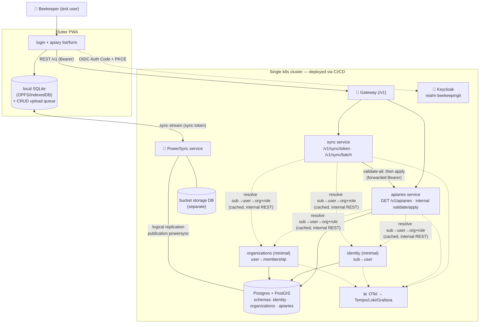
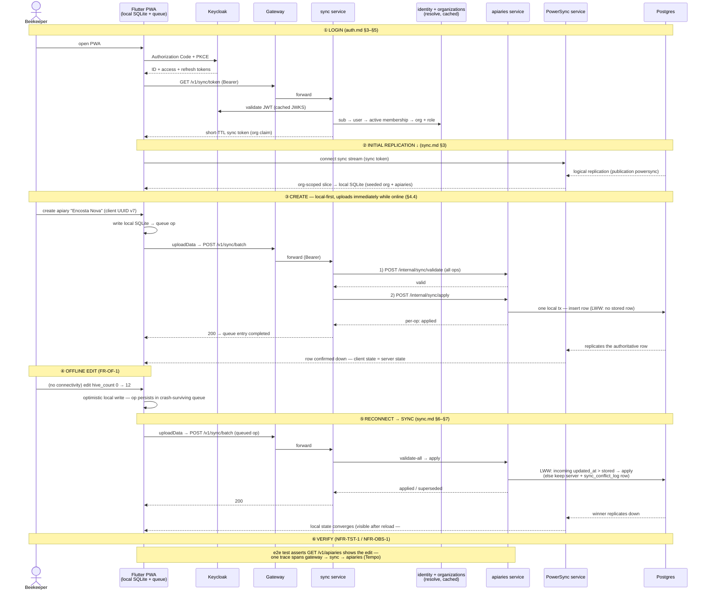

# Walking-Skeleton Slice Design (M0)

> **Status:** High-Level Design (HLD) — the end-to-end design of the **M0 walking skeleton**:
> **login → create a trivial record → edit offline → sync**. This is the consolidation task of
> EPIC-DESIGN: it composes [service-decomposition.md](service-decomposition.md),
> [data-model.md](data-model.md), [sync.md](sync.md), [history.md](history.md),
> [api-contracts.md](api-contracts.md) and [auth.md](auth.md) (ADRs 0001–0007) into **one
> coherent slice**, and fixes the last slice-level decisions so **EPIC-00 #23 has no
> architectural unknowns left**. Intent lives in [../../requirements/](../../requirements/).

**Issue:** #110 · **Epic:** #103 (EPIC-DESIGN) · **Milestone:** M0
**Requirements:** NFR-ARC-1, NFR-TST-1 (+ NFR-ARC-3, NFR-OBS-1, FR-OF-1/2 via #23)
**Decisions:** [D-1](../../requirements/decisions.md#d-1--v1-uses-a-full-microservices-architecture) (microservices),
[D-5](../../requirements/decisions.md) (Flutter/Go), [D-6](../../requirements/decisions.md#d-6--data--offline-sync-postgresql--postgis-sqlite-on-device-managed-sync) (Postgres + PowerSync),
[D-7](../../requirements/decisions.md#d-7--identity--auth-keycloak-self-hosted) (Keycloak),
[D-10](../../requirements/decisions.md) (PWA-first),
[D-12](../../requirements/decisions.md#d-12--offline-sync-write-back-atomic-validation-parity-notify-and-fix) (write-back)
**Depends on:** #104, #105, #106, #107, #108, #109, #54 (SP-1)
**ADRs consolidated:** [0001](../adr/0001-service-decomposition.md) · [0002](../adr/0002-multi-tenancy.md) ·
[0003](../adr/0003-api-contract-conventions.md) · [0004](../adr/0004-authn-authz.md) ·
[0005](../adr/0005-sync-engine-choice.md) · [0006](../adr/0006-sync-conflict-resolution.md) ·
[0007](../adr/0007-history-audit.md) — no new ADR; the slice-scoping decisions in §4 are
recorded here as their place of record.

---

## 1. Purpose & scope

The walking skeleton is the **M0 exit-criteria slice** (#23): one thin vertical path that proves
the architecture end-to-end **before scaling out** — a user logs in via Keycloak from the Flutter
PWA, creates a trivial record persisted through a Go service into Postgres, edits it offline,
and the edit syncs when connectivity returns; the whole slice is deployed via CI/CD with
traces/logs visible (NFR-OBS-1), and an automated test exercises the path (NFR-TST-1).

**This document decides:** the minimal component set the slice exercises (§3), the contracts
between them (§5), the end-to-end sequence (§6), the slice-level decisions the sibling designs
left to #110 (§4), and the exact build scope of **EPIC-00 #23** (§7).

**This document does not redesign anything.** Every mechanism below is already decided in a
sibling design; where a sentence needs detail, it links to the owning section instead of
restating it.

### 1.1 The consolidation in one sentence per design

| Design (ADR)                                                                                       | What the slice takes from it                                                                                                                                                 |
| -------------------------------------------------------------------------------------------------- | ---------------------------------------------------------------------------------------------------------------------------------------------------------------------------- |
| [service-decomposition.md](service-decomposition.md) (0001)                                        | Schema-per-service ownership; services write only their own schema; the gateway + single-cluster topology                                                                    |
| [data-model.md](data-model.md) (0002)                                                              | The `apiaries` shape (client-generated UUID v7, `organization_id`, `updated_at`, `deleted_at`); tenancy = org-id on every owned row                                          |
| [api-contracts.md](api-contracts.md) (0003)                                                        | Contract-first REST + OpenAPI 3.1 under `/v1`; RFC 9457 errors; tenancy never a client parameter                                                                             |
| [auth.md](auth.md) (0004)                                                                          | OIDC Auth Code + PKCE login; JWKS validation in the shared middleware; org + role resolved from membership per request                                                       |
| [ADR-0005](../adr/0005-sync-engine-choice.md) + [SP-1](../spikes/sp-1-powersync-vs-electricsql.md) | PowerSync (self-hosted); web SDK (wa-sqlite over OPFS/IndexedDB); the proven k8s deployment shape                                                                            |
| [sync.md](sync.md) (0006)                                                                          | Org-scoped Sync-Rules slice + short-lived sync token; single write-back seam (`POST /v1/sync/batch`); validate-first + forward-retry; record-level LWW + conflict log        |
| [history.md](history.md) (0007)                                                                    | Nothing **built** in the slice (FR-HIS is out of scope per #23) — but the apply path is shaped so the in-transaction `audit_log` INSERT drops in later without rework (§4.6) |

---

## 2. The slice story — and the one insight that makes it thin

The skeleton's four steps look like two different write paths ("create online" vs "edit
offline"). They are not. Per [sync.md](sync.md) §2, the **field client always writes
local-first**: every PWA write lands in local SQLite immediately and queues in PowerSync's
crash-surviving upload queue; when online, the queue flushes within moments through the **one
write-back seam** (`uploadData` → `POST /v1/sync/batch`).

> **Consolidation clarification (finalized here, §4.4):** for the **Flutter PWA**, _online
> create_ and _offline edit_ are the **same mechanism** — the only difference is how long the
> op sits in the queue. The "online writes go straight through the normal service API" path in
> [sync.md](sync.md) §1 belongs to **online-only clients** (the React Admin App, and AI
> confirmed actions via the owning service) — not to the field client.

This is why one thin slice proves the whole architecture: building "create" gives you "offline
edit + sync" almost for free, and the skeleton exercises **every** load-bearing seam — OIDC
login, JWKS middleware, membership-based org resolution, the sync token, Sync-Rules replication,
the write-back coordinator, an owning service's validate/apply path with LWW, logical
replication back down, contract-first codegen, tracing across services, and CI/CD to the
cluster.

---

## 3. Minimal component set

### 3.1 What runs in the slice

| Component                                 | Role in the slice                                                                                                                                       | Source design                                                                  |
| ----------------------------------------- | ------------------------------------------------------------------------------------------------------------------------------------------------------- | ------------------------------------------------------------------------------ |
| **Flutter PWA** (from #21)                | Login, apiary list + create/edit form (name, hive count), PowerSync web SDK (local SQLite via OPFS/IndexedDB)                                           | D-5/D-10, [tech-stack](../../requirements/tech-stack.md), ADR-0005             |
| **API Gateway** (Traefik/NGINX)           | TLS, `/v1` routing (§5.3), optional edge JWT check                                                                                                      | [service-decomposition.md](service-decomposition.md) §6, [auth.md](auth.md) §4 |
| **Keycloak**                              | Realm `beekeepingit`, public client `beekeepingit-pwa` (Auth Code + PKCE), JWKS                                                                         | [auth.md](auth.md) §3                                                          |
| **`identity` service** (minimal)          | `identity.users` + the internal **sub → user** resolve endpoint (§5.2)                                                                                  | [auth.md](auth.md) §5.1 step 1                                                 |
| **`organizations` service** (minimal)     | `organizations.organizations` + `memberships`; internal **active-membership** resolve endpoint (§5.2)                                                   | [auth.md](auth.md) §5.1 steps 2–3                                              |
| **`apiaries` service**                    | The owning service of the trivial record: migrations, `GET /v1/apiaries` (+`/{id}`), internal sync **validate/apply** with LWW + `sync_conflict_log`    | [data-model.md](data-model.md), [sync.md](sync.md) §4–§5                       |
| **`sync` service** (new, thin, stateless) | `GET /v1/sync/token` (short-TTL sync token + its JWKS) and `POST /v1/sync/batch` (the write-back **coordinator**) — §4.3                                | [sync.md](sync.md) §3.4, §6                                                    |
| **PowerSync service** (self-hosted)       | Logical replication from Postgres (publication `powersync`) → org-parameterized stream → client SQLite; bucket storage in its **own separate database** | ADR-0005, SP-1 §4                                                              |
| **PostgreSQL + PostGIS**                  | One cluster; schemas `identity`, `organizations`, `apiaries`; `wal_level=logical`                                                                       | D-6, [data-model.md](data-model.md) §4                                         |
| **Observability stack** (with #87)        | OTel from every Go service + gateway → Tempo/Loki/Grafana; one trace across gateway → sync → apiaries                                                   | NFR-OBS-1, #20 template                                                        |
| **CI/CD** (with #88/#86)                  | Build/test/publish images, deploy the slice to the cluster via the Helm umbrella (#83)                                                                  | NFR-ARC-3, EPIC-13                                                             |

### 3.2 Deliberately **not** in the slice

`activities`, `journeys`, `todos`, `ai` services · React Admin App · MinIO · `audit_log`
capture (FR-HIS → EPIC-07, per #23's note) · notify-and-fix UX and per-record sync-status
badges (FR-OF-2 → EPIC-06 #58) · the **connection-quality sync gate** (FR-OF-3 → EPIC-06;
the skeleton pushes on simple reconnect — [sync.md](sync.md) §7.1) · onboarding flows
(profile/org creation, invitations → EPIC-01 #25–#27) · role-differentiated authz (`admin` vs `user` matrix → #28; the slice only
needs _"active member"_, since apiary CRUD is available to both roles per [auth.md](auth.md)
§5.3) · optional RLS (#30) · offline **login** (native phase, [auth.md](auth.md) §6).

None of these change the architecture the skeleton proves; they extend it.

### 3.3 Slice container view

---

## 4. Slice-level decisions (finalized here)

Each of these was explicitly deferred to #110 or left as a "build detail" by a sibling design.
They are **narrow, slice-scoping decisions** — recorded here, no new ADR.

### 4.1 The trivial record is an **apiary**

The record the skeleton creates/edits is an `apiaries` row with just **`name` + `hive_count`**
(the [data-model.md](data-model.md) §3 shape; `location` stays nullable and unused in the
slice — PostGIS is installed by #22 but not exercised). Why apiaries:

- it is the **core field entity** and the exact slice [SP-1](../spikes/sp-1-powersync-vs-electricsql.md)
  already proved end-to-end (same table, same LWW semantics) — least new risk;
- its **OpenAPI contract skeleton already exists**
  ([`contracts/openapi/apiaries.openapi.yaml`](../../contracts/openapi/apiaries.openapi.yaml)),
  so the contract-first pipeline is exercised without authoring a throwaway spec;
- everything built for it is **kept**: EPIC-02 (#31) grows this same service, table and contract
  — nothing in the skeleton is disposable.

### 4.2 Membership resolution v1 = **internal REST calls + short-TTL cache**

[auth.md](auth.md) §5.1 fixed the _rule_ (verified `sub` → `identity.users` → active membership
→ `organization_id` + `role`) but left the _read path_ ("call the `organizations` service vs a
replicated projection") open. **Decided for v1:** the shared middleware makes two **internal
REST calls** — `identity` (sub → user) and `organizations` (user → active membership) — with a
short-TTL (~30–60 s) per-instance cache keyed by `sub`.

- It is the [api-contracts.md](api-contracts.md) §10 **default** (REST/JSON for the rare
  synchronous internal call; no new infra), and cross-service DB reads are forbidden anyway
  (ownership rules 1/3).
- The volume is bounded by the cache TTL, and v1 is single-org (C-1).
- A **replicated membership projection** stays the reserved upgrade if the resolve path ever
  shows up in latency budgets — a middleware-internal swap, invisible to services.
- Bonus for the skeleton: it makes the slice exercise a real **east-west REST call + trace
  propagation**, which nothing else in M0 would.

### 4.3 The coordinator and the sync-token endpoint live in **one thin `sync` service**

[sync.md](sync.md) §6.4 allowed the write-back coordinator to "start as a gateway/BFF route".
Our gateway is Traefik/NGINX — not programmable — so **decided:** a dedicated, thin, stateless
Go **`sync` service** hosts both client-facing sync endpoints:

- `GET /v1/sync/token` — mints the **short-TTL sync token** (RS256, org claim resolved from
  membership per §4.2) and serves the **JWKS** PowerSync validates it against
  ([sync.md](sync.md) §3.4; SP-1's `client_auth.jwks_uri` pattern);
- `POST /v1/sync/batch` — the **single write-back seam**: validate-all → apply → idempotent
  forward-retry ([sync.md](sync.md) §6). It owns no domain data and holds no schema credentials;
  it only orchestrates calls to owning services' internal endpoints, **forwarding the caller's
  bearer token** so each owning service re-validates and re-resolves org itself (zero-trust,
  [auth.md](auth.md) §4).

In the skeleton the coordinator fans out to exactly **one** service (`apiaries`) — the
degenerate-but-real case ([sync.md](sync.md) §6.3: single-service push is trivially atomic).
The two-phase contract (§5.2) is still implemented as specified, so adding a second owning
service later changes **nothing** in the client or the coordinator's contract.

### 4.4 The field client has **one write path**

Finalizing §2's clarification as a rule: **every Flutter-client write — online or offline —
goes local-first through the PowerSync queue and the `/v1/sync/batch` seam.** The PWA never
calls `POST/PATCH/DELETE /v1/apiaries` directly. Direct REST writes are the path for
**online-only clients** (Admin App; AI confirmed actions execute through the owning service's
REST API per D-11). Consequences:

- one write path to validate, trace, and test — not two;
- the client-facing REST **read** surface stays (Admin App, deep history, computed reads, and
  the skeleton's e2e assertions §7.3) — canonical _field_ reads are local per
  [service-decomposition.md](service-decomposition.md) rule 3;
- FR-OF-2's "synced" status falls out of the queue state ([sync.md](sync.md) §8), identically
  online and offline.

### 4.5 Skeleton identity data is **seeded, not onboarded**

#23's AC starts at "a user can log in" — profile/org onboarding is EPIC-01 (#25–#27). The
skeleton **seeds** what login needs:

- **Keycloak realm import** (dev/CI-grade): realm `beekeepingit`, client `beekeepingit-pwa`,
  one test user (password credential, email pre-verified);
- **SQL seed** (idempotent, dev/CI-only): the matching `identity.users` row (by `keycloak_sub`),
  one `organizations` row, one **active `admin` membership** — exactly the rows the §4.2
  resolve path needs.

This still exercises the full authN/authZ pipeline on every request (nothing is stubbed); it
only skips the _creation UX_. EPIC-01 replaces the seed with real onboarding; EPIC-14 (#15)
owns production realm config and secrets.

### 4.6 What the apply path includes in the skeleton: **LWW + conflict log, no audit log**

The `apiaries` sync-apply implements the full [sync.md](sync.md) §5.2 semantics **except**
history: record-level LWW (strict `>` comparator on `updated_at`, server keeps on equal — §4.1
there), tombstone soft-deletes, idempotency on the client UUID PK, and the
**`sync_conflict_log`** write (it is the safety net that makes LWW non-destructive, it is one
INSERT, and SP-1 already proved it). The **`audit_log` INSERT is the one omission** (FR-HIS out
of scope per #23): the apply step is written as _one local transaction with a clearly marked
seam_ where EPIC-07 (#59/#61) adds the in-transaction audit row ([history.md](history.md) §4)
without restructuring. No conflict/rejection **UI** ships in the skeleton (EPIC-06 #58); the
server side of notify-and-fix (RFC 9457 `code` + `errors[]` on validation reject) exists from
day one because it is just the contract's error shape.

---

## 5. Contracts between the components

Everything below follows [api-contracts.md](api-contracts.md) (REST + OpenAPI 3.1, RFC 9457
errors, `snake_case`, UUID v7 ids, bearer JWT, tenancy never a client parameter).

### 5.1 Client-facing (through the gateway)

| Contract                                        | Consumer → Provider                            | Shape                                                                                                                                                                                                                                                               |
| ----------------------------------------------- | ---------------------------------------------- | ------------------------------------------------------------------------------------------------------------------------------------------------------------------------------------------------------------------------------------------------------------------- |
| **OIDC login**                                  | PWA → Keycloak                                 | Authorization Code + **PKCE**, public client `beekeepingit-pwa` ([auth.md](auth.md) §3.2)                                                                                                                                                                           |
| **`GET /v1/sync/token`**                        | PWA (PowerSync `fetchCredentials`) → `sync`    | Bearer (Keycloak JWT) → `200 { token, expires_at }`; token = RS256 sync token, TTL minutes, org claim from membership ([sync.md](sync.md) §3.4)                                                                                                                     |
| **`POST /v1/sync/batch`**                       | PWA (PowerSync `uploadData`) → `sync`          | Bearer → body = one client transaction: `{ ops: [ { op: put\|patch\|delete, entity_type, id, data, updated_at } ] }`; `200` per-op results (`applied` · `superseded` · rejected detail) or `422` problem+json with the offending op(s) ([sync.md](sync.md) §5.2/§6) |
| **`GET /v1/apiaries`, `GET /v1/apiaries/{id}`** | PWA (e2e assertions; later Admin) → `apiaries` | Existing contract [`apiaries.openapi.yaml`](../../contracts/openapi/apiaries.openapi.yaml); cursor pagination                                                                                                                                                       |
| **Sync stream**                                 | PWA (PowerSync web SDK) ↔ PowerSync service    | Engine protocol (behind the ADR-0005/NFR-ARC-2 boundary), authenticated by the **sync token**; org-parameterized stream over `apiaries` + the active `organizations` row                                                                                            |

A new **`contracts/openapi/sync.openapi.yaml`** (token + batch, stamped from
`_shared/components.openapi.yaml`) is a #23 deliverable — it is the write-back seam's public
contract and must be authored contract-first like every other surface.

### 5.2 Internal (east-west, in-cluster; same conventions, never exposed via the gateway)

| Contract                  | Consumer → Provider                              | Shape                                                                                                                                                                                                                                                                                                       |
| ------------------------- | ------------------------------------------------ | ----------------------------------------------------------------------------------------------------------------------------------------------------------------------------------------------------------------------------------------------------------------------------------------------------------- |
| **Resolve user**          | shared middleware → `identity`                   | `GET /internal/users/by-sub/{sub}` → `200 { user_id, … }` / `404`                                                                                                                                                                                                                                           |
| **Resolve membership**    | shared middleware → `organizations`              | `GET /internal/memberships/active?user_id=` → `200 { organization_id, role }` / `404` (→ caller returns `403`)                                                                                                                                                                                              |
| **Sync validate / apply** | `sync` coordinator → owning service (`apiaries`) | `POST /internal/sync/validate` (dry-run all ops, field-level RFC 9457 detail on reject) and `POST /internal/sync/apply` (one local tx: LWW + conflict log; idempotent on `(PK, op)`; per-op results) — [sync.md](sync.md) §5.2/§6.2. Caller's bearer token forwarded; provider re-authenticates + re-scopes |
| **JWKS (sync token)**     | PowerSync service → `sync`                       | `GET /internal/sync/jwks.json` (SP-1 `client_auth.jwks_uri`)                                                                                                                                                                                                                                                |
| **JWKS (Keycloak)**       | every service → Keycloak                         | OIDC discovery → JWKS, cached, refetch on unknown `kid` ([auth.md](auth.md) §4)                                                                                                                                                                                                                             |

### 5.3 Gateway routes & data-plane wiring

| Route / link                                                                                                                                   | Target                                                                                                     |
| ---------------------------------------------------------------------------------------------------------------------------------------------- | ---------------------------------------------------------------------------------------------------------- |
| `/v1/sync/**`                                                                                                                                  | `sync` service                                                                                             |
| `/v1/apiaries/**`                                                                                                                              | `apiaries` service                                                                                         |
| `/sync-stream/**` (PowerSync HTTP/WebSocket endpoint)                                                                                          | PowerSync service                                                                                          |
| `/auth/**` (or dedicated host)                                                                                                                 | Keycloak                                                                                                   |
| `/` (static)                                                                                                                                   | PWA bundle (with #93)                                                                                      |
| Postgres publication **`powersync`** — **only** the synced tables (`apiaries.apiaries`, `organizations.organizations`), _not_ `FOR ALL TABLES` | PowerSync logical replication (SP-1 §4; bucket storage in its own DB so the publication never captures it) |
| W3C `traceparent` propagated PWA → gateway → `sync` → `apiaries`; OTel from all services                                                       | observability stack (#87)                                                                                  |

The Sync-Rules stream is **org-parameterized** off the sync token's org claim
([sync.md](sync.md) §3.4) — even with one org seeded, the skeleton runs the _real_ scoped
stream, not SP-1's `global` throwaway rule, so tenancy layer 3 (ADR-0002) is exercised.

---

## 6. End-to-end sequence (the #110 diagram)

If any op fails **validation**, step ⑤ short-circuits before any write: the coordinator returns
`422` problem+json with the offending op(s) and the whole push stays queued
([sync.md](sync.md) §6.2 — nothing written, D-12 honored). A **post-validation transient**
failure heals by idempotent forward-retry of the same batch. The skeleton implements both
server behaviors; the _user-facing_ fix flow is EPIC-06.

---

## 7. Exactly what EPIC-00 #23 must build

### 7.1 Prerequisites the slice consumes (not #23's scope)

| From                           | What the slice needs                                                                                                                                                                                  |
| ------------------------------ | ----------------------------------------------------------------------------------------------------------------------------------------------------------------------------------------------------- |
| #19                            | monorepo tooling (lint/format/task runner) the new dirs plug into                                                                                                                                     |
| #20                            | the **shared Go service template** — health, config, structured logs, OTel, JWKS middleware + §4.2 resolve/cache, RFC 9457 errors, pgx/sqlc + migrations. All four slice services are stamped from it |
| #21                            | the **Flutter PWA skeleton** — shell, routing, theming, state mgmt, i18n scaffold (slice strings EN/PT from day one)                                                                                  |
| #22                            | **local dev environment**: Postgres+PostGIS (`wal_level=logical`), Keycloak, PowerSync (+ bucket-storage DB), gateway (MinIO not needed by the slice)                                                 |
| EPIC-13 #83/#84/#87/#88 (+#86) | Helm umbrella + platform subcharts, observability stack, CI/CD pipeline to the cluster — #23's "deployed via CI/CD, traces visible" AC rides on these                                                 |

### 7.2 The #23 build list (this closes its "no unknowns" AC)

1. **Keycloak realm import (dev/CI)** — realm `beekeepingit`, client `beekeepingit-pwa`
   (PKCE), test user (§4.5). _Overlap note:_ EPIC-01 #24 owns the production-grade realm/login
   story — #23 ships the dev-grade import + PWA login wiring; #24 hardens (flows, theming,
   verification) without redoing it. Don't build it twice.
2. **`identity` service (minimal)** — `identity.users` migration; `GET /internal/users/by-sub/{sub}`; seed.
3. **`organizations` service (minimal)** — `organizations` + `memberships` migrations;
   `GET /internal/memberships/active`; seed (org + admin membership).
4. **`apiaries` service** — migration (`apiaries` per [data-model.md](data-model.md) §3 +
   `sync_conflict_log` per [sync.md](sync.md) §4.2); contract-first `GET /v1/apiaries[/{id}]`
   from the existing spec; `POST /internal/sync/validate|apply` with LWW + conflict log +
   tombstones + idempotency (§4.6). REST write handlers (`POST/PATCH/DELETE`) are **EPIC-02
   #31**, not the skeleton (§4.4).
5. **`sync` service** — `/v1/sync/token` (+ JWKS) and the `/v1/sync/batch` coordinator (§4.3);
   **new contract `contracts/openapi/sync.openapi.yaml`**.
6. **PowerSync config** — publication `powersync` (synced tables only); **org-parameterized
   Sync Rules** stream (`apiaries` + active `organizations` row); `client_auth.jwks_uri` → the
   sync service (§5.3, SP-1 §4).
7. **PWA slice UI** — login via OIDC; apiaries list + create/edit form (name, hive count)
   reading **local SQLite**; PowerSync web SDK connector (`fetchCredentials` → token,
   `uploadData` → batch). EN/PT strings externalized; WCAG 2.2 AA / gloves-friendly basics per
   the #21 scaffold.
8. **Deploy** — Helm subcharts for the four Go services + PowerSync + PWA static bundle wired
   into the umbrella (#83); CI/CD path builds, tests, publishes and deploys the slice (#88).
9. **The automated test** (§7.3) running in CI.
10. **Observability check** — one trace spanning gateway → `sync` → `apiaries` visible in
    Tempo/Grafana; per-service structured logs in Loki (NFR-OBS-1, the M0 exit criterion).

### 7.3 The automated test (NFR-TST-1)

One **e2e test of the full slice**, in CI: log in as the seeded user → create an apiary → go
offline (network cut) → edit it → verify the edit is local-only → reconnect → assert
**server-side** via `GET /v1/apiaries` that the edit arrived → reload the PWA and assert the
local state converged. This is SP-1's 8-check script promoted to a kept, CI-run test against
the real stack. **Recommended driver: Playwright** against the built PWA (CDP network
offlining is first-class; Flutter web semantics enabled for selectors); Flutter
`integration_test` is the fallback if canvas semantics prove brittle — final tool choice is a
#23 build detail, either satisfies the AC. Service-level Go integration tests (containerized
Postgres) cover the LWW/conflict-log/idempotency matrix of the apply endpoint
(coding-standards).

---

## 8. No architectural unknowns left (the #110 gate)

Every question the slice touches, and where it is closed:

| Concern                                                                                                                      | Closed by                                                       |
| ---------------------------------------------------------------------------------------------------------------------------- | --------------------------------------------------------------- |
| Service boundaries, ownership, topology                                                                                      | [service-decomposition.md](service-decomposition.md) / ADR-0001 |
| Record shape, tenancy, ids, tombstones                                                                                       | [data-model.md](data-model.md) / ADR-0002                       |
| Contract style, errors, versioning, internal calls                                                                           | [api-contracts.md](api-contracts.md) / ADR-0003                 |
| Login, JWT validation, org+role resolution                                                                                   | [auth.md](auth.md) / ADR-0004 (Q-AUTH, Q-ROLE resolved)         |
| Sync engine + PWA persistence                                                                                                | ADR-0005 / SP-1 (#54)                                           |
| Slice scoping, sync token, LWW + conflict log, write-back atomicity                                                          | [sync.md](sync.md) / ADR-0006 (Q-SYNC, D-12 resolved)           |
| History capture (out of slice scope, seam reserved)                                                                          | [history.md](history.md) / ADR-0007 (Q-HIS resolved)            |
| Trivial record · membership read path · coordinator placement · single client write path · seed strategy · slice apply scope | **this doc**, §4.1–§4.6                                         |

**Open `Q-*` check:** no unresolved open question blocks the slice. Q-AICLOUD, Q-JOUR, Q-TODO,
Q-DIST, Q-MAP, Q-IMP, Q-NOTIF, Q-SEARCH all concern entities/features outside the skeleton
(journeys are **not** in the slice, so Q-JOUR stays with EPIC-04 #46). Q-PERF/Q-DR/Q-CMP are
operational NFR clarifications owned by EPIC-13/14.

**Risks carried (known, accepted, not blockers):**

| Risk                                                         | Standing                                                                                                           |
| ------------------------------------------------------------ | ------------------------------------------------------------------------------------------------------------------ |
| iOS PWA storage eviction (OPFS/IndexedDB ~7-day heuristic)   | Browser constraint; iOS is last in D-10 — validate at iOS phase (SP-1 §2, ADR-0005)                                |
| Device-clock LWW skew                                        | Accepted for v1; conflict log is the telemetry; HLC is a comparator swap behind the seam ([sync.md](sync.md) §4.3) |
| Resolve-path latency (two cached internal calls per request) | Bounded by cache TTL; projection upgrade reserved (§4.2)                                                           |

---

## 9. Acceptance-criteria traceability (#110)

- [x] **End-to-end solution design** for the M0 walking skeleton (login → create → offline
      edit → sync) — §2–§6
- [x] **Sequence diagram** + the **minimal set of services/components** exercised and the
      **contracts between them** — §6, §3, §5
- [x] **Identifies exactly what EPIC-00 #23 must build**; no architectural unknowns left —
      §7, §8
- [x] **Consolidates** the decomposition/data/sync/contract/auth ADRs into a coherent slice
      design in `docs/` — §1.1, §4 (this doc; ADRs 0001–0007)

## 10. Links

- Consolidates: [service-decomposition.md](service-decomposition.md) (#104) ·
  [data-model.md](data-model.md) (#105) · [sync.md](sync.md) (#106) ·
  [history.md](history.md) (#107) · [api-contracts.md](api-contracts.md) (#108) ·
  [auth.md](auth.md) (#109) · [SP-1](../spikes/sp-1-powersync-vs-electricsql.md) (#54)
- Contracts: [`contracts/openapi/`](../../contracts/openapi/) (apiaries, organizations,
  `_shared`; `sync` to be authored by #23)
- Intent: [decisions.md](../../requirements/decisions.md) (D-1, D-5–D-7, D-10–D-12) ·
  [non-functional-requirements.md](../../requirements/non-functional-requirements.md)
  (NFR-ARC, NFR-TST, NFR-OBS)
- Build: **EPIC-00 #23** (+ #19–#22 prerequisites; EPIC-13 #83/#84/#87/#88) — then EPIC-01/02/06/07
  extend the slice

---

## 11. As built (#23)

The slice was implemented per §7.2. Concrete artifacts:

| §7.2 item               | Where it landed                                                                                                                                                                                                                               |
| ----------------------- | --------------------------------------------------------------------------------------------------------------------------------------------------------------------------------------------------------------------------------------------- |
| 2. `identity`           | [`services/identity`](../../services/identity) — `identity.users`, `GET /internal/users/by-sub/{sub}`, dev seed                                                                                                                               |
| 3. `organizations`      | [`services/organizations`](../../services/organizations) — `organizations`+`memberships`, `GET /internal/memberships/active`, dev seed                                                                                                        |
| §4.2 resolve middleware | [`services/servicetemplate/authn`](../../services/servicetemplate/authn) `NewOrgResolver` (+ `authn/authtest`); dev-seed constants in [`services/shared/devseed`](../../services/shared/devseed)                                              |
| 4. `apiaries`           | [`services/apiaries`](../../services/apiaries) — `apiaries`+`sync_conflict_log`, `GET /v1/apiaries[/{id}]`, `POST /internal/sync/{validate,apply}` (LWW + conflict log + tombstones + idempotency, §4.6)                                      |
| 5. `sync` + contract    | [`services/sync`](../../services/sync) — `/v1/sync/token` (+ JWKS), `/v1/sync/batch` coordinator; [`contracts/openapi/sync.openapi.yaml`](../../contracts/openapi/sync.openapi.yaml)                                                          |
| 6. PowerSync config     | [`charts/powersync/values.yaml`](../../infra/helm/beekeepingit/charts/powersync/values.yaml) org-scoped Sync Rules + `sync` JWKS; scoped `powersync` publication in [`charts/postgres`](../../infra/helm/beekeepingit/charts/postgres) (§5.3) |
| 1. Keycloak realm       | [`charts/keycloak/files/beekeepingit-realm.json`](../../infra/helm/beekeepingit/charts/keycloak/files/beekeepingit-realm.json) — test user pinned to the seed `sub`, audience mapper                                                          |
| 7. PWA slice UI         | [`client/lib`](../../client/lib) — OIDC-PKCE login, PowerSync web SDK connector, apiary list + create/edit form (local-first), EN/PT                                                                                                          |
| 8. Deploy               | [`charts/services`](../../infra/helm/beekeepingit/charts/services) + [`charts/pwa`](../../infra/helm/beekeepingit/charts/pwa) subcharts, gateway multi-route; per-component `Dockerfile`s                                                     |
| 9. Test                 | [`client/e2e`](../../client/e2e) Playwright full-slice test; per-service Go integration tests (LWW/conflict/idempotency matrix + coordinator)                                                                                                 |
| 9. CI scoping           | scoped `task go:test -- <dir>` ([`taskfiles/go.yml`](../../taskfiles/go.yml)); `build-publish.yml` per-component build; `docker` + new `gomod` in `dependabot.yml`                                                                            |

**Slice-scoping impl notes** (beyond §4): the `apiaries` table omits the
`location geography` column (PostGIS unexercised in the slice, §4.1 — EPIC-02
adds it additively); the `powersync` publication is scoped `FOR TABLES IN SCHEMA
apiaries, organizations` (§5.3, was `FOR ALL TABLES`); Go service images package
a workspace-built static binary (distroless); the Flutter pin was bumped to
3.44.4 (Dart ≥3.10, required by `powersync_core`). **Deploy-time validation
items** (need the live cluster) are tracked in
[`FOLLOWUPS.md`](../../FOLLOWUPS.md).
