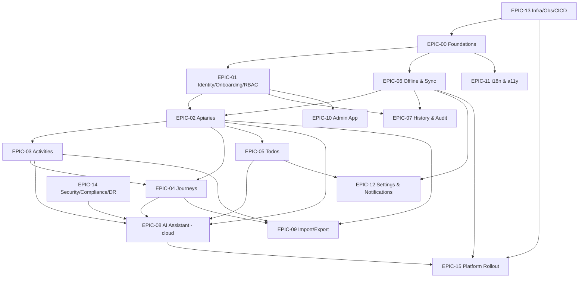

# Roadmap & Backlog

The ordered backlog for everything decided so far. **Order and dependencies follow
the decisions** in [../requirements/decisions.md](../requirements/decisions.md) —
especially **D-10** (rollout: PWA → Android → iOS, native only when needed) and
**D-4** (billing/quotas + on-device AI deferred; admin app + import/export kept).

- **Epics** live in [epics/](epics/) (one file each) and become a `type/epic` Issue.
- **Stories** under each epic become individual Issues (labels + requirement refs).
- Generation convention: [README.md](README.md). Labels: [../.github/labels.yml](../.github/labels.yml).

> IDs are stable. `M*` = milestone, `EPIC-*` = epic, `SP-*` = spike.

---

## Milestones (build order)

| # | Milestone | Goal | Phase (D-10) |
|---|---|---|---|
| **M0** | Foundations & Walking Skeleton | Prove the architecture end-to-end on one thin slice | PWA |
| **M1** | Core domain | Onboarding + Apiaries + Activities, offline + history | PWA |
| **M2** | Journeys & Todos | Seasonal aggregation + task management | PWA |
| **M3** | AI + Admin + Import/Export | Complete the **PWA product** | PWA |
| **M4** | Android | Package & distribute on Android (direct APK) | Android |
| **M5** | iOS + native enablement | iOS app + on-device AI + native offline | iOS / native |
| **—** | Deferred | Billing, quotas (mechanism stubs only earlier) | post-v1 |

### Exit criteria
- **M0:** login (Keycloak) → create a record → edit offline → syncs online, deployed
  to the cluster via CI/CD, with traces/logs visible. Sync engine chosen (SP-1).
- **M1:** a user can onboard (profile → org → invite), manage apiaries and activities
  fully offline, with change history and EN/PT + a11y baseline.
- **M2:** journeys (plan + stats) and todos working over the M1 data.
- **M3:** cloud AI assistant (with consent/GDPR), admin web app, and CSV/JSON
  import/export → **feature-complete PWA**.
- **M4:** installable Android build distributed via direct APK; Android polish.
- **M5:** iOS in TestFlight/App Store; on-device AI + local/cloud toggle; native
  offline login + background sync.

---

## Dependency graph

---

## Epic catalog (the backlog)

Each epic lists its **stories** (→ Issues). Acceptance criteria are detailed in the
per-epic files under [epics/](epics/).

### EPIC-00 — Foundations & Walking Skeleton · M0 · deps: EPIC-13
*Reqs: NFR-MNT, NFR-TST, NFR-ARC*
- Monorepo tooling & conventions (lint/format, task runner, pre-commit)
- Shared Go service template (health, config, structured logging, OTel, JWT middleware, error format, DB access)
- Flutter app skeleton (PWA shell, routing, theming, state mgmt, i18n scaffold)
- Local dev environment (Postgres+PostGIS, Keycloak, sync engine, MinIO, gateway)
- **Walking-skeleton vertical slice**: login → create trivial record → offline edit → sync

### EPIC-01 — Identity, Onboarding & RBAC · M0→M1 · deps: EPIC-00
*Reqs: FR-ONB-1/2/3, FR-AU-1, FR-TEN-1/2, NFR-ROL-1, NFR-SEC; D-3*
- Keycloak realm/client + OIDC login in client (M0)
- User profile creation + enforce completion (FR-ONB-1)
- Organization creation + enforce before app access (FR-ONB-2)
- Org membership & **email invitations**; org creator = admin (FR-ONB-3, D-3)
- Roles & permissions (admin/user) + org-scoped authorization middleware (NFR-ROL-1, FR-TEN)
- Account settings: change password, update profile (FR-AU-1)
- Tenancy enforcement (`organization_id` scoping; optional RLS) (FR-TEN-2)

### EPIC-02 — Apiaries · M1 · deps: EPIC-01, EPIC-06
*Reqs: FR-AP-1..7*
- Apiary CRUD (FR-AP-1)
- Apiary detail page incl. hive count (FR-AP-7, D-2)
- List ordered by proximity to user (FR-AP-2, PostGIS)
- Map view: apiary markers + user location (FR-AP-3)
- Map/list toggle (FR-AP-4)
- Search by name/location/attributes (FR-AP-6)
- Distance between two apiaries — haversine offline, driving online later (FR-AP-5, Q-DIST)

### EPIC-03 — Activities · M1 · deps: EPIC-02
*Reqs: FR-AC-1..6, FR-TEN-2; D-2*
- Activity type model + per-type attributes (JSONB) incl. hive-count attr (FR-AC-1, D-2)
- Add activity (select type, fill attributes) (FR-AC-2)
- Edit activity (FR-AC-3)
- Delete activity (FR-AC-4)
- Apiary activity list + filters (type, date range) (FR-AC-5)
- All-apiaries activity list + filters (FR-AC-6)
- Per-user attribution of activities (FR-TEN-2)

### EPIC-04 — Journeys · M2 · deps: EPIC-02, EPIC-03
*Reqs: FR-JO-1..4; Q-JOUR, D-2*
- Journey planning: select apiaries + activities to perform (FR-JO-4)
- Activity↔journey attribution model (Q-JOUR)
- Journeys list + filters (date range, activity type) (FR-JO-2)
- Journey detail: apiaries visited, activities, stats (FR-JO-3)
- Journey statistics/aggregation: apiaries visited, hives harvested (Σ hive-count), honey collected, missing (FR-JO-1, D-2)

### EPIC-05 — Todos · M2 · deps: EPIC-02
*Reqs: FR-TD-1; Q-TODO*
- Todo model + lifecycle (create/complete/reopen/edit/delete) (FR-TD-1, Q-TODO)
- Associations to apiary/area (Q-TODO)
- Quick-create from main screen, apiaries list, apiary detail (FR-TD-1)
- Todo list + filters (due date, priority) (FR-TD-1)

### EPIC-06 — Offline & Sync · M0→M1 · deps: EPIC-00, EPIC-13
*Reqs: FR-OF-1; Q-SYNC, SP-1*
- **SP-1 spike**: PowerSync vs ElectricSQL incl. web/PWA persistence
- Client local store + sync integration (web SDK)
- Conflict policy: server-authoritative last-write-wins + conflict log (Q-SYNC)
- Org/user-scoped replication slice
- Offline UX: sync status, queued changes, retry

### EPIC-07 — History & Audit · M1 · deps: EPIC-01, EPIC-06
*Reqs: FR-HIS-1; Q-HIS*
- Append-only history per entity (actor + timestamp) (FR-HIS-1)
- History view per apiary/activity/journey (FR-HIS-1)
- History across offline edits + sync (Q-HIS)
- Retention/immutability policy (Q-HIS)

### EPIC-08 — AI Assistant (cloud) · M3 · deps: EPIC-02/03/04/05, EPIC-14
*Reqs: FR-AI-1, NFR-AI-1(cloud); Q-AICLOUD, D-8*
- AI gateway Go service calling a hosted LLM (e.g. Claude API)
- NL→structured-query (tool-calling) over org data (FR-AI-1)
- Chat UI + context scope selector (org/apiary/journey) (FR-AI-1)
- Consent + GDPR (DPA, no-training, EU residency, PII minimization) (Q-AICLOUD)
- Guardrails: read-only, scoped, parameterized
- Example-question coverage tests (FR-AI examples)

### EPIC-09 — Import/Export · M3 · deps: EPIC-02/03/04
*Reqs: FR-IE-1/2; Q-IMP*
- Export apiaries/activities/journeys (CSV/JSON) (FR-IE-1)
- Import (CSV/JSON): merge vs replace, ID handling, dedupe (FR-IE-2, Q-IMP)
- Tie-in to GDPR data export (NFR-CMP)

### EPIC-10 — Admin App (web) · M3 · deps: EPIC-01
*Reqs: NFR-ROL-2, NFR-ROL-1*
- React admin scaffold + Keycloak auth (online-only) (NFR-ROL-2)
- Organization management
- Member management (invite/remove)
- Roles & permissions management (NFR-ROL-1)
- Placeholder hooks for quotas/rate-limits (deferred — EPIC-91)

### EPIC-11 — i18n & Accessibility · M0→ongoing · deps: EPIC-00
*Reqs: NFR-I18N-1, FR-AX-1, FR-UX-1; Q-AX*
- i18n framework EN + PT; locale date/number formats (NFR-I18N)
- Translation extraction/workflow
- Accessibility: WCAG 2.2 AA, screen reader, keyboard nav (FR-AX, Q-AX)
- Field-first UX: large tap targets, gloves-friendly (FR-UX)

### EPIC-12 — Settings & Notifications · M3 · deps: EPIC-05, EPIC-06
*Reqs: FR-ST-1; Q-NOTIF*
- App settings: notification prefs, sync settings, etc. (FR-ST-1)
- Notification system: events (todo due, sync results) + channel decision (Q-NOTIF)

### EPIC-13 — Infrastructure, Observability & CI/CD · M0→ongoing · deps: —
*Reqs: NFR-ARC-1/2/3, NFR-OBS-1, NFR-PER-1*
- k8s + Helm charts (umbrella) on a single cluster (NFR-ARC-3)
- Postgres+PostGIS, Keycloak, MinIO, gateway/ingress deploy
- Infra abstraction (S3-compatible storage, DB access layer) (NFR-ARC-2)
- GitOps (ArgoCD/Flux) deploy to the local cluster
- Observability: OTel + Prometheus + Grafana + Loki + Tempo (NFR-OBS)
- CI/CD: GitHub Actions, path-filtered monorepo (build/test/scan/publish/deploy); macOS for iOS added at M5

### EPIC-14 — Security, Compliance & DR · M0→M3 · deps: EPIC-01, EPIC-13
*Reqs: NFR-SEC-1, NFR-CMP-1, NFR-DR-1; Q-CMP/Q-REG, Q-DR, Q-AICLOUD*
- Security baseline: secrets mgmt, TLS, input validation, authz, dependency/container scanning, SQLi/XSS/CSRF protections (NFR-SEC)
- GDPR: data export/erasure, consent records, privacy policy, EU residency (NFR-CMP)
- Portuguese/EU beekeeping + honey-traceability regulatory research (Q-REG)
- Disaster recovery: Postgres backups, restore drills, RPO/RTO (NFR-DR, Q-DR)

### EPIC-15 — Platform Rollout: PWA → Android → iOS · M0/M4/M5 · deps: EPIC-13, EPIC-06, EPIC-08
*Reqs: FR-PL-1, NFR-AI-2/3; D-10, D-8, SP-2*
- PWA hosting + installability (manifest, service worker) — M0/ongoing
- Android build + direct APK distribution (+ optional Play) — M4
- iOS native build + Apple Developer + macOS CI + TestFlight/App Store — M5
- **On-device AI (SP-2)** + local/cloud toggle — M5 (D-8, NFR-AI-2/3)
- Native offline login + background sync — M5

---

## Deferred (tracked, not scheduled for v1) — per D-4

### EPIC-90 — Billing & Subscriptions · Deferred
*Reqs: FR-AU-2; D-4* — subscription model + feature-toggle/enforcement mechanism
stubs now; billing UI later.

### EPIC-91 — Rate Limiting & Quotas · Deferred
*Reqs: NFR-RL-1; D-4* — enforcement mechanism + admin management later.

---

## Spikes

| ID | Spike | Resolves | When |
|---|---|---|---|
| **SP-1** | PowerSync vs ElectricSQL (incl. web/PWA persistence, conflict handling, self-hosting) | D-6 sync engine, Q-SYNC | M0 (near-term) |
| **SP-2** | On-device LLM feasibility + NL→query accuracy on a mid-range phone | D-8 model, Q-LLM | M5 (native phase) |

## Ordering rationale
1. **M0 first** to de-risk the hardest cross-cutting pieces (sync, auth, deploy) on a
   single slice before building features on top.
2. **PWA product (M1–M3)** before any packaging — matches D-10 (PWA first) and keeps
   cloud AI (D-8) viable without native.
3. **Android (M4) before iOS (M5)** — Android is cheaper (direct APK, no Apple fee);
   iOS bundles the costly/native-only work (Apple account, macOS CI, on-device AI).
4. **Deferred items** stay out of the critical path but keep design seams (D-4).
